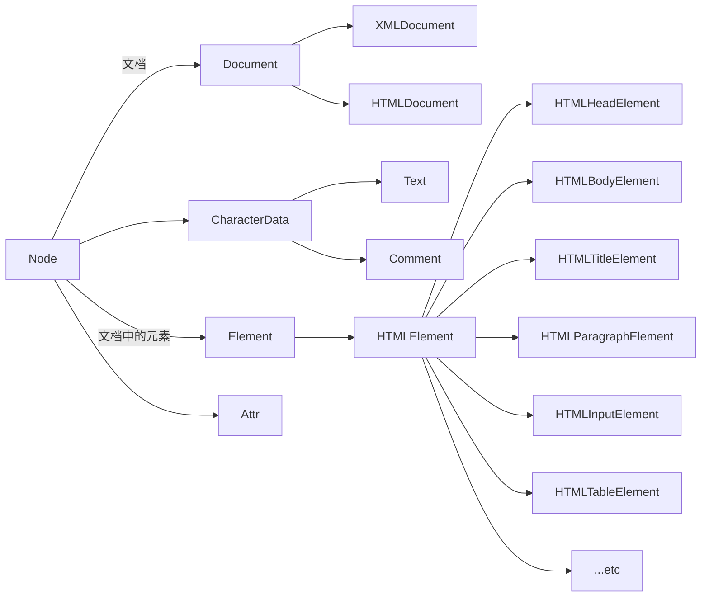
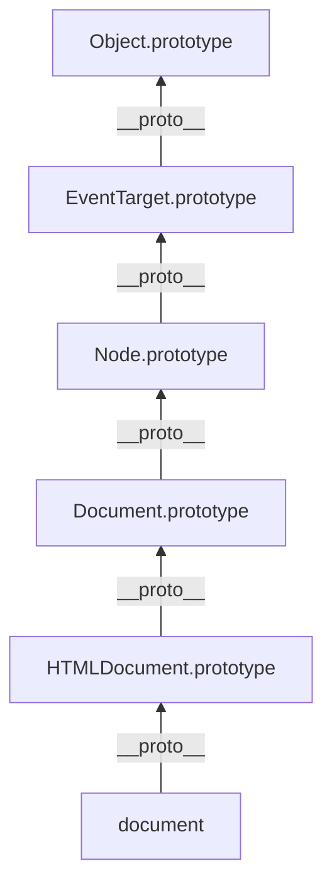

# 19. dom继承树,dom基本操作

## 19.1 dom继承树,dom基本操作(上)

### 1. DOM 继承树

- [x] **dome继承树图示**



- [x] document与DOM继承树之间的关系



- [x] demo1

```js
HTMLDocument.prototype.bcd = '123';
document.bcd; // 123

Document.prototype.abc = '1';
document.abc; // 1

HTMLDocument.prototype.aaa = '2';
Document.prototype.aaa = '3';
document.aaa; // 2
```

- [x] demo2

```js
HTMLHeadElement.prototype.abc = 'demo';
var body = document.getElementsByTagName("body")[0];
var head = document.getElementsByTagName("head")[0];

head.abc; // demo
body.abc; // undefined

HTMLElement.prototype.bcd = '123';

head.abc; // 123
body.abc; // 123
```

> 对于DOM继承树 我们能看懂上面的DOM继承树的图就可以了

### 2. DOM基本操作 - 查

```
1. getElementById() 定义在 Document.prototype 上，即 Element节点上都不能使用。

2. getElementsByName() 定义在 HTMLDocument.prototype 上，即非html中的document以外不能使用(xml document,Element)

3. getElementsByTagName() 定义在 Document.prototype 和 Element.prototype 上
    定义在 Element.prototype 上 就表示节点可以直接调用
    eg: const body = document.getElementsByTagName('body')[0]
    body.getElementsByTagName('div')[0]

4. 在HTMLDocument.prototype上 定义了一些常用的属性，body,head,分别指代HTML文档中的<body><head>标签。
    对这句话的理解: 
    const body1 = document.getElementsByTagName('body')[0]; // 通过方法来获取body
    const body2 = document.body; // 也可以直接通过继承HTMLDocument.prototype上的属性body 来获取body
    body1 === body2; // true

5. 在Document.prototype上 定义了 documentElement 属性，指代文档的根元素，在HTML文档中，他总是指代<html>元素
    对这句话的理解:
    const html1 = document.getElementsByTagName('html')[0]; // 通过方法来获取html
    const html2 = document.documentElement; // 也可以直接通过继承 Document.prototype上的属性documentElement 来获取html

6. getElementsByClassName、querySelectorAll、querySelector在Document,Element类中均有定义
    和3一样 表示这些方法 都可以通过节点来调用
```

- [x] **demo1**

```html
<div>
    <span class="item1">要求选中该span元素</span>
</div>
<span></span>
```

```js
// 借助被选中元素的父级来选中指定元素
const div = document.getElementsByTagName("div")[0],
    span1 = div.getElementsByTagName("span")[0],
    span2 = div.getElementsByClassName("item1")[0],
    span3 = div.querySelectorAll("span")[0],
    span4 = div.querySelector("span");
```

- [x] **demo2**

```js
// 直接表示 body head html
document.body; // body
document.head; // head
document.documentElement; // html
```

### 3. 课堂练习

```
1. 遍历元素节点树，要求不能用children属性
2. 封装函数，返回元素e的第n层祖先元素
3. 封装函数，返回元素e的第n个兄弟节点，n为正，返回后面的兄弟节点，n为负，返回前面的，n为0，返回自己。
4. 编辑函数，封装children功能，解决以前部分浏览器的兼容性问题 
5. 自己封装hasChildren()方法，不可用children属性
```

## 19.2 dom继承树,dom基本操作(中)

### 1. 课堂练习讲解

- [x] test1

```html
<div>
    <span>
        <strong>
            <em>
                <a href="#"></a>
            </em>
        </strong>
    </span>
    <p></p>
</div>
<span></span>
```

```js
const div = document.querySelector("div");
/**
 * 遍历元素节点树 (在原型链上编程)
 */
Element.prototype.retChildElements = function () {
    var childs = this.childNodes,
        len = childs.length;
    for (var i = 0; i < len; i++) {
        if (childs[i].nodeType === 1) {
            console.log(childs[i]);
        }
    }
}
div.retChildElements();
```

- [x] test2

```html
<div>
    <span>
        <strong>
            <em>
                <a href="#"></a>
            </em>
        </strong>
    </span>
</div>
```

```js
var a = document.getElementsByTagName('a')[0];
/**
 * 封装函数，返回元素e的第n层祖先元素
 * @param {HTMLElement} elem 指定元素
 * @param {Number} n 第几层父级
 */
function retParent(elem, n) {
    while (elem && n) {
        elem = elem.parentElement;
        n--;
    }
    return elem;
}
```

- [x] test3

```html
<div>
    <b></b>
    abc
    <!-- this is comment -->
    <strong>
        <span>
            <i></i>
        </span>
    </strong>
</div>
```

```js
/**
 * 编辑函数，封装 myChildren 功能，解决以前部分浏览器的兼容性问题。
 */
Element.prototype.myChildren = function () {
    var child = this.childNodes,
        len = child.length,
        arr = [];
    for (var i = 0; i < len; i++) {
        if (child[i].nodeType == 1) {
            arr.push(child[i]);
        }
    }
    return arr;
}
const div = document.getElementsByTagName("div")[0];
div.myChildren(); // [b, strong]
```

- [x] test4

```html
<div>
    <b></b>
    abc
    <!-- this is comment -->
    <strong>
        <span>
            <i></i>
        </span>
    </strong>
</div>
```

```js
/**
 * 自己封装 hasChildren()方法，不可用 children 属性。
 */
Element.prototype.hasChildren = function () {
    var child = this.childNodes,
        len = child.length;
    for (var i = 0; i < len; i++) {
        if (child[i].nodeType == 1) {
            return true;
        }
    }
    return false;
}
var div = document.getElementsByTagName("div")[0];
div.hasChildren(); // true
```

- [ ] **test5**

```html
<div>
    <span></span>
    <p></p>
    <strong></strong>
    <!-- this is comment -->
    <i></i>
    <address></address>
</div>
```

```js
/**
 * 封装函数，返回元素 e 的第 n 个兄弟元素节点，n 为正，返回后面的兄弟元素
节点，n 为负，返回前面的，n 为 0，返回自己。
 */
function retSibling(e, n) {
    while (e && n) {
        if (n > 0) {
            if (e.nextElementSibling) {
                e = e.nextElementSibling;
            } else { // 兼容IE
                for (e = e.nextSibling; e && e.nodeType != 1; e = e.nextSibling);
                // 正常开发的时候 还是中规中矩的写 这里这么写 就是为了认识一下 for循环是很灵活的即可
            }
            n--;
        } else {
            if (e.previousElementSibling) {
                e = e.previousElementSibling;
            } else { // 兼容IE
                for (e = e.previousSibling; e && e.nodeType != 1; e = e.previousSibling);
            }
            n++;
        }
    }
    return e;
}
var strong = document.getElementsByTagName("strong")[0];
```

```
解析：和练习 2 一样，写一个 while 循环，用 n 控制循环圈数，并且 e 得有意义，然后循环里边当 n 大于 0 的时候每一圈都让 e 等于他的下一个兄弟元素节点，当 n 小于 0的时候每一圈都让 e 等于他的前一个兄弟元素节点，最后返回 e 即可，如果 n 等于 0，就直接返回 e ，但是这么写有一个兼容性问题，因为老版本的 ie 没 有nextElementSibling 和 previousElementSibling，那么，我们就得把程序写全，拿 n为正举例：当 e.nextElementSibling 有意义时就走里边的，没有意义的话，我们在里边写个 for 循环，先让 e 等于他下一个兄弟节点，然后判断 e 的 nodeType 是不是不等于 1，如果不等于 1，就继续让 e 等于他的下一个兄弟节点，直到等于 1 的时候循环结束（我们以前讲过 for 循环的执行顺序，这里边的大括号里边没有内容的话就可以不写，如果第二句条件成立的话，他会执行第三条语句，再判断第二条语句是否成立，一直循环，直到 e 的 nodeType 等于 1，循环结束）。但是这么写还有一个问题，比如说我们假设用的是老版本的 ie，retSibling(strong,3)就会报错，因为第二圈的时候 e就是address标签了，然后第三圈执行for第一句后e是文本节点，文本节点的nodeType不是 1，继续后边的 e 变成了 null，然后判断，null 没有 nodeType 所以报错，故此我们在判断的时候必须加上条件 e，如果 e 等于 null，循环结束。下边的也是一样的，现 在 retSibling(strong,1) 就 是 <i></i> ， retSibling(strong,2) 就 是<address></address>，retSibling(strong,3)是 null，retSibling(strong,4)也是null ， retSibling(strong,-1) 就 是 <p></p> ， retSibling(strong,-2) 就 是<span></span>，retSibling(strong,-3)和 retSibling(strong,-4)都是 null。
```

### 2. DOM基本操作 - 增

| 方法                              | 说明                                |
| --------------------------------- | ----------------------------------- |
| document.createElement()          | 创建元素节点 (即: 创建标签)         |
| document.createTextNode()         | 创建文本节点                        |
| document.createComment()          | 创建注释节点                        |
| document.createDocumentFragment() | 创建文档碎片节点 (后期课程再作讲解) |

### 3. DOM基本操作 - 插

| 方法                              | 说明                                        |
| --------------------------------- | ------------------------------------------- |
| 父级.appendChild(Node)            | 类似于push 在父级的内push一个节点           |
| 父级.insertBefore(Node_a, Node_b) | 在父级元素内的 节点Node_b之前插入节点Node_a |

- [x] **demo1**

```html
<div></div>
```

```js
var div = document.getElementsByTagName("div")[0]; 
var text = document.createTextNode("邓宝宝"); 
var span = document.createElement("span"); 
div.appendChild(text); 
div.appendChild(span); 
var text1 = document.createTextNode("demo"); 
span.appendChild(text1);
```

```html
<div>
    "邓宝宝"
    <span>demo</span>
</div>
```

- [x] **demo2 理解appendChild是剪切操作**

```html
<div></div>
```

```js
var div = document.getElementsByTagName("div")[0]; 
var text = document.createTextNode("邓宝宝"); 
var span = document.createElement("span"); 
div.appendChild(text); 
div.appendChild(span); 
var text1 = document.createTextNode("demo"); 
span.appendChild(text1); 
span.appendChild(text); // 将页面中已有的东西 重新插入到新的位置 (剪切过去)
```

```html
<div>
    <span>
        demo
        邓宝宝
    </span>
</div>
```

- [x] **demo3**

```html
<div></div>
<span></span>
```

```js
var div = document.getElementsByTagName("div")[0];
var span = document.getElementsByTagName("span")[0];
div.appendChild(span);
```

```html
<div>
    <span></span>
</div>
```

> 思考: 插入操作 是无缝插入 还是 前后有回车的插入

- [x] demo4

```html
<!DOCTYPE html>
<html lang="en">

<head>
    <meta charset="UTF-8">
    <title>测试插入时是否带有不可见空格</title>
    <style>
        span {
            display: inline-block;
            width: 50px;
            height: 50px;
            line-height: 50px;
            text-align: center;
            border: 1px solid #ddd;
        }
    </style>
</head>

<body>
    <div class="wrapper">
        <span>0</span><span>1</span>
    </div>
    <span>2</span>
    <script>
        var div = document.getElementsByTagName("div")[0];
        var span = document.getElementsByTagName("span")[2];
        div.appendChild(span);
        var newSpan = document.createElement("span");
        newSpan.innerText = 3;
        div.appendChild(newSpan);
    </script>
</body>

</html>
```

```html
<div class="wrapper">
    <span>0</span><span>1</span>
    <span>2</span><span>3</span>
</div>
```

```
分析:
    1和2之间存在间隙 这说明 新插入的2并不是紧紧挨着1来插入的
    但是新建的span 插入后又是紧挨着2的 它们之间没有间隙
结论:
    目前得出的结论可能并不准确 因为不想在测试了 感觉上就是
    若是第一个append进去的元素 它会换行后插入
    随后哦append进去的元素 它就会紧挨着前一个append进去的元素 之间不存在间隙
    页面布局如果需要这样类似的小间隙问题时 要知道可能是由于append插入操作导致的
```

- [x] demo5

```html
<div>
    <span></span>
</div>
```

```js
var div = document.getElementsByTagName("div")[0];
var span = document.getElementsByTagName("span")[0];
var strong = document.createElement("strong");
div.insertBefore(strong, span);
```

```html
<div>
    <strong></strong>
    <span></span>
</div>
```

### 4. DOM基本操作 - 删

| 方法               | 说明                      |
| ------------------ | ------------------------- |
| 父级.removeChild() | 谋杀 父级删除自己的子节点 |
| 自己.remove()      | 自杀                      |

- [x] demo1

```html
<div>
    <span></span>
    <strong></strong>
    <i></i>
</div>
```

```js
var div = document.getElementsByTagName("div")[0];
var span = document.getElementsByTagName("span")[0];
var strong = document.getElementsByTagName("strong")[0];
var i = document.getElementsByTagName("i")[0];

div.removeChild(i); // 返回值就是被删除的那个i标签
```

```html
<div>
    <span></span>
    <strong></strong>
</div>
```

- [x] demo2

```html
<div>
    <span></span>
    <strong></strong>
    <i></i>
</div>
```

```js
var div = document.getElementsByTagName("div")[0];
var span = document.getElementsByTagName("span")[0];
var strong = document.getElementsByTagName("strong")[0];
var i = document.getElementsByTagName("i")[0];

i.remove();
strong.remove();
```

```html
<div>
    <span></span>
</div>
```

### 5. DOM基本操作 - 替换

| 方法                                  | 说明                                |
| ------------------------------------- | ----------------------------------- |
| 父级.replaceChild(new_Node, old_Node) | 新节点替换老节点 返回被替换的老节点 |

- [x] demo1

```html
<div>
    <span></span>
    <strong></strong>
    <i></i>
</div>
```

```js
var div = document.getElementsByTagName("div")[0];
var strong = document.getElementsByTagName("strong")[0];
var p = document.createElement("p");

div.replaceChild(p, strong); // 返回被替换的元素 strong
```

```html
<div>
    <span></span>
    <p></p>
    <i></i>
</div>
```

### 6. Element节点的一些属性

| 属性      | 说明                                     |
| --------- | ---------------------------------------- |
| innerHTML | 可读可写 用于改变元素里面的 **html内容** |
| innerText | 可读可写 用于改变元素里面的 **文本内容** |

> 老版本火狐不兼容 innerText 用textContent来代替 
> 但是 textContent 在老版本的IE上不好使
> 知道就行 万一看到别人的程序中用了 textContent 别不认识
> 使用的话 还是用 innerText 即可

- [x] demo

```html
<div></div>
```

```js
div.innerHTML="<span style='background-color:red;color:#fff;font-size:20px'>123</span>"
```

<div><span style="
background-color:red;
color:#fff;
font-size:20px">123</span></div>

### 7. Element节点的一些方法

| 方法         | 说明     |
| ------------ | -------- |
| setAttribute(属性名, 属性值) | 添加属性 |
| getAttribute(属性名) | 查看属性 |

- [x] demo1

```html
<div></div>
```

```js
const div = document.getElementsByTagName("div")[0];
div.setAttribute("class","demo");
div.setAttribute("id","only");
```

```html
<div class="demo" id="only"></div>
```

```js
div.getAttribute("class"); // demo
div.getAttribute("id"); // only
```

- [x] **demo2 - data-log**

```
data-log 是一个咋们自定义的属性 一般我们会用它来统计点击率
```

```html
<div>
    <a href="#" data-log="1">item1</a>
    <a href="#" data-log="2">item2</a>
    <a href="#" data-log="3">item3</a>
</div>
```

```js
const div = document.querySelector("div"),
    items = document.querySelectorAll("a");

var clickObj = {}; // 记录各item被点击的次数
Array.from(items).forEach(item =>{ // 初始化
    clickObj[item.dataset.log] = 0;
});
console.log(clickObj);
div.onclick = function (e) {
    if (e.target.nodeName === "A") {
        clickObj[e.target.dataset.log]++;
    }
}
console.log(clickObj); // 最后将统计结果 通过 ajax 返回给后端
```

- [x] demo3

```html
<!-- 要求: 给body下面的所有元素身上都添加上一个 this-name 属性
属性值为 它们各自的 nodeName -->
<body>
    <div></div>
    <span></span>
    <strong></strong>
</body>
```

```js
// const all = document.getElementsByTagName("*"); // 全选
const all = document.body.children;
Array.from(all).forEach(item => {
    item.setAttribute("this-name", item.nodeName);
});
```

### 8. 课堂练习

- [x] test

```html
请编写一段JavaScript脚本 生成下面这段DOM结构
要求: 使用标准的DOM方法或属性
提示: dom.className 可以读写class

<div class="example">
    <p class="slogan">成哥，你最帅!</p>
</div>
```

```js
var div = document.createElement("div");
var p = document.createElement("p");
div.setAttribute("class", "example");
p.setAttribute("class", "slogan");
document.body.appendChild(div);
div.appendChild(p);
p.innerHTML = "成哥，你最帅!";
```

```js
var div = document.createElement("div");
div.setAttribute("class", "example");
div.innerHTML = `<p class="slogan">成哥，你最帅!</p>`;
```

## 19.3 dom继承树,dom基本操作(下)

```
1. 讲解了一下上节课的课后练习
2. 布置了2道新的 课后练习题
    1. 封装函数 insertAfter()；功能类似 insertBefore();
    提示: 可忽略老版本浏览器，直接在 Element.prototype 上编程
    这是之前阿里2面的一道题
    2. 将目标节点内部的节点逆序
    eg:
       <div><a></a><em></em></div>
       <div><em></em><a></a></div>
```

- [x] **test1**

> 阿里大神 程劭非winter

[“计算机之子”winter：我的前端学习路线与方法](https://www.infoq.cn/article/odrsoj*igawhjrgzqvpa)

```html
<div>
    <span></span>
    <i></i>
    <b></b>
    <strong></strong>
</div>
```

```js
var div = document.getElementsByTagName("div")[0];
var b = document.getElementsByTagName("b")[0];
var strong = document.getElementsByTagName("strong")[0];
/**
 * 在目标节点的后面插入新节点
 * @param {HTMLElement} targetNode 目标节点
 * @param {HTMLElement} newNode 新节点
 */
Element.prototype.insertAfter = function (targetNode, newNode) {
    var Node = targetNode.nextElementSibling; // 插入前 位于目标节点之后的那个节点
    if (Node == null) {
        this.appendChild(newNode); // Node为null 表示目标节点已经是最后一个节点 所以直接append到父级最后即可
    } else {
        this.insertBefore(newNode, Node); // 将新节点直接插入到 Node 前
    }
}
var p = document.createElement("p");
div.insertAfter(strong, p);
```

```html
<div> 
    <span></span>
    <i></i>
    <b></b>
    <strong></strong>
    <p></p>
</div>
```

- [x] test2

```html
<div>
    <span></span>
    <i></i>
    <b></b>
    <strong></strong>
</div>
```

```js
var div = document.getElementsByTagName("div")[0];
Element.prototype.inversElement = function () {
    var len = this.children.length;
    for (var i = len - 1; i >= 0; i--) {
        this.appendChild(this.children[i]);
    }
}
```

```js
// 错误写法
for (var i = 0; i < len; i++) {
    this.appendChild(this.children[i]);
}
// 这种错误写法 是由于没有考虑到DOM树的实时更新
// 比如说 第一次append的时候 是截取第一个元素 即span 并 插入到strong后面 这次是正确的 此时最后一个元素就是span了 而b由原来的第3个元素变为了第2个元素
// 但是第二次append的时候 是截取第二个元素 即b 并 插入到span的后面 此时就出现了问题
// 第三次 ... 第四次... 
// 对比上述正确程序 再思考思考 为何先取最后一个就不会有这样的问题
```

