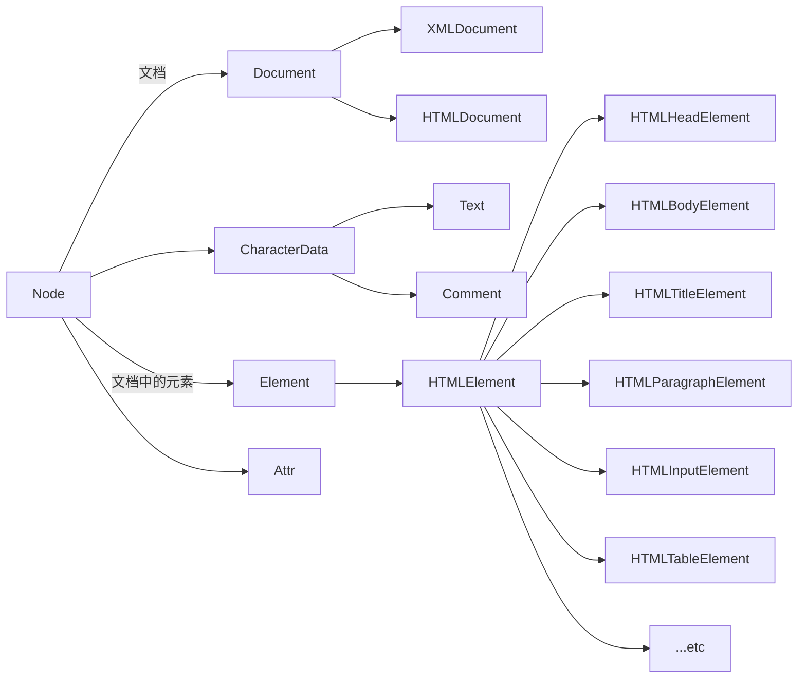
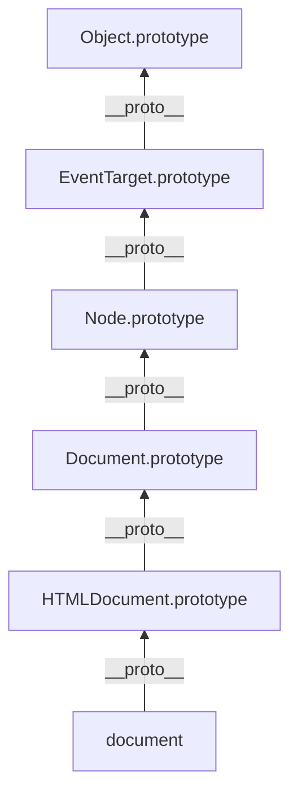

# 1. 课程前导

`重复内容`

视频时长8分钟 概括起来 主要讲解了如下4部分的内容

1. 前端工程师主要负责的工作介绍
2. 前端技术的应用领域介绍
3. 市场对前端工程师的需求分析
4. 前端工程师需要掌握的必要技能

```
HTML
CSS
JavaScript
jQuery
网络
CSS3
H5
es6
webpack4.0
git
小程序
设计模式
VUE
VUEX
VUE源码
React
Node.js
Mongo DB数据库
等等
```

# 2. 课前须知及[编辑器]使用方法

`重复内容`

本节9分钟的内容 主要讲解了如下两个内容

1. Sublime Text 的安装及基本使用;
2. Visual Studio Code 的安装及基本使用;(没介绍)

# 3. javascript浏览器发展史, js介绍, 入门, js引入, 变量, 值类型, 运算符

```
本节课开始的这些内容 不涉及具体的知识点 就是唠唠嗑
1. 成哥的这门课程的授课形式是线下的录播课 当时线下授课 将近持续了3个月左右的时间
2. JavaScript是咋们前端最为核心的语言
3. 前面几节课程 和 咋们之前学习的 HTML+CSS 没有关系 但是后面的内容 关系就大了
4. JavaScript语言不比 java c c++ 这些语言差
5. JavaScript的难度在于它的广度 而非 深度 并且 它的难度是倒序的 前面的几节课很难 后面就一马平川了
6. 学完JavaScript之后 咋们要接触的就是 JQuery JQuery源码 CSS3...
    后面学习的这些内容 看似很多 但是它们都是JavaScript的附带品
    C3与JavaScript搭配起来使用 可以做出非常炫酷的效果
    H5确实新增了一些标签 但是要展现出它们真正的功能 那还得与JavaScript搭配起来使用
    JQuery等第三方库 和 一些框架 实际上都是对JavaScript的封装 都是利用JavaScript来实现的
    除此之外, 还有很多模块化协同开发 都和JavaScript相关
       ...反正这东西真的很重要 必须掌握
7. 英语 + 互联网技能 + (金融) 搭配起来 很吃香
8. 听成哥给你唠唠金融的杠杆玩法... 没听懂 只感觉这东西水好深
```

## 3.1 javascript 浏览器发展史

### 1. 浏览器发展史

[浏览器内核发展编年史 bilibili](https://www.bilibili.com/video/BV1C54y1e7Yd?from=search&seid=3198101999815197659)

`网上有很多相关的文章 和 视频 直接搜就行`

```
1. JavaScript和java的关系
    它们是两门完全不同的语言 除了名字上看上去有点关系 别的P点关系都木得
2. JavaScript原来是叫LiveScript的 但是当时它和Java都不火 然后两个公司就沟通 要不改个名儿呗 蹭蹭热度 之后JavaScript就诞生了...
```

### 2. 浏览器的组成

```
浏览器 === shell + 内核
内核又包括 渲染引擎(语法规则和渲染)+js引擎+其他模块
```

### 3. JavaScript的逼格(特色)

```
1. 编译型 和 解释型
    编译型
        优点: 更快
        不足: 跨平台性不好
    解释型
        优点: 跨平台性好
        不足: 稍慢
2. 同步 和 异步
    异步 同时执行(比如link标签的加载)
    同步 有先后顺序
3. ECMAScript
    JavaScript刚推出的时候, 并不火, 但是它很强大, 很多人都根据它所能实现的功能来仿写它的源码;
    比如微软当时就抄出了个JScript, CEnvi抄出了个ScriptEase, 它们和JavaScript一样, 都可以在浏览器上运行;
    后面为了统一规则, ECMA组织指定出了一套标准, 随后推出了 JavaScript这一玩意儿;
    所以之前的 JScript和ScriptEase 就都死了, 大伙都开始使用 JavaScript;
    所以对于咋们影响就是: 就掌握好JavaScript就行, 选择少了, 没必要在语言的选择上花费心思;
    统一了规则之后, 对我们来说应该算是福音吧, 咋们写网页就不必去考虑, 到底该使用哪门语言 这样的问题了;

JavaScript语言的特点还有很多, 非要讲的话, 有很多东西可以唠, 还是直接上网搜关键词来的直接;
keyword: JavaScript 特点 与其他语言的不同 ...
```

### 4. js执行队列

[JavaScript 运行机制详解：再谈Event Loop 阮一峰](https://www.ruanyifeng.com/blog/2014/10/event-loop.html)

> 推荐书籍《ES6 标准入门》(第2版)

## 3.2 js介绍,入门,js引入,变量,值类型,运算符

### 1. 主流浏览器

`重复内容`

```
主流浏览器的两个必要条件:
    1. 一定的市场份额
    2. 有独立研发的内核(值钱)
浏览器的组成:
    1. shell(外壳 不值钱)
    2. 内核(值钱)
```

| 主流浏览器    | 内核         |
| ------------- | ------------ |
| IE            | trident      |
| Firefox       | Gecko        |
| Google chrome | Webkit/blink |
| Safari        | Webkit       |
| Opera         | presto       |

### 2. JavaScript引入方式

- [x] 直接写在script标签内部

```html
<script>
    console.log("hello world!!!");
</script>
```

- [x] 通过script标签上的src属性引入外部的JavaScript文件

```html
<script src="./test1.js"></script>
```

```
1. 推荐使用外部引入的方式来开发 咋们常说的 结构 行为 样式 相分离 指的就是 相关的代码单独写到对应的文件中 不要混着写
2. 细节: 如果一个script标签已经用来引入外部的js文件了 那么如果我们继续再这对script标签下面编辑我们的js代码 那么这些代码是被无视的
```

- [x] demo1

```html
<script src="./test.js">
    consoel.log("a"); // 该语句不会执行
</script>
```

### 3. type='text/tpl'

`<script type='text/tpl'></script>`

[html5前端开发的干货模板“text/tpl” script template CSDN](https://blog.csdn.net/mjr99999/article/details/74936683)

```
课程中仅仅是提了一下 并未做过多介绍 这好像是H5中的相关内容
感觉文章中描述的这个效果 直接利用 `模板字符串` 也能实现
```

### 4. js基本语法

#### 1. 变量

[JavaScript 保留关键字](https://www.runoob.com/js/js-reserved.html)

```
1. 变量
    1. 变量声明 var a;
    2. 赋值 a = 1;
    3. 单一var声明法:
        var a, b, c, d;
        var a = 1, b, c = 2; // 声明的同时可以对变量进行赋值
2. 变量命名规则
    1. 变量名必须以 英文字母 _ $ 开头
    2. 变量名可以包含 英文字母 _ $ 数字
    3. 不可以使用系统的关键字 保留字 作为变量名
        关键字: 指系统给咋们定义好的词 具备特定功能
        保留字: 指那些之后可能会作为关键字的一些特殊词
```

- [x] demo1

```js
var a; // 声明一个变量a
// 向系统声明一块空间 给这块空间起一个名儿 叫a
a = 100; // 变量赋值
// 将100这个值 放到这个空间中 也就是给变量a赋值为100
a = 10; // 变量赋值
// 这个空间中原来存放的值 100 会被最新的值 10 给覆盖
```

- [x] demo2

```js
var a = 10;
var b = 20;
var c;
c = a + b; // c 的值是30
// 运算的优先级大于赋值的优先级
```

#### 2. 数据类型

[JavaScript 数据类型 W3School](https://www.w3school.com.cn/js/js_datatypes.asp)

```
1. JavaScript的数据类型可以分为两大类
    1. 原始类型(stack)
        Number Boolean String undefined null
    2. 引用类型(heap)
        array object function
2. JavaScript数据的类型有赋的值决定
```

#### 3. 栈(stack)和堆(heap)

```
1. 简述 stack 和 heap 之间的区别
    1. 如果变量是一个原始类型 那么它的值是直接放在 stack内部的
    原始类型之间的赋值 是拷贝副本 副本与原来的那个值之间不会相互影响
    2. 如果变量是一个引用类型 那么它的值是放在 heap内部的
    而它的stack中放的是指向对应heap的地址
    所以引用类型之间赋值 虽然拷贝的也是副本 但是但是被拷贝的这个副本实际上是一个地址
    这个地址指向某一块特定的内存空间 这块空间中存放的也就是该引用类型的变量
    所以副本和原来的值 都是指向同一块 heap空间
    综上: 它们实际上是共用一个值
2. 原始值和引用值补充
    1. 原始值是不可改变的
    重新给原始类型的变量进行赋值操作 那么原来存放的那个值的stack空间 就会与该变量名之间切断联系
    然后重新开一个stack空间 用来存放新的值 并与变量名建立联系
    2. 引用值是可以改变的
    我们是可以对原来创建的那个引用类型的变量进行修改的
    当然 我们如果重新给引用类型的变量赋值 那么实际上也就是覆盖原来的值
PS: 弄清楚结果还是比较简单的 但是弄清楚原理 有些困难 以上写的自己的理解 好像还是有些偏差...
若依旧存有困惑 可以回看以下这一节的视频内容 有图文讲解 也许会更容易理解一些
```

[js中栈和堆的概念和区别 掘金](https://juejin.cn/post/6854573215327617031)

- [x] stack

```js
var a = 10;
var b = a;
a = 20;
console.log(b); // 10
```

- [x] heap1

```js
var arr = [1];
var arr1 = arr;
arr.push(2);
console.log(arr1); // [1, 2]
```

- [x] heap2

```js
var arr = [1, 2];
var arr1 = arr;
arr = [1, 3]; // 这一步相当于重新在heap中创建了块空间 arr的stack中存放的就是指向这块新空间的地址 arr 和 原来的 [1, 2] 这块heap空间没有关系了
console.log(arr1); // [1, 2]
```

#### 4. 规范

```
1. 语句以分号结尾
    1. 这一点非强制要求 也就是说 即便不加 程序也可以运行 但建议加上
    2. 可以不加分号的一些语句
        函数后面不加 function(){}
        for循环后面不加 for(){}
        if语句后面不加 if(){}
2. 运算符前后要有空格
```

#### 5. 错误

```
1. JavaScript中的错误大致可分为两种
    1. 低级错误(语法解析错误)
        代码一行都不会执行  控制台会直接报错
    2. 逻辑错误(标准错误 情有可原)
2. js语法错误会引发当前块的后续代码终止 但不会影响其它js代码块
```

- [x] JavaScript代码块

```html
<!-- 代码块1 -->
<script>
    console.log(a); // 语法上没错 但是输出一个不存在的变量 控制台是会报错的 不过并不会影响到其它的js代码块
</script>
<!-- 代码块2 -->
<script>
    console.log(111); // 可以正常打印
</script>
```

#### 6. JavaScript 运算符

[JavaScript 运算符 菜鸟教程](https://www.runoob.com/js/js-operators.html)

[JavaScript 运算符 W3School](https://www.w3school.com.cn/js/js_operators.asp)

[表达式与运算符 mdn](https://developer.mozilla.org/zh-CN/docs/Web/JavaScript/Guide/Expressions_and_Operators#%E8%BF%90%E7%AE%97%E7%AC%A6)

- [x] test1

```js
var a = 10;
var b = ++a - 1 + a++;
// 结果 a 是 12 b 是 21
```

- [x] test2

```js
var a = (10 * 3 - 4 / 2 + 1) % 2,
    b = 3;
b %= a + 3;
console.log(a++); // 1
console.log(--b); // 2
```

- [x] **请交换a与b的值**

```js
var a = 123;
var b = 234;
var c = a;
a = b;
b = c;
console.log(a, b); // 234 123
/* 方式2
var a = 123;
var b = 234;
a = a + b;
b = a - b;
a = a - b;
console.log(a, b); // 234 123
 */
```

# 4. 比较运算符, 逻辑运算符, 条件语句, 循环语句

## 4.1 比较运算符,逻辑运算符

`标题和视频内容对应不上 比较运算符和逻辑运算符的相关知识点 见:4.3`

```
这一部分的内容 在前一节课的结尾 都介绍过了 成哥重复讲了
补充以下两个注意点:
    1. 任何数据类型加字符串都等于字符串
    2. NaN 和 Infinity 都是 Number类型
```

- [x] test

```js
var a = 1;
var b = a-- + --a; // 先执行--a
console.log(b); // 0
/* 分析
1. 表达式 --a ==> 0 此时a变为0
2. 表达式 a-- ==> 0 此时a变为-1
3. b = 0 + 0; */
```

## 4.2 学员必听

`重复内容`

```
介绍渡一的联系方式...
PS: 同HTML+CSS课程中的4.2一样的内容
```

## 4.3 条件语句,循环语句

### 1. 两数交换测试讲解

`...很基础`

### 2. 比较运算符 和 逻辑运算符

[JavaScript 比较 和 逻辑运算符 菜鸟教程](https://www.runoob.com/js/js-comparisons.html)

```
1. 字符串之间的比较 比较的是它们的ASCII码
2. 转换为 boolean值 是false的6个值(记住)
    undefined
    null
    NaN
    ""
    0
    false
3. 逻辑运算符(重点内容)  && || !
    1. 逻辑与: && 先看第一个表达式转换成布尔值的结果 如果结果是true(是false则直接返回 不会继续看后面的表达式)
    那么它会继续看第二个表达式转换成布尔值的结果(假设仅有三个表达式) 如果结果是true(是false则直接返回 不会继续看后面的表达式)
    那么它会直接返回第三个表达式的结果(因为此时已经到最后一个表达式了 所以不必再进行判断了)
        比如: 1 && 2 && 3 整个表达式返回的结果是 3
        比如: 1 && 0 && 3 整个表达式返回的结果是 0
    2. 逻辑或: || 和逻辑与是一样的道理(将上述对逻辑与的介绍中的内容中的false和true对调即可)
        比如: 0 || false || "" 整个表达式返回的结果是 ""
        比如: 1 || 0 || 3 整个表达式返回的结果是 1
    3. 逻辑非: ! 取反
        比如: !0 结果是true
        比如: !!"" 结果是false
        PS: 使用两个非!!即可判断一个数据转化为boolean值是true还是false
```

- [x] 字符串之间的比较

```js
"10" > "8" // false 先比较的是 "1" > "8"
```

### 3. 逻辑运算符应用 - 短路语句

- [x] 确保数据到位 再执行函数体

```js
// data是后端传递过来的数据 但是由于一些原因 这传过来的数据 可能是空 转化为布尔值就是false
data && fun(data); // 只有当data确实有传递过来时 咋们才执行后面的函数
```

- [x] 常见于兼容写法

```js
div.onclick = function(e){
    // 对于IE浏览器而言 div它的事件对象是存放在window.event里面的
    // 对于非IE浏览器而言 div它的事件对象是存放在e里面的(也就是传递过来的第一个参数 命名也可以不是e)
    var event = e || window.event; // 兼容IE的写法
}
```

### 4. 条件语句

[JavaScript If...Else 语句 W3School](https://www.w3school.com.cn/js/js_if_else.asp)

- [x] if...else语句

```js
var score = parseInt(window.prompt("please input your score."))
if(score > 90 && score <= 100){
    document.write("alibaba");
}else if(score > 80 && score <= 90){
    document.write("tencent");
}else if(score > 70 && score <= 80){
    document.write("baidu");
}else if(score > 60 && score <= 70){
    document.write("mogujie");
}else if(score < 60){
    document.write("Oh my god!!! you gotta be kidding me!!!");
}else{
    document.write("error");
}
// 条件之间都是互斥关系 那么使用else if结构更好
```

- [x] if语句 和 逻辑与运算符

```js
if(1 > 2){
    document.write("a");
}
1 > 2 && document.write("a");
```

### 5. 循环

```
1. 清楚for循环的执行顺序
    for(①;②;③){
        循环体
    }
    先执行一遍①
    判断② 结尾若是true 则执行循环体
    执行③
    判断② 结尾若是true 则执行循环体
    执行③
    判断② 结尾若是true 则执行循环体
    执行③
    判断② 结尾若是true 则执行循环体
    执行③
    ...(一旦②不成立 立即跳出循环)
2. for循环相当的灵活
    for循环前后不写东西 就是 while循环
    for( ; 循环条件; ){

    }
    while(循环条件){

    }
3. do...while循环语法
   do{
    循环体; // 至少执行一次
   }while(循环条件)
   PS: do...while循环没啥用 知道有它就行
```

```js
// 要求打印出0-100以内 能被3或5或7整除的数
for (var i = 0; i < 100; i++) {
    if (i % 3 === 0 || i % 5 === 0 || i % 7 === 0) {
        document.write(i + " ");
    }
}
```

### 6. 课后作业

1. 计算2的n次幂 n可输入 n为自然数
2. 计算n的阶乘 n可输入(注意: 0和1的阶乘都是1)
3. 著名的斐波那契数列 1 1 2 3 5 8 要求输出第n项
4. 编写一个程序 输入一个三位数的正整数 输出时反向输出 (如: 输入 456 输出 654)
5. 输入a b c三个数字 打印出最大的
6. 打印出100以内的质数(质数: 从1除到它本身 能被两个数整除 (2是第一个质数) )

# 5. 条件语句补充, 初始引用值, typeof, 类型转换

<p style="color: #008c8c; text-align: center; border: 1px solid #ddd;">前一节的课后作业例题</p>


1. 计算2的n次幂 n可输入 n为自然数
2. 计算n的阶乘 n可输入(注意: 0和1的阶乘都是1)
3. 著名的斐波那契数列 1 1 2 3 5 8 要求输出第n项
4. 编写一个程序 输入一个三位数的正整数 输出时反向输出 (如: 输入 456 输出 654)
5. 输入a b c三个数字 打印出最大的
6. 打印出100以内的质数(质数: 从1除到它本身 能被两个数整除 (2是第一个质数) )

<p style="color: #008c8c; text-align: center; border: 1px solid #ddd;">自己的答案</p>

```js
// 1. 计算2的n次幂 n可输入 n为自然数(注意:自然数包括0和正整数)
var num = count = parseInt(window.prompt("input a num."));
var result = 1;
while (count--) {
    result *= 2;
}
console.log(`2的${num}次方是${result}`);
```

```js
// 2. 计算n的阶乘 n可输入(注意: 0和1的阶乘都是1)
var n = count = parseInt(window.prompt("input n."));
var result;
if (n === 0 || n === 1) {
    result = 1;
} else if (n >= 2) {
    for (var i = 1; i < count; i++) {
        n *= i;
    }
    result = n;
} else {
    console.log("error");
}
console.log(`${count}的阶乘是${result}`);
```

```js
// 3. 著名的斐波那契数列 1 1 2 3 5 8 要求输出第n项
var n = count = parseInt(window.prompt("input n."));
var result;
if (n === 1 || n === 2) {
    result = 1;
} else if (n > 2) {
    var former = latter = 1;
    for (var i = 3; i <= n; i++) {
        result = former + latter;
        latter = former;
        former = result;
    }
} else {
    console.log("error");
}
console.log(`斐波那契数列的第${count}项是${result}`);
```

```js
// 4. 编写一个程序 输入一个三位数的正整数 输出时反向输出 (如: 输入 456 输出 654)
var num = parseInt(window.prompt("input num."));
if (num < 100 || num > 1000) {
    console.log("error");
} else {
    var ge = parseInt(num / 100);
    var shi = parseInt(num % 100 / 10);
    var bai = num % 10;
    var result = bai * 100 + shi * 10 + ge;
}
console.log(`${num} ==> ${result}`);
```

```js
// 5. 输入a b c三个数字 打印出最大的;
var arr = [];
for (var i = 0; i < 3; i++) {
    arr.push(parseInt(window.prompt("input a num.")));
}
console.log(`${arr}中的max是${Math.max.apply(null, arr)}`);
```

```js
// 6. 打印出100以内的质数(质数: 从1除到它本身 能被两个数整除 (2是第一个质数) )
for (var i = 0; i < 100; i++) {
    var count = 0;
    for (var j = 1; j <= i; j++) {
        if (i % j === 0) {
            count++;
        }
    }
    if (count === 2) {
        console.log(i);
    }
}
```

<p style="color: #008c8c; text-align: center; border: 1px solid #ddd;">成哥的答案</p>

```js
// 1. 计算2的n次幂 n可输入 n为自然数(注意:自然数包括0和正整数)
var n = parseInt(window.prompt("input"));
var mul = 1;
for (var i = 0; i < n; i++){
    mul *= 2;
}
document.write(mul);
```

```js
// 2. 计算n的阶乘 n可输入(注意: 0和1的阶乘都是1)
var n = parseInt(window.prompt("input"));
var mul = 1;
for (var i = 1; i <= n; i++) {
    mul *= i;
}
document.write(mul);
```

```js
// 3. 著名的斐波那契数列 1 1 2 3 5 8 要求输出第n项
var n = parseInt(window.prompt("input"));
var first = 1,
    second = 1,
    third;
if (n > 2) {
    for (var i = 0; i < n - 2; i++) {
        third = first + second;
        first = second;
        second = third;
    }
    document.write(third);
} else {
    document.write(1);
}
```

```js
// 4. 编写一个程序 输入一个三位数的正整数 输出时反向输出 (如: 输入 456 输出 654)
// 只讲了思路 实现步骤和自己想的是一样的
```

```js
// 5. 输入a b c三个数字 打印出最大的;
var a = parseInt(window.prompt("input"));
var b = parseInt(window.prompt("input"));
var c = parseInt(window.prompt("input"));
if (a > b) {
    if (a > c) {
        document.write(a);
    } else {
        document.write(b);
    }
} else {
    if (b > c) {
        document.write(b);
    } else {
        document.write(c);
    }
}
```

```js
// 6. 打印出100以内的质数(质数: 从1除到它本身 能被两个数整除 (2是第一个质数) )
/* 法1 */
// var count = 0;
// for (var i = 2; i < 100; i++) {
//     for (var j = 1; j <= i; j++) {
//         if (i % j === 0) {
//             count++;
//         }
//     }
//     if (count == 2) {
//         document.write(i + " ");
//     }
//     count = 0;
// }

/* 法2 */
var count = 0;
for (var i = 2; i < 100; i++) {
    for (var j = 1; j <= Math.sqrt(i); j++) {
        if (i % j === 0) {
            count++;
        }
    }
    if (count == 1) {
        document.write(i + " ");
    }
    count = 0;
}
```

## 5.1 条件语句补充,初始引用值

> 这节课讲的是上一节课的作业内容 对应的知识点是在5.2中讲解的

## 5.2 typeof, 类型转换

### 1. `Switch` `break` `continue`

[JavaScript Switch 语句 W3School](https://www.w3school.com.cn/js/js_switch.asp)

[JavaScript Break 和 Continue W3School](https://www.w3school.com.cn/js/js_break.asp)

- [x] switch break

```js
var date = window.prompt('input');
switch (date) {
    case "Monday":
        console.log('working');
        break;
    case "Tuesday":
        console.log('working');
        break;
    case "Wednesday":
        console.log('working');
        break;
    case "Thursday":
        console.log('working');
        break;
    case "Friday":
        console.log('working');
        break;
    case "Tuesday":
        console.log('relaxing');
        break;
    case "Sunday":
        console.log('relaxing');
        break;
}
```

```js
// 简化上述写法
var date = window.prompt('input');
switch (date) {
    case "Monday":
    case "Tuesday":
    case "Wednesday":
    case "Thursday":
    case "Friday":
        console.log('working');
        break;
    case "Tuesday":
    case "Sunday":
        console.log('relaxing');
        break;
}
```

### 2. 初始引用值

[JavaScript Array 对象 W3School](https://www.w3school.com.cn/jsref/jsref_obj_array.asp)

[JavaScript 对象 W3School](https://www.w3school.com.cn/js/js_objects.asp)

> 简述了引用值的概念

### 3. 编程形式的区别

[如何通俗易懂地举例说明「面向对象」和「面向过程」有什么区别？ 知乎](https://www.zhihu.com/question/27468564/answer/757537214)

### 4. typeof

- [x] typeof

```js
// 下面这些内容 也是本堂课的课后作业
console.log(typeof (a));                  // undefined
// 对于一个尚未声明的变量只能使用typeof操作符，返回值是undefined
console.log(typeof (undefined));          // undefined
console.log(typeof (NaN));                // number
// 非数NaN属于Number类型
console.log(typeof (null));               // object
var a = "123abc";
console.log(typeof (+a));                 // number
console.log(typeof (!!a));                // boolean
console.log(typeof (a + " "));            // string
console.log(typeof (1 == "1"));           // boolean
console.log(typeof (NaN == NaN));         // boolean
console.log(typeof (NaN == undefined));   // boolean
console.log(typeof ("11" + 11));          // string
console.log(typeof (1 === "1"));          // boolean
console.log(parseInt("123abc"));          // 123
var num = 123123.345678;
console.log(num.toFixed(3));              // 123123.346
// typeof 返回的值
/* 六种数据类型：
    number、string、boolean、undefined、object、function
    PS：凡是引用类型返回object (引用类型，例：数组 [] 、 对象 {} )
    函数是一个例外 其实函数本质上也是一个对象 但是 typeof 函数 返回的是 "function"
*/
// typeof的返回值是String类型
console.log(typeof (typeof (123)));  // typeof (123) 返回 "number"  而 "number" 是 string 类型
```

### 5. 类型转换

[JavaScript 数据类型转换 W3CSchool](https://www.w3cschool.cn/javascript_guide/javascript_guide-2dg6268m.html)

```
1. 显示类型转换
    Number(mix)
    parseInt(string,radix)
    parseFloat(string)
    toString(radix)
    String(mix)
    Boolean() // 等价于 !!
2. 隐式类型转换
    isNaN ()
        Number()
    ++/—  +/-（一元正负）
        Number()
    +
        String()
    */%
        Number()
    && || ！
        Boolean()
    <  >  <=  >=
        看情况
    == !=
        看情况
3. 不发生类型转换
    ===  !==
PS: 学到这一块的时候 无意间看到了网上的好多 教程 还都是全套的... 还没仔细看过 不过大致看了目录 还挺诱人 比如: W3CSchool (不是W3School)
```

# 6. 函数,小练习,初始作用域

## 6.1 函数,小练习,初始作用域(上)

### 1. 函数基础

[JavaScript 函数 w3school](https://www.w3school.com.cn/js/js_functions.asp)

```
1. 视频中介绍的内容几个点
    定义函数
        函数声明
        函数表达式
        (这两种定义函数的方式 其实还有一点很重要的区别 是和预编译相关的 讲到预编译这部分知识点的时候再重点介绍)
    组成形式
        函数名称
        参数
            形参 ==> 函数定义的写的参数
            实参 ==> 函数调用时传入的参数
        返回值
2. 几个注意点
    1. 与java和C不同 弱语言永远不会输出地址
```

- **定义函数**

```js
// 定义函数方式1 函数声明
function theFirstName(){}
console.log(theFirstName); // JavaScript与java和c不同 不会打印地址 而是直接打印函数体

// 定义函数方式2 函数表达式
// 2.1 命名函数表达式
var test = function abc() {
    console.log("a");
}
console.log(test.name); // abc

// 2.1 匿名函数表达式(也叫函数表达式 因为写成命名函数表达式的形式 没啥用 它们之间只有一点区别 就是name属性值的问题)
var demo = function () {
    console.log("b");
}
console.log(demo.name); // demo

// 两种函数表达式的调用方式是相同的
test();
demo();
```

- **函数参数**

```js
function fun(a, b, c, d) {
    if (fun.length > arguments.length) {
        console.log("形参多了...");
    } else if (fun.length === arguments.length) {
        console.log("相等...");
    } else {
        console.log("实参多了...");
    }
}
fun(1, 2, 3, 4, 5); // 实参多了
fun(1, 2, 3); // 形参多了
fun(1, 2, 3, 4); // 相等
```

```
1. 参数的传递是很随意的 形参传多了 或 传少了 都不会影响函数的调用
2. 实际上 我们传入的所有实参 都会由arguments(实参列表 它是一个伪数组)来接收 通过arguments.length即可访问传入的实参的个数
3. 形参的个数 我们可以通过 函数名.length 来获取
4. 形参列表 和 实参列表 之间存在映射关系
```

```js
// 实现任意个数求和
// function sum() {
//     return Array.from(arguments).reduce((acc, cur) => {
//         return acc + cur;
//     }, 0);
// }
function sum() {
    var result = 0;
    for (var i = 0; i < arguments.length; i++) {
        result += arguments[i];
    }
    return result;
}
console.log(sum(1, 2, 3));; // 6
console.log(sum(10, 20, 30)); // 60
```

```js
// 形参列表 和 实参列表 之间存在映射关系
function fun(a, b) {
    console.log(a, b, arguments[0], arguments[1]); // 1 2 1 2
    a = 10;
    console.log(a, b, arguments[0], arguments[1]); // 10 2 10 2
    arguments[1] = 20;
    console.log(a, b, arguments[0], arguments[1]); // 10 20 10 20
}
fun(1, 2);
```

```js
// 注意 映射的个数 主要是由传入的实参来决定的
function fun(a, b) {
    console.log(a, b, arguments[0], arguments[1]); // 1 undefined 1 undefined
    a = 10;
    console.log(a, b, arguments[0], arguments[1]); // 10 undefined 10 undefined
    arguments[1] = 20;
    console.log(a, b, arguments[0], arguments[1]); // 10 undefined 10 20
}
fun(1); // 只传入一个实参 那么只有它会有映射
```

### 2. 小练习

<p style="color: #008c8c; text-align: center; border: 1px solid #ddd;">课后作业例题</p>

1. 写一个函数 功能是告知你选定的小动物的叫声
2. 写一个函数 实现加法计数器 `写过了 就是前面那个不定参求和`
3. 定义一组函数 输入数字 逆转并输出汉字形式
4. 写一个函数 实现n的阶乘
5. 写一个函数 实现斐波那契数列

<p style="color: #008c8c; text-align: center; border: 1px solid #ddd;">自己的答案</p>

`没写`

## 6.1 函数,小练习,初始作用域(下)

### 1. 上节课小练习讲解

<p style="color: #008c8c; text-align: center; border: 1px solid #ddd;">成哥的答案</p>

```js
// 1. 写一个函数 功能是告知你选定的小动物的叫声
function scream(animal){
   switch(animal){
       case "dog":
           console.log("wang!");
       case "cat":
           console.log("miao!");
       case "fish":
           console.log("O~O~O~");
   }
}
```

```js
// 3. 定义一组函数 输入数字 逆转并输出汉字形式
function reverse() {
    var num = window.prompt("input");
    var str = '';
    for (var i = num.length - 1; i >= 0; i--) {
        str += transfer(num[i]);
    }
    console.log(str);
    function transfer(target) {
        switch (target) {
            case "1":
                return "壹";
            case "2":
                return "俩";
            case "3":
                return "仨";
        }
    }
}
reverse();
```

```
1. JavaScript的字符串 底层是基于数组来实现的;
    访问第一个字符: str.charAt(0) str[0]
    获取字符串长度: str.length
```

```js
// 4. 阶乘(递归)
function jc(n) {
    if (n === 1 || n === 0) {
        return 1;
    }
    return n * jc(n - 1);
}
```

```js
// 5. 写一个函数 实现斐波那契数列
function fun(n) {
    if (n === 1 || n === 2) {
        return 1;
    } else {
        return fun(n - 1) + fun(n - 2);
    }
}
```

### 2. 作用域

```
1. 大致的介绍了一下函数的局部作用域是咋回事 ==> 外面的可以访问里面的 里面的无法访问外面的
2. 作用域正式开讲是在 ==> 7.1 递归,预编译(上) [实际上也没怎么讲]
```

<p style="color: #008c8c; text-align: center; border: 1px solid #ddd;">挑战型作业</p>

**要求输入一串低于10位的数字,输出这串数字的中文大写**

```
eg: input: 10000 output:壹万
eg: input: 1001010 output:壹佰万壹仟零壹拾
eg: input: 101000 ouput:壹拾万壹仟(千位不为0不用读0)
eg: input: 100100 ouput:壹拾万零壹佰(千位为0需要读0)
```

```html
<!DOCTYPE html>
<html lang="en">

<head>
    <meta charset="UTF-8">
    <title>挑战型作业(直接copy网上的)</title>
</head>

<body>
    <script>
        function chineseNumber(num) {
            //汉字的数字
            var cnNums = new Array('零', '壹', '贰', '叁', '肆', '伍', '陆', '柒', '捌', '玖');

            //基本数位单位
            var cnIntRadice = new Array('', '拾', '佰', '仟');

            //整数部分扩展数位单位
            var cnIntUnits = new Array('', '万', '亿', '兆');

            //最大处理的数字
            var maxNum = 999999999;

            //输出的中文数字符串
            var chineseStr = '';

            // 如果输入为空，返回空
            if (num == '') {
                return '';
            }
            if (parseInt(num) > maxNum) {
                //超出最大处理数字
                return '超出最大处理数字';
            }
            //  如果输入为0，返回零
            if (num == '0') {
                chineseStr = cnNums[0];
                return chineseStr;
            }

            var zeroCount = 0; // 遇零计数
            var intLen = integerNum.length; //  数字符串总长度

            // 开始打印中文数字
            for (var i = 0; i < intLen; i++) {
                var n = integerNum.substr(i, 1); //取字符

                var p = intLen - i - 1; //求数位级位置
                //例如：12345678, i=2位,下标[2](字符为3)-对应'拾'万数级, 8-2-1=5 模%4佘1，取cnIntRadice[m]数组m=1位下标是'拾'

                var q = p / 4; //定-0空、1万、2亿、3兆 4种扩展数位
                var m = p % 4; //定-0空、1拾、2佰、3千 4种基本数位

                if (n == '0') { //遇零计数
                    zeroCount++;
                } else {
                    if (zeroCount > 0 && m != 3) { //非千位有零存在加零字符，遇千跳过不加零
                        chineseStr += cnNums[0];
                    }
                    //加入零字符后，计数归零
                    zeroCount = 0;
                    //加入字符与位级'空拾佰千'
                    chineseStr += cnNums[parseInt(n)] + cnIntRadice[m];
                }

                // 在空位级，加不加万、亿、兆
                if (m == 0 && zeroCount < 4) {
                    chineseStr += cnIntUnits[q];
                }
            }
            return chineseStr;
        }

        var integerNum = window.prompt('请输入低于10位的数字', 123456789);
        var chineseText = chineseNumber(integerNum);

        console.log('你输入了:' + integerNum);
        console.log('中文大写:' + chineseText);
        document.write('你输入了：' + integerNum);
        document.write('<br>中文大写：' + chineseText);
    </script>
</body>

</html>
```

# 7. 递归,预编译

## 7.1 递归,预编译(上)

### 1. 递归

- **分析上一节课后习题4 阶乘**

```js
// 4. 阶乘(递归)
function jc(n) {
    if (n === 1 || n === 0) {
        return 1;
    }
    return n * jc(n - 1);
}
```

```
过程分析:
    规律 ==> n! = n * (n - 1)!
    出口 ==> n === 1 时 返回1
比如我们要输出4的阶乘 执行 jc(4) 程序的执行过程如下
1. jc(4) 要求返回计算结果 但是如果直接返回回去的话 那么返回的是4 * jc(3) 它还不是最终的计算结果 由于返回的结果还没有计算完 所以不会返回 下面一步要做的就是计算返回的结果是什么 即:若想得到1的结果 那么 必须得到2中的结果 [jc第一次调用还未结束]
2. 调用jc(3) ==> 3 * jc(2) 同上 若想得到2的结果 必须得到3的结果 [jc第一,二次调用还未结束]
3. 调用jc(2) ==> 2 * jc(1) 同上 若想得到3的结果 必须得到4的结果 [jc第一,二,三次调用还未结束]
4. jc(1) ==> 1 找到了出口 返回1 [jc第一,二,三次调用还未结束 jc第四次调用时找到了出口]
5. 此时可以确定3中的计算结果 ==> 2 (因为jc(1)的值确定后 2 * jc(1)的结果 也就是jc(2) ==> 2) [jc第三次调用结束]
6. 此时可以确定2中的计算结果 ==> 6 (因为jc(2)的值确定后 3 * jc(2)的结果 也就是jc(3) ==> 6) [jc第二次调用结束]
7. 此时可以确定1中的计算结果 ==> 18 (因为jc(3)的值确定后 3 * jc(3)的结果 也就是jc(4) ==> 18) [jc第一次调用结束]
8. 最终即可将1中的计算结果返回 所以最终返回的是 18
小结:
    一开始从上往下不断的递归调用
    找到出口
    然后逐层返回结果
PS: 递归只有一点好处 就是令代码更加简洁 递归执行的速度 实际上是很慢的 咋们看看执行过程分析也能认识到 最先调用的是最后执行完的 最后调用的反而是最先执行完的 先调用的要等到后调用的执行完之后才能执行完
```

- **分析上一节课后习题5 斐波那切数量**

```js
// 5. 写一个函数 实现斐波那契数列
function fun(n) {
    if (n === 1 || n === 2) {
        return 1;
    } else {
        return fun(n - 1) + fun(n - 2);
    }
}
```

```
注意点: 若想用递归实现 必须要找规律和出口 并且 出口要写在规律的前面
```

- **作用域**

```
1. 作用域的定义: 变量和函数生效的区域
    变量作用域又称上下文
    函数生效的区域是指函数能被访问的区域
2. 全局 局部变量(没讲 在预编译那一块会讲)
3. 作用域的访问顺序(没讲 在预编译那一块会讲)
```

```js
function test(){
    var a = 123;
    function demo(){
        var b = 234;
        // 这里可以访问外面的a
    }
    // 这里不能访问里边的b
}
```

### 2. 预编译

```
问: 预编译是什么?
答: 在JavaScript执行之前 会创建一个叫做执行期上下文的变量对象 这个创建执行期上下文的过程叫做预编译 预编译问题 就是解决执行顺序的问题
```

- **js运行三部曲**

1. 语法分析(通篇看一遍 若发现低级的语法错误 直接报错 程序一行都不会执行)
2. 预编译(在解释执行之前进行的操作)
3. 解释执行(解释一行执行一行)

- **预编译前奏**

1. imply global 暗示全局变量 ==> 即:任何变量 如果未经声明就赋值 此变量就为全局对象所有
2. 一切声明的全局变量 全是window的属性

```js
var d = 345; // window.d = 345 d是在全局环境下声明的变量 归window所有
a = 123; // window.a === 123
function test(){
    var c = b = 234; // window.b === 234
}
test();
// 注意: var c = b = 234; 这条语句仅声明了变量c 并未声明变量b 变量b属于未经声明就赋值的变量 归全局所有
```

- **函数预编译4部曲**

`理解下面4个步骤就okk 不理解的话 回看视频`

1. 创建AO对象
2. 找形参和变量声明，将变量和形参名作为AO属性名，值为undefined
3. 将实参值和形参统一
4. 在函数体里面找函数声明，值赋予函数体

- **全局预编译3部曲**

`理解下面3个步骤就okk 不理解的话 回看视频`

1. 创建GO对象
2. 找形参和变量声明，将变量和形参名作为GO属性名，值为undefined
3. 在全局中找函数声明，值赋予函数体

```
注意点:
1. 在预编译阶段执行过的操作 在解释执行阶段不会重复执行
2. 函数预编译发生在 函数执行的前一刻
3. 函数声明和函数表达式要会辨别
    函数声明: function a() {} 会提升
    函数表达式: var a = function() {} 不会提升
4. 注意对AO和GO的理解
    AO 表示的其实就是当前的函数的执行上下文 也就是 当前函数的作用域 当函数需要访问某个变量时 它会现在自己的作用域中查找该变量 如果查到了 就不会往外查找 否则才会向外查找 (如果咋们在函数中访问的变量在它的AO中可以找到 那么咋们操作的实际上就是当前这个局部作用域中的变量 对外头的同名变量 是没影响的)
    GO 表示的其实就是全局的作用域 也就是 window对象
```

**code1**

```js
function fn(a) {
    console.log(a); // function a() { }
    console.log(b); // undefined
    console.log(d); // function d() { }
    var a = 123;    // 解释执行阶段 只会执行 a = 123;
    console.log(a); // 123
    console.log(b); // undefined
    console.log(d); // function d() { }
    function a() { }    // 这是 函数声明
    // PS：该语句在预编译时已经执行过了，所以在执行函数体时不再重复执行
    console.log(a); // 123
    console.log(b); // undefined
    console.log(d); // function d() { }
    var b = function () { } // 这算是 变量声明 而非 函数声明
    // PS：函数执行时 只会执行 b = function () { }
    console.log(a); // 123
    console.log(b); // function () { }
    console.log(d); // function d() { }
    function d() { }   // 这是 函数声明
    // PS：该语句在预编译时已经执行过了，所以在执行函数体时不再重复执行
    console.log(a); // 123
    console.log(b); // function () { }
    console.log(d); // funciton d() { }
}
fn(1);

/*
预编译发生在函数执行之前(调用函数的前一刻)；
在预编译阶段执行过的语句，不会再重复执行；
1、创建AO对象
AO{ }
2、找形参和变量声明，将它们作为AO属性名，值为undefined
执行：var a; var b;
AO{
    a : undefined,
    b : undefined
}
3、将实参值和形参统一
执行：a = 1;
AO{
    a : 1;
    b : undefined
}
4、在函数体里面找函数声明，值赋予函数体
执行：function a() { }; function d() { };
AO{
    a : function a() { },
    b : undeined,
    d : function d() { }
}
*/
```

**code2**

```js
// 函数预编译 练手
function test(a, b) {
    console.log(a);     // function a() {}
    console.log(b);     // undefined
    var b = 234;        // 解释执行阶段 执行: b = 234;
    // 预编译时执行 var b;
    console.log(a);     // function a() {}
    console.log(b);     // 234
    a = 123;            // 解释执行阶段 执行: a = 123;
    // 注意 - 这个变量a 是函数test内部的局部变量 在预编译时 AO对象中 执行了 var a;
    // 在全局环境中访问 window.a 返回 undefined
    console.log(a);     // 123
    console.log(b);     // 234
    function a() { } // 预编译时执行
    console.log(a);     // 123
    console.log(b);     // 234
    var a; // 预编译时执行
    console.log(a);     // 123
    console.log(b);     // 234
    b = 345; // 解释执行阶段 执行: b = 345;
    console.log(a);     // 123
    console.log(b);     // 345
    var b = function () { }  // 解释执行阶段 执行: b = function () {}
    // 预编译时执行 var b;
    console.log(a);     // 123
    console.log(b);     // function () {}
}
test(1);
```

**code3**

```js
// 能充分理解下面这一块的预编译过程 预编译应该就掌握的差不多了 想清楚后 丢控制台验证验证
console.log(test);

function test(test) {
    console.log(test);
    var test = 234;
    console.log(test);
    function test() {}
}

test(1);
var test = 123;
```

```js
// 全局预编译和函数预编译全面分析
console.log(test); // 输出 fun1

function test(test) { // fun1 全局预编译阶段执行 function test(){ ... }
    console.log(test); // 输出 fun2
    var test = 234; // 函数fun1预编译阶段2执行 var test; 解释执行阶段执行 test = 234;
    console.log(test); // 输出 234

    function test() {} // fun2 函数fun1预编译阶段4执行
}

test(1);
var test = 123; // 全局预编译阶段2执行 var test;
/*
全局预编译过程分析:
1. 创建全局对象
GO{

}
2. 找变量声明 值赋为 undefined
GO{
    test: undefined,
}
3. 在全局环境下找函数声明 将GO对象中对应的属性名的值赋为该函数体
GO{
    test: fun1,
}

函数预编译过程分析:
1. 创建test的作用域AO对象
AO{

}
2. 找形参和变量声明 值赋为 undefined
AO{
    test: undefined,
}
3. 将实参值与形参值向统一
AO{
    test: 1,
}
4. 在函数fun1内部找函数声明 将AO对象中对应的属性名的值赋为该函数体
AO{
    test: fun2,
}
*/
```

**code4**

```js
function test() {
    console.log(b);     // undefined
    if (a) {
        var b = 100; // 函数test预编译阶段2会执行 var b; 由于调用test之前GO内部的a的值还是undefined 所以在函数test的解释执行阶段不会执行 b = 100; 也就是说 AO中的b的值依旧是 undefined
    }
    console.log(b);     // undefined
    c = 234;
    console.log(c);     // 234
}
var a;
test();
a = 10;
console.log(c);     // 234
```

## 7.2 一个特别的辅助工具(上)

```
同HTML+CSS的6.2 ==> 推送渡一的微信公众号
```

## 7.3 递归,预编译(下)

### 1. 先来几个小练习回顾一下之前的知识点

- [x] **code1**

```js
function bar() {
    return foo;
    foo = 10;
    function foo() {} // fun1
    var foo = 11;
}
console.log(bar()); // fun1
```

- [x] **code2**

```js
console.log(bar()); // 11
function bar() {
    foo = 10;
    function foo() {} // fun1
    var foo = 11;
    return foo;
}
```

- [x] **code3**

```js
a = 100;
function demo(e){
    function e(){} // fun1
    arguments[0] = 2;
    console.log(e); // 2
    if(a){
        var b = 123;
        function c(){ // fun2
            // 猪都能做出来
        }
    }
    var c;
    a = 10;
    var a;
    console.log(b); // undefined
    f = 123;
    console.log(c); // fun2(旧版)undefined(新版)
    console.log(a); // 10
}
var a;
demo(1);
console.log(a); // 100
console.log(f); // 123
```

```
注意: 之前是允许function声明在if里的 但是现在变了 不允许将function声明在if里
(因为这道题有点旧了 不过只要理解就行)
```

- [x] **code4**

```js
var str = false + 1;
console.log(str); // 1
var demo = false == 1;
console.log(demo); // false
if(typeof(a) && -true + (+undefined) + ""){
    console.log("基础扎实"); // 会打印
}
if(11 + '11' * 2 == 33){
    console.log('基础扎实'); // 会打印
}
!!" " + !!"" - !!false || console.log("你觉得能打印 你就是猪");
```

### 2. 面试题讲解

- [x] **面试题7.3-1**

```
问: css 中 display 的属性值有几种 分别是什么?
答: 目前学到过的有 4 个 分别是: block inline-block inline none
```

- [x] **面试题7.3-2**

```
问: 这段代码中 box_l 和 box_r 平行排列 均分 且 没有边距 有几种实现方法
<div class="box">
    <div class="box_l"></div>
    <div class="box_r"></div>
</div>
```

```css
.box_l,
.box_r {
    float: left;
    width: 50%;
    height: 100px;
}

.box_l {
    background-color: #333;
}

.box_r {
    background-color: #666;
}
```

```css
.box {
    font-size: 0;
}

.box_l,
.box_r {
    display: inline-block;
    width: 50%;
    height: 100px;
}

.box_l {
    background-color: #333;
}

.box_r {
    background-color: #666;
}
```

```css
.box_l {
    position: absolute;
    left: 0;
    width: 50%;
    height: 100px;
    background-color: #333;
}

.box_r {
    position: absolute;
    right: 0;
    width: 50%;
    height: 100px;
    background-color: #666;
}
```

```css
/* 两栏自适应的写法 不过注意 结构需要改一下 position定位的元素需要在设置margin的元素的上面 */
.box_l {
    margin-right: 50%;
    height: 100px;
    background-color: #333;
}

.box_r {
    position: absolute;
    right: 0;
    width: 50%;
    height: 100px;
    background-color: #666;
}
```

```css
.box {
    font-size: 0;
}

.box_l,
.box_r {
    display: inline-block;
    height: 100px;
}

.box_l {
    width: 100%;
    margin-right: -50%;
    background-color: #333;
}

.box_r {
    width: 50%;
    background-color: #666;
}
```

- [x] **面试题7.3-3**

```
问: 如何使用 css 和 html 写一个三角形?
```

```html
<!DOCTYPE html>
<html lang="en">

<head>
    <meta charset="UTF-8">
    <title>三角形</title>
    <style>
        div {
            width: 0;
            height: 0;
            border: 100px solid transparent;
            border-bottom-color: red;
        }
    </style>
</head>

<body>
    <div></div>
</body>

</html>
```

<div style="
width: 0;
height: 0;
border: 100px solid transparent;
border-bottom-color: red;"></div>

- [x] **面试题7.3-4**

```
问: 父元素是一个div 宽高 不固定 子元素是一个块元素 宽高已知 如何实现子元素在父元素内水平 垂直居中?(可写出所有实现方法)
```

```html
<div class="father">
    <div class="son"></div>
</div>
```

```css
.father {
    width: 400px;
    height: 400px;
    border: 1px solid #ddd;
    margin: 100px auto;
    overflow: hidden;
    resize: auto;
}

.son {
    position: relative;
    width: 100px;
    height: 100px;
    background-color: #666;
    top: calc(50% - 50px);
    left: calc(50% - 50px);
}
```

```css
.father {
    position: relative;
    width: 400px;
    height: 400px;
    border: 1px solid #ddd;
    margin: 100px auto;
    overflow: hidden;
    resize: auto;
}

.son {
    position: absolute;
    width: 100px;
    height: 100px;
    background-color: #666;
    top: calc(50% - 50px);
    left: calc(50% - 50px);
}
```

```css
.father {
    position: relative;
    width: 400px;
    height: 400px;
    border: 1px solid #ddd;
    margin: 100px auto;
    overflow: hidden;
    resize: auto;
}

.son {
    position: absolute;
    left: 0;
    right: 0;
    margin: 0 auto;
    /* left: calc(50% - 50px); */
    top: calc(50% - 50px);
    width: 100px;
    height: 100px;
    background-color: #666;
}
```

```css
.father {
    width: 400px;
    height: 400px;
    line-height: 398px;
    text-align: center;
    border: 1px solid #ddd;
    margin: 100px auto;
    overflow: hidden;
    resize: auto;
}

.son {
    display: inline-block;
    vertical-align: middle;
    width: 100px;
    height: 100px;
    background-color: #666;
}
```

- [x] **面试题7.3-5**

```
问: 请写出以下程序的执行结果
var foo = 10 + '20';
console.log(foo);
答: "1020"
```

- [x] **面试题7.3-6**

```
问: 执行以下语句后 window.foo 的值是?
(window.foo || (window.foo = 'bar'));
答: 'bar'
```

# 8. 神秘的课程

```
教打字...
```

# 9. 作用域,作用域链精解,立即执行函数,闭包

## 9.1 作用域,作用域链精解

### 1. 作用域链

```
1. 我们要明确一点 函数本质上它也是个对象 既然是对象 那么就可以有属性和方法
    比如说: fun.name fun.length
    下面我们要接触到的就是 fun.[[scope]] 可见 [[scope]] 其实是一个隐式属性(系统可以用 咋们不能用 虽然咋们不能用 但是它确确实实存在)
2. 官方对 [[scope]] 的解释如下:
    每个 JavaScript 函数都是一个对象 对象中有些属性我们可以访问 有些不可以 这些属性仅供 JavaScript 引擎存取 [[scope]] 就是其中一个
    [[scope]] 指的就是我们所说的作用域链 其中存储了执行(运行)期上下文的集合
3. 官方对 作用域链 的解释如下:
    [[scope]]中存储的执行期上下文对象的集合 这个集合呈现链式链接 我们把这种链式链接叫做作用域链
4. 官方对 执行期上下文 的解释如下:
    当函数执行时(函数执行的前一刻) 会创建一个执行期上下文的内部对象
    一个执行期上下文定义了一个函数执行时的环境
    函数每次执行时 对应的执行期上下文都是独一无二的 所以多次调用一个函数 会导致创建多个执行上下文
    当函数执行完毕 它所创建的执行上下文被销毁
5. 查找变量: (在哪个函数里面查找变量 就)从(该函数的)作用域链的顶端依次向下查找
本节课内容在视频中有非常详细的讲解 后期如果有疑问 可以回看一遍视频 1.5倍速看 也就一个番茄钟
```

- [x] **code1**

```js
function a() {
   function b() {
       function c() {

       }
       c();
   }
   b();
}
a();
```

```
分析作用域链
1. a defined a.[[scope]] --> 0: GO
2. a doing   a.[[scope]] --> 0: aAO
                             1: GO
3. b defined b.[[scope]] --> 0: aAO
                             1: GO
4. b doing   b.[[scope]] --> 0: bAO
                             1: aAO
                             2: GO
4. b doing   b.[[scope]] --> 0: bAO
                             1: aAO
                             2: GO
5. c defined c.[[scope]] --> 0: bAO
                             1: aAO
                             2: GO
6. c doing   c.[[scope]] --> 0: cAO
                             1: bAO
                             2: aAO
                             3: GO
注意点: 指向执行期上下文对象(比如 b doing 时的 [[scope]]中存放的 aAO 和 c defined 时的 [[scope]]中存放的 aAO)都是同一个 指向的是相同的引用
```

- [深入理解 JavaScript 作用域和作用域链 FunDebug](https://blog.fundebug.com/2019/03/15/understand-javascript-scope/)

- [x] **code2**

```js
var x = 10;

function fn() {
   console.log(x);
}

function show(f) {
   var x = 20(function () {
       f(); //10，而不是20
   })();
}
show(fn);
```

- [x] **code3**

```js
var a = 10;

function fn() {
   var b = 20;

   function bar() {
       console.log(a + b); // 30
   }
   return bar;
}
var x = fn(),
   b = 200;
x(); // bar()
```

- [JavaScript深入之词法作用域和动态作用域 冴羽](https://github.com/mqyqingfeng/Blog/issues/3)

- [x] **code4**

```js
var value = 1;

function foo() {
    console.log(value);
}

function bar() {
    var value = 2;
    foo();
}

bar();

// 结果是 1
```

- [x] **code5**

```js
// 《JavaScript权威指南》中的例子
var scope = "global scope";

function checkscope() {
    var scope = "local scope";

    function f() {
        return scope;
    }
    return f();
}
checkscope(); // local scope
```

- [x] **code6**

```js
// 《JavaScript权威指南》中的例子
var scope = "global scope";

function checkscope(){
    var scope = "local scope";
    function f(){
        return scope;
    }
    return f;
}
checkscope()();
```

[JavaScript深入之执行上下文栈 冴羽](https://github.com/mqyqingfeng/Blog/issues/4)

```
以上两个例子之间的不同点在于它们的执行上下文栈有所不同
code5 ==> 执行栈最下面是 GO 上面是 checkscope 的 AO 在上面是 f 的 AO
    当f执行完之后
        1. f 的 AO 弹出栈
        2. checkscope 的 AO 弹出栈
code6 ==> 执行栈最下面是 GO 上面是 checkscope
    当 checkscope 执行完之后
        1. checkscope 的 AO 弹出栈
        2. 然后执行 f 此时再将 f 的 AO 压入执行栈
        3. f 执行完之后 f 的 AO 弹出栈

小结:
    简单点说 两者之间的区别就是
    1. 在code5中 先执行完的是 f 然后才是 checkscope 所以 f 的 AO 先销毁后 checkscope 的 AO 再被销毁
    2. 在code6中 先执行完的是 checkscope 然后才是 f 所以 checkscope 的 AO 先销毁后 f 的 AO 再被销毁
    3. 虽然后者是 checkscope 先执行完 并 销毁 checkscope 的 AO 但是我们依旧可以访问到 "local scope"
        这是因为: f 的 AO 实际上包含了 checkscope 的 AO 也就是 f 是在 checkscope 的基础上 生成的 自身的 AO
```

[JavaScript深入之变量对象 冴羽](https://github.com/mqyqingfeng/Blog/issues/5)

```
这一部分的内容还涉及到 this部分的知识点 看完成哥视频的 this 部分知识点之后 再回头来看看这篇文章
感悟:
1. 实际上阅读网上一些大佬的文章 和 直接看成哥的教学视频比起来 要花的时间也差差不多
2. 建议多上网查查 尤其是那些经常听到的关键词 好处多多
    1. 有很多现成的资料 直接搬运即可 github 上多逛逛
    2. 很多关键性的名词 实际上会有很多种不同的叫法 这应该是由于译者理解所导致的
    3. 可以拓展自学能力
    4. 看文章的时候 不要着急 对于一些文章 如果实在来不及看文案 最起码把代码都仔细看一遍 并 将那些比较陌生的代码给 搬运到笔记中
    5. 还是不要着急 确保理解 再继续 以免后期返工
```

## 9.2 立即执行函数

### 1. 闭包

> 本节的视频标题确实是 立即执行函数 但是 前半部分内容讲的 也确实是 闭包 后半节讲的是 立即执行函数
> 这部分的内容 在 9.4 闭包精细版 还会介绍一遍

- [x] **code1**

```js
function a() {
   function b() {
       var bbb = 234;
       console.log(aaa);
   }
   var aaa = 123;
   return b;
}

var glob = 100;
var demo = a();
demo(); // 123
// 和9.1里面的 code5 code6 类似
```

- [x] **code2**

```js
// 闭包实现累加器
function a() {
    var num = 0;

    function b() {
        num++;
        console.log(num);
    }
    return b;
}
var demo = a();
demo(); // 1
demo(); // 2
```

### 2. 闭包的危害及其应用

#### 2.1 危害

```
当内部函数被保存到外部时 将会生成闭包
闭包会导致原有作用域链不释放 造成内存泄露
```

#### 2.2 应用

```
1. 实现公有变量
    eg: 函数累加器
2. 可以做缓存(存储结构)
    eg: eater
3. 可以实现封装 属性私有化
    eg: Person()
4. 模块化开发 防止污染全局变量
```

1. 实现公有变量

- [x] **code1**

```js
function add() {
    var count = 0;

    function demo() {
        count++;
        console.log(count);
    }
    return demo;
}
var counter = add();
counter(); // 1
counter(); // 2
counter(); // 3
counter(); // 4
```

- [x] **code2**

```js
function test() {
   var num = 100;

   function a() {
       num++;
       console.log(num);
   }

   function b() {
       num--;
       console.log(num);
   }
   return [a, b];
}
var myArr = test();
myArr[0](); // 101
myArr[1](); // 100
```

2. 可以做缓存(存储结构)

- [x] **code3**

```js
function eater() {
    var food = "";
    var obj = {
        eat: function () {
            console.log("i am eating " + food);
            food = "";
        },
        push: function (myFood) {
            food = myFood;
        }
    }
    return obj;
}
var eater1 = eater();
eater1.push('banana'); // 将banana缓存到局部作用域链的food变量中
eater1.eat();       // i am eating banana
```

3. 可以实现封装 属性私有化

> 也就是 构造函数中 用var关键字来声明变量 ...

4. 模块化开发 防止污染全局变量

> 12.2 ==> 1.命名空间

### 3. 立即执行函数

```
1. 立即执行函数一般用于那些只会被执行一次的函数 比如针对一些 初始化功能的函数
2. 使用立即执行函数的好处
    将定义的函数 立即执行 执行后 直接销毁
3. 写法:
(function (){
    // 函数体
})()
或者
(function (){
    // 函数体
}())
// W3C建议使用后者
4. 传参:
(function (a, b, c){
    // 函数体
})(1, 2, 3)
5. 返回值:
var result = (function (){
    // 函数体
    return 1;
})()


var test = function () {
   console.log(1);
}();
console.log(test); // undefined
```

- 函数执行符号与立即执行函数

- [x] **code1**

```js
// 只有表达式才能被执行符号"()"执行
// 执行符号就是一对小括号 ()

1. 这是一个函数声明 声明了一个 test 函数 test函数的函数名 就是 test
function test() {
    console.log(1);
};
console.log(test.name); // test

2. 函数声明 并不是 表达式 所以它不能被执行符号执行
function test() {
    console.log(1);
}(); // 会报错 Uncaught SyntaxError: Unexpected token ')'

3. 只有表达式才能被执行符号执行
// 采用运算符加函数声明的方式 可以将其转化为表达式 进而能够被执行符号执行
(function test() {
    console.log(1);
})(); // 利用运算符 () 将其转化为表达式

+ function test() {
    console.log(1);
}(); // 也可利用运算符 +(正号) 将其转化为表达式

4. 能被执行符号执行的函数表达式 那么函数名就会被忽略
(function test() {
    console.log(1);
})();

console.log(test.name); // 报错: Uncaught ReferenceError: test is not defined
```

- [x] **code2**

```js
var result = function () {
    return 1;
}();
// 1. 函数声明 function() {} 放在的赋值运算符 = 的右侧 它被转化为了一个表达式
// 2. 随后表达式被执行符号执行
// 3. 表达式执行之后的结果是 return 的值 也就是 1
// 4. 将右侧表达式执行的结果赋值给左侧声明的变量 result
console.log(result); // 1
```

- [x] **code3**

```js
var result = function () {
    // 函数体
    // return undefined;
}();
// 如果没有返回明确的值 那么默认返回的是 undefined
console.log(result); // undefined
```

- [x] **阿里笔试题**

```js
// 请写出下列程序的运行结果
function test(a, b, c, d){
    console.log(a + b + c + d);
}(1, 2, 3, 4);

答: 4
分析如下:
1. 首先上面这种写法是一个函数声明 并非 表达式 所以肯定是不能被执行符号"()"执行的
function test(a, b, c, d){
    console.log(a + b + c + d);
}
2. 其次 如果它不是一个表达式的话 那么 以下这种写法 就不再表示为立即执行函数传递参数的含义了
(1, 2, 3, 4)
它表示的就仅仅是一个括号运算符 而非 执行符号 并不表示传参
3. 最后我们需要理解的就是逗号运算符的知识点 ==> 逗号操作符 对它的每个操作数求值（从左到右），并返回最后一个操作数的值。
所以表达式 "1, 2, 3, 4" 的结果是 4
4. 综上 上述代码实际上可以看做是 声明了一个函数 test 但是并未执行 随后又写了一个表达式 "(1, 2, 3, 4)" 而该表达式的结果是 4 所以程序的运行结果是 4
```

## 9.3 闭包

- [x] **code1**

> 这个例子 在前文的参考链接中 有介绍
> PS: 这个例子很重要 必须充分理解

- [深入理解 JavaScript 作用域和作用域链 FunDebug](https://blog.fundebug.com/2019/03/15/understand-javascript-scope/)

```js
function test() {
    var arr = [];
    for (var i = 0; i < 10; i++) {
        arr[i] = function () {
            document.write(i + "、");
        };
    }
    return arr;
}
var myArr = test();
for (var j = 0; j < 10; j++) {
    myArr[j]();
}
// 会打印 10、10、10、10、10、10、10、10、10、10、
/* 重点理解好三个点
1. var声明的变量 不存在块级作用域
2. 函数的指执行期上下文是在函数被执行的前一刻创建的 而不是在函数定义的时候
3. 函数被定义的时候 它的[[scope]]中就存放着父级执行时的[[scope]] (这么说好像并不严谨 不过对于该案例来说 应该是没错滴)
   PS: 后面在介绍解决该bug的老解决方式时 主要也是利用第三点这个原理 咋们就是给每一个函数 都添加上一个父级 这个父级是一个立即执行函数
   这样 咋们之前定义的每一个函数 距离它们最近的父级 就是立即执行函数了 然后咋们新增添的立即执行函数自身的AO 实际上就是用来存放当前的循环变量值的
   所以 当我们利用闭包 把函数保存到外部 我们访问变量 i 时 沿着作用域链向上找 会优先访问 咋们利用立即执行函数创建的那个AO上 i  */
```

**老方法 利用立即执行函数 解决上述 code1 中常见的bug**

```
原理很简单: 由于函数在被执行的前一刻 都会创建一个自己的执行上下文对象 立即执行函数也是如此
所以 在每一次进入for循环后 我们都执行一次立即执行函数 创建一个独有的作用域
这就相当于咋们创建了 10 个 独立的执行上下文 每个执行上下文都保存着 对应的循环变量的值
```

- [x] **code2**

```js
// 老解决方式 1
function test() {
    var arr = [];
    for (var i = 0; i < 10; i++) {
        (function (j) {
            arr[j] = function () { document.write(j + "、"); }
        }(i));
    }
    return arr;
}
var myArr = test();
for (var j = 0; j < 10; j++) {
    myArr[j]();
}
// 会打印 0、1、2、3、4、5、6、7、8、9、
```

- [x] **code3**

```js
// 老解决方式 2
function test() {
    var arr = [];
    for (var i = 0; i < 10; i++) {
        arr[i] = function (j) {
            return function () { document.write(j + "、"); };
        }(i);
    }
    return arr;
}
var myArr = test();
for (var j = 0; j < 10; j++) {
    myArr[j]();
}
// 会打印 0、1、2、3、4、5、6、7、8、9、
```

**新方法 利用let关键字来声明循环变量i 解决上述 code1 中常见的bug**

```js
// 新解决方式 ==> let 声明循环变量
function test() {
    var arr = [];
    for (let i = 0; i < 10; i++) {
        arr[i] = function () {
            document.write(i + "、");
        };
    }
    return arr;
}
var myArr = test();
for (var j = 0; j < 10; j++) {
    myArr[j]();
}
// 会打印 0、1、2、3、4、5、6、7、8、9、
// 涉及到块级作用域的相关知识 在ES6之前 貌似是没有块级作用域的 所以 在以前 咋们一般都是使用立即执行函数来应付上述bug的
// PS: 块级作用域 在后期 袁老师讲的ES6中会讲解到
```

## 9.4 闭包精细版

### 1. 闭包

```
当内部函数被保存到外部时 将会生成闭包 闭包会导致原有作用域链不释放 造成内存泄露
闭包可以用来实现模块化开发
```

- 将函数保存到外部 常见的两种做法

- [x] **code1**

```js
// 闭包实现累加器 ==> 利用 return
function a() {
    var num = 0;

    function b() {
        num++;
        console.log(num);
    }
    return b;
}
var demo = a();
demo(); // 1
demo(); // 2
```

- [x] **code2**

```js
// 闭包实现累加器 ==> 利用 全局变量
var demo;
function a() {
    var num = 0;

    demo = function b() {
        num++;
        console.log(num);
    }
}
a();
demo(); // 1
demo(); // 2
```

- 闭包 用作缓存

- [x] **code3**

```js
function test() {
    var food = "apple";
    var obj = {
        eatFood: function () {
            if (food != "") {
                console.log("I am eating " + food);
                food = "";
            }else{
                console.log("There is nothing! empty!");
            }
        },
        pushFood: function (myFood) {
            food = myFood;
        }
    }
    return obj;
}
var person = test();

person.eatFood(); // I am eating apple
person.eatFood(); // There is nothing! empty!
person.pushFood("banana");
person.eatFood(); // I am eating banana
```

- 闭包导致的经典问题

- [x] **code4**

```js
// 重复内容
function test() {
    var arr = [];
    for (var i = 0; i < 10; i++) {
        arr[i] = function () {
            document.write(i + "、");
        };
    }
    return arr;
}
var myArr = test();
for (var j = 0; j < 10; j++) {
    myArr[j]();
}
```

### 2. 立即执行函数

> 重复内容  和 9.2 第三个知识点中介绍的内容一样

### 3. 笔试题1

```html
<ul>
    <li>a</li>
    <li>a</li>
    <li>a</li>
    <li>a</li>
</ul>
```

```
要求: 使用原生JS addEventListener 给每个li元素绑定一个click事件 当li被点击时 输出它们的次序
(比如点击的是 第一个li元素里面的a 那么输出1 第二个输出2 以此类推)
```

- [x] **code1**

```js
// 常见的问题写法
var ul = document.querySelector("ul");
var liList = document.querySelectorAll("li");
for (var i = 1; i <= liList.length; i++) {
    liList[i - 1].addEventListener("click", function () {
        console.log(i);
    })
}
```

- [x] **code2**

```js
// 使用新学习的立即执行函数来解决
var ul = document.querySelector("ul");
var liList = document.querySelectorAll("li");
for (var i = 1; i <= liList.length; i++) {
    (function (j) {
        liList[j - 1].addEventListener("click", function () {
            console.log(j);
        })
    }(i))
}
```

- [x] **code3**

```js
// 使用ES6的let来解决 ==> 块级作用域
var ul = document.querySelector("ul");
var liList = document.querySelectorAll("li");
for(let i = 1; i <= liList.length; i++){
    liList[i - 1].addEventListener("click", function(){
        console.log(i);
    })
}
```

### 4. 复习前面的知识点

- [x] **code1**

```js
// 重复内容
a = 100;
function demo(e){
    function e(){} // fun1
    arguments[0] = 2;
    console.log(e); // 2
    if(a){
        var b = 123;
        function c(){ // fun2
            // 猪都能做出来
        }
    }
    var c;
    a = 10;
    var a;
    console.log(b); // undefined
    f = 123;
    console.log(c); // fun2(旧版)undefined(新版)
    console.log(a); // 10
}
var a;
demo(1);
console.log(a); // 100
console.log(f); // 123
```

```
该案例是 7.3 的 第一个知识点 下面的 code3 前面讲解过
```

### 5. 笔试题2

```
题: 写一个方法 求一个字符串的字节长度
(提示: 字符串有一个方法 charCodeAt() 一个中文占两个字节 一个英文占一个字节
charCodeAt() 的定义和用法
  charCodeAt() 方法可返回指定位置的字符的Unicode编码 这个返回值是 0 - 65535 之间的整数
  当返回值是 <= 255时 为英文 当返回值 > 255时 为中文
charCodeAt() 的语法
  stringObject.charCodeAt(index)
eg:
<script type="javascript/text">
    var str = "Hello World!";
    document.write(str.charCodeAt(1)); // 输出101
</script>
PS: e的 unicode编码是 101
)
```

- 两种不同的思维方式

- [x] **code1**

```js
// 直接翻译版
function retByteslen(target) {
    var count = 0;
    for (var i = 0; i < target.length; i++) {
        if (target.charCodeAt(i) <= 255) {
            count++;
        } else if (target.charCodeAt(i) > 255) {
            count += 2;
        }
    }
    console.log(count);
}
```

- [x] **code2**

```js
// 理解算法后 改进版1
function retByteslen(target) {
    var count = 0;
    for (var i = 0; i < target.length; i++) {
        count++;
        if (target.charCodeAt(i) > 255) {
            count ++; // 汉字比英文大1
        }
    }
    console.log(count);
}
```

- [x] **code3**

```js
// 理解算法后 改进版2
function retByteslen(target) {
    var count = len = target.length; // 直接让count的初始值 等于 字符串长度
    for (var i = 0; i < len; i++) {
        if (target.charCodeAt(i) > 255) {
            count ++; // 汉字比英文大1
        }
    }
    console.log(count);
}
// 注意 每次 target 点 length 实际上都是一个求值的过程 既然是求值 那么想必是需要花费时间的
// 上述优化后的代码 只 求了一次 target 点 length 的值
```

### 6. 笔试题3

```
这是一道"微店"的笔试题
    PS: 微店 和 Tencent 的关系
    微店不是Tencent的
    腾讯 投资了 口袋时尚 而 微店 是 口袋时尚 旗下的一款软件
```

- [x] **code1 - 题1**

```js
// 写出以下程序的执行结果
var f = (
    function f(){
        return "1";
    },
    function g(){
        return 2;
    }
)();

typeof f; // "number"
```

- [x] **code2 - 题2**

```js
// 写出以下程序的执行结果
var x = 1;
if (function f() {}) {
    x += typeof (f);
}
console.log(x); // "1undefined"
/* 分析过程如下:
1. 首先明确一点 if语句 if(){} 的小括号里面放的是啥?
    答: 是if语句的 条件判断表达式
    (发现 小括号内的语句 是一个表达式)
2. 既然是一个 表达式 那么 function f() {} 和 function () {} 就没有啥本质上的区别了 也就是说 f 写和不写 都一样
3. 清楚该条件判断表达式的结果 转换为 boolean 值 是 true 还是 false
    答: true 因为丢控制台验证后发现 !!function () {} ==> 结果是 true
    (实际上 只要小括号内的表达式不是那6个转化为 boolean 是 false 的值 其余的都是 true)
    undefined null NaN "" 0 false
4. typeof f; 该表达式的结果是 "undefined"
    因为此时的 f 就相当于一个未经声明的变量
5. 1 += "undefined"; 结果是 "1undefined"
6. 代码虽少 但 涉及到的知识点 还真不少...
*/
```

# 10.  对象,包装类

## 10.1 对象,包装类(上)

### 1. 对象的定义

- [JavaScript 对象 W3school](https://www.w3school.com.cn/js/js_objects.asp)

### 2. 对象的基本操作

- [x] **code1 - 视频讲解 测试案例**

```js
// 创建一个 mrDeng 对象
var mrDeng = {
    name: "MrDeng",
    age: 40,
    sex: "meal",
    health: 100,
    smoke: function () {
        console.log("I am smoking ! cool!!!");
        this.health--;
    },
    drink: function () {
        console.log("I am drink");
        this.health++;
    }
}
// 增
mrDeng.wife = "xiaoliu";
// 删
delete mrDeng.age;
// 改
mrDeng.sex = "femeal";
// 注意: 访问一个对象中不存在的属性时 不会报错 而是 返回一个 undefined
```

- [x] **code2 - 视频讲解 测试案例**

```js
var deng = {
    prepareWife: "xiaowang",
    name: "laodeng",
    sex: "male",
    gf: "xiaoliu",
    wife: "",
    divorce: function () {
        delete this.wife;
        this.gf = this.prepareWife;
    },
    getMarried: function () {
        this.wife = this.gf;
    },
    changePrepareWife: function (someone) {
        this.prepareWife = someone;
    }
}
```

- [x] **[补充] 可配置属性和不可配置属性**

```js
// var 出来的属性，是不可配置的属性，不可配置的属性，无法删除delete。
var num = 123; // 不可配置的属性
console.log(window.num); // 123
delete window.num; // 无法删除不可配置的属性
console.log(window.num); // 123
```

```js
// 通过对象名.属性名的形式添加的属性，属于可配置的属性，可以delete删除。
window.num = 123;
console.log(window.num); // 123
delete window.num;
console.log(window.num); // undefined
```

```
小结: 隐式生成的(省略var) 全局变量 无法delete
```

### 3. 对象的创建方式

```
1. plainObject 对象字面(直接)量方式
    var obj = {};
2. 构造函数方式
    2.1 系统自带的构造函数 Object() Array() Nember() Boolean() String() Date()
        new Object();
    2.2 自定义构造函数
3. Object.create(原型)方式

补充知识点: 单双引号问题
    "abc" 和 'abc' 在咋们写JavaScript时 它俩是等效的
    但是 为了和后端(php)相互配合 建议使用 '' 因为php是没有双引号的 只有单引号
规范: 构造函数命名规范 大驼峰式
```

- [x] **code1 - 视频讲解 测试案例**

```js
function Car(color) {
    this.color = color;
    this.name = "BMW";
    this.height = "1400";
    this.lang = "4900";
    this.weight = 1000;
    this.health = 100;
    this.run = function () {
        this.health--;
    }
}

var car = new Car('red');
var car1 = new Car('green');
car.name = "Maserati";
car1.name = "Merz";
```

- [x] **code2 - 视频讲解 测试案例**

```js
function Student(name, age, sex) {
    this.name = name;
    this.age = age;
    this.sex = sex;
    this.grade = 2017;
}

var student = new Student('zhangsann', 18, 'male');
```

## 10.2 对象,包装类(下)

### 1. 构造函数内部原理

```
构造函数本质上也是一个函数 当我们用调用函数时 若前面加了 new 关键字 那么会隐式的执行 1 和 3
1. 在函数体最前面隐式的加上 this = {}
    var this = Object.create(Student.prototype);
2. 执行 this.xxx = xxx;
3. 隐式的返回 this
    return this;
```

- [x] **code1 - 视频讲解 测试案例**

```js
function Person() {
   // var this = {};
   this.name = name;
   this.height = height;
   this.say = function () {
       console.log(this.say);
   }
   // return this;
}
```

- [x] **code2 - 视频讲解 测试案例**

```js
// 模拟构造函数创建对象 (仅仅是浅层的模拟一下 深层还涉及到原型链那一块的知识点)
function Person() {
    var that = {}; // var that = Object.create(Person.prototype);
    that.name = name;
    that.height = height;
    return that;
}

var person = Person('xiaowang', 180);
var person1 = Person('xiaozhang', 175);
```

- 细节 - 构造函数的返回值

```js
return 对象;  // 可以覆盖 return this;
return 原始值; // 被忽略
// 即: 后者 写了和没写都一样 前者 若写了 会直接影响最后隐式语句 return this;
```

### 2. 包装类

```
1. 原始值 和 引用值
    原始值 不允许属性和方法
    引用值 允许有属性和方法
2. 问: 数字是原始值?
   答: 错. 因为只有 原始数字 才是原始值. 数字分为 原始数字 和 对象数字

   原始数字 ==> var num = 123; ==> typeof num 返回 "number"
   对象数字 ==> var num = new Number(123); ==> typeof num 返回 "object"

   原始数字 不允许有属性和方法
   对象数字 允许有属性和方法
3. 问: 对象数字 还能像正常数字那样参与数学运算嘛?
   答: 可以 但是一旦参与了数学运算 那么对象数字将会自动转化为 原始数字 [见 code3]
4. 不仅仅是数字是这样 字符串 布尔值 都类似
5. 但是 还有两个原始值 undefined 和 null 它们是没有 对象类型的 它们只能是原始值类型
```

- [x] **code3 - 对象数字 参与数学运算**

```js
var num = new Number(123);
typeof num; // "object"
var result = num * 2; // 246
typeof num; // "number"
```

- [x] **code4**

```js
// 思考 str 明明是一个原始值 为何它身上有属性 length
var str = "abcd";
str.length; // 4
// 思考 str.abc = "a" 在原始类型上添加属性 为何程序不会报错
str.abc = "a";
// 思考 再次访问str身上的abc时 得到的结果却是 undefined
str.abc; // undefined
```

- [x] **code5 原始类型在调用属性或方法时 JS引擎会先对原始类型的数据进行包装 -- 基本包装类型**

```js
var str = "abcd";
// str 是一个原始类型 但是下面要访问它的 length属性 所以在访问该属性时 会进行以下一系列的隐式操作
// 1. 创建一个原始类型的实例 并 在实力上调用指定的属性或方法 new String("abcd").length;
// 2. 销毁创建好的实例
str.length; // 4
// 同上
// 1. new String("abcd").abc = "a"
// 2. 销毁
str.abc = "a";
// 同上
// 1. new String("abcd").abc;
// 2. 销毁
str.abc; // undefined
```

```
思考小结:
    1. 思考 str 明明是一个原始值 为何它身上有属性 length?
    答: 实际上并非 str 身上带有 length属性
    而是当我们访问 str这个原始类型上的length属性时
    JS引擎在后台新创建了一个值和str一样的基本包装类型
    然后访问这个新创建的基本包装类型上的 length属性
    随后立即销毁
    所以我们访问length属性 实际上访问的是新建后的那个实例上的length属性 这个实例在执行完 str.length后立即就被销毁了
    2. 思考 str.abc = "a" 在原始类型上添加属性 为何程序不会报错
    答: 原理和1一样
    我们实际上并不是在一个原始类型上添加属性abc
    而是 给JS引擎在后台新创建的实例添加属性abc 并且令属性值为 "a"
    随后立即销毁
    3. 思考 再次访问str身上的abc时 得到的结果却是 undefined
    答: 由于在前一步 即: str.abc = "a" 语句执行完后
    JS引擎在后台新建的实例就立即被销毁了
    所以我们是不可能访问到 abc 属性的
    至于我们为何会得到 undefined 这个值
    其实就是我们在向一个实例中访问一个它本身就不带有的一个属性
小结:
    1. 但凡是 从一个原始类型的数据身上访问 属性或方法 JS引擎都会在后台新建一个与之对应的基本包装类型
    2. 以上程序 实际上共隐式的创建了3个完全独立的实例
```

- [x] **code6 经典笔试题(考查对基本包装类的理解)**

```js
var arr = [1, 2, 3, 4];
arr.length = 2;
arr; // [1, 2]

var str = "abcd";
str.length = 2;
str; // ?
```

```
解析:
    1. 注意 arr本身就是一个引用类型的值 所以 arr.length = 2; 这条语句可以对其进行截断处理
    2. 但是 str本身是一个原始类型的值 所以 str.length = 2;
    实际上是: new String("abcd").length = 2; 销毁;
    所以 str本身是没有变化的 依旧是 "abcd"
```

- [x] **code7 对比 code6**

```js
var str = new String("abcd");
str.length = 2;
str; // String {"abcd"}
str.length; // 4
// 可见 字符串本身即便是一个引用类型 咋们也不能通过length属性对其进行修改
// length ==> read only
```

### 3. 笔试题1

```js
var str = "abc";
str += 1;
var test = typeof (str);
if (test.length == 6) {
    test.sign = "typeof的返回结果可能为String";
}
console.log(test.sign); // undefined
```

### 4. 笔试题2

```js
function Person(name, age, sex) {
    var a = 0;
    this.name = name;
    this.age = age;
    this.sex = sex;

    function sss() {
        a++;
        console.log(a);
    }
    this.say = sss;
}
var oPerson = new Person();
oPerson.say(); // 1
oPerson.say(); // 2
var oPerson1 = new Person();
oPerson1.say(); // 1
```

### 5. 笔试题3

问: 以下程序执行完后 x,y,z 的值分别是?

```js
var x = 1,
    y = z = 0;

function add(n) {
    return n = n + 1;
}
y = add(x);

function add(n) {
    return n = n + 3;
}

z = add(x);
// x = 1
// y = 4
// z = 4
```

### 6. 笔试题4

问: 以下代码中console.log的结果是[1, 2, 3, 4, 5]的是?

```js
// A
function foo(x) {
    console.log(arguments)
    return x
}
foo(1, 2, 3, 4, 5)
// B
function foo(x) {
    console.log(arguments)
    return x
}(1, 2, 3, 4, 5)
// C
(function foo(x) {
    console.log(arguments)
    return x
})(1, 2, 3, 4, 5)
// D
function foo() {
    bar.apply(null, arguments)
}

function bar() {
    console.log(arguments);
}
foo(1, 2, 3, 4, 5)

答: ACD
```

### 7. 笔试题5

题: 容器400*100 要求实现文本的水平垂直居中

```html
<!DOCTYPE html>
<html lang="en">

<head>
    <meta charset="UTF-8">
    <title>笔试题7</title>
    <style>
        div {
            width: 400px;
            height: 100px;
            line-height: 100px;
            text-align: center;
            border: 1px solid #ddd;
            box-sizing: border-box;
        }
    </style>
</head>

<body>
    <div>我是一行文本，需要水平和垂直居中</div>
</body>

</html>
```

<div style="
width: 400px;
height: 100px;
line-height: 100px;
text-align: center;
border: 1px solid #ddd;
box-sizing: border-box;">我是一行文本，需要水平和垂直居中</div>

### 8. 笔试题6

[parseInt mdn](https://developer.mozilla.org/zh-CN/docs/Web/JavaScript/Reference/Global_Objects/parseInt)

```js
parseInt(3, 8); // 3
parseInt(3, 2); // NaN
parseInt(3, 0); // NaN(或者3)
// 0进制 有争议 它第3个表达式 在不同浏览器上输出的结果会有所不同
```

### 9. 笔试题7

```
题: 问 typeof 的返回值有可能是哪些值?
答: "number" "string" "boolean" "undefined" "function" "object"
```

### 10. 笔试题8

```js
// 看看下面alert的结果是什么?
function b(x, y, a) {
    arguments[2] = 10;
    alert(a);
}
b(1, 2, 3);
// 如果函数体改成以下内容 结果又会是什么?
a = 10;
alert(arguments[2]);
// 答: 都是 10
```

### 11. 课后作业

> 该作业在前面讲解过 9.4 ==> 5. 笔试题2(以下内容是直接copy过来的 当该笔记转移到github上时 直接丢一个锚链接即可)

```
题: 写一个方法 求一个字符串的字节长度
(提示: 字符串有一个方法 charCodeAt() 一个中文占两个字节 一个英文占一个字节
charCodeAt() 的定义和用法
  charCodeAt() 方法可返回指定位置的字符的Unicode编码 这个返回值是 0 - 65535 之间的整数
  当返回值是 <= 255时 为英文 当返回值 > 255时 为中文
charCodeAt() 的语法
  stringObject.charCodeAt(index)
eg:
<script type="javascript/text">
    var str = "Hello World!";
    document.write(str.charCodeAt(1)); // 输出101
</script>
PS: e的 unicode编码是 101
)
```

- 两种不同的思维方式

- [x] **code1**

```js
// 直接翻译版
function retByteslen(target) {
    var count = 0;
    for (var i = 0; i < target.length; i++) {
        if (target.charCodeAt(i) <= 255) {
            count++;
        } else if (target.charCodeAt(i) > 255) {
            count += 2;
        }
    }
    console.log(count);
}
```

- [x] **code2**

```js
// 理解算法后 改进版1
function retByteslen(target) {
    var count = 0;
    for (var i = 0; i < target.length; i++) {
        count++;
        if (target.charCodeAt(i) > 255) {
            count ++; // 汉字比英文大1
        }
    }
    console.log(count);
}
```

- [x] **code3**

```js
// 理解算法后 改进版2
function retByteslen(target) {
    var count = len = target.length; // 直接让count的初始值 等于 字符串长度
    for (var i = 0; i < len; i++) {
        if (target.charCodeAt(i) > 255) {
            count ++; // 汉字比英文大1
        }
    }
    console.log(count);
}
// 注意 每次 target 点 length 实际上都是一个求值的过程 既然是求值 那么想必是需要花费时间的
// 上述优化后的代码 只 求了一次 target 点 length 的值
```

# 11. 原型,原型链,call/apply

## 11.1 原型,原型链,call/apply(上)

```
1. 原型的定义
    原型是function对象的一个属性 它定义了构造函数构造出的对象的公共祖先
    通过该构造函数产生的对象 可以继承该原型的属性和方法
    原型也是对象
2. 利用原型特点和概念，可以提取共有属性。 - (提取公有属性 ==> 原型的作用)
3. 对象属性的增删和原型上属性增删改查。
4. 对象如何查看原型 ==> 隐式属性 __proto__ 。
5. 对象如何查看对象的构造函数 ==> constructor。
```

### 1. 认识原型

- [x] **code1 - 视频教学所用案例**

```js
Person.prototype.lastName = 'deng';
Person.prototype.say = function() {
    console.log("hehe");
}
function Person(name, age, sex) {
    // var this = { __proto__: Person.prototype }
    this.name = name;
    this.age = age;
    this.sex = sex;
    // return this;
}
var person = new Person();
console.log(person.lastName); // deng
var person1 = new Person("xuming", 35, "male");
```

### 2. 利用原型特点和概念，可以提取共有属性。

- [x] **code2 - 视频教学所用案例**

```js
Car.prototype.height = 1400;
Car.prototype.lang = 4900;
Car.prototype.carName = "BMW";

function Car(color, owner) {
    this.owner = owner;
    this.color = color;
}

var car = new Car('red', 'prof.ji');
var car1 = new Car('green', 'laodeng');
```

### 3. 原型上属性的增删改查

- [x] **code3 - 视频教学所用案例**

```js
// 增
Car.prototype.height = 1400;
Car.prototype.lang = 4900;
Car.prototype.carName = "BMW";
// 删
delete Car.prototype.height;
// 改
Car.prototype.lang = 5000;
// 查
Car.prototype.carName;
// 注意: 咋们不要试图利用通过 构造函数 创建出来的 实例对象 来操作 原型对象
```

### 4. 原型本质上也是个对象

- [x] **code4 - 视频教学所用案例**

```js
// Car.prototype.height = 1400;
// Car.prototype.lang = 4900;
// Car.prototype.carName = "BMW";

Car.prototype = {
    height : 1400,
    lang : 4900,
    carName : "BMW"
}

function Car(color, owner) {
    this.owner = owner;
    this.color = color;
}

var car = new Car('red', 'prof.ji');
var car1 = new Car('green', 'laodeng');
```

### 5. 原型上的constructor属性

- [x] **code5**

```js
// 原型上的 constructor属性 指向构造函数 (创建该实例的构造函数)
function Person(){}

function Car() {}

var car = new Car();
car.constructor; // ƒ Car() {}
```

- [x] **code6**

```js
// constructor属性 可修改
function Person() {}

function Car() {}

Car.prototype.constructor = Person;
var car = new Car();
car.constructor; // ƒ Person() {}
```

## 11.2 原型,原型链,call/apply(下)

> `__variable__` 表示系统自带的属性 命名规范 双下划线打头 双下划线结尾
> 类似的 在开发时 如果你写的代码中 某个变量不希望你的同事修改 那么可以使用_打头的命名规范 _variable

### 1. `__proto__`属性

- [x] **code1 - 视频教学所用案例**

```js
Person.prototype.name = "abc";

function Person() {
    // var this = { __proto__: Person.prototype }
    // return this;
}

var obj = {
    name: "sunny"
}

var person = new Person();

person.name; // "abc"

person.__proto__ = obj;

person.name; // "sunny"

/* 解释说明
1. 首先明确 Person.prototype 是一个对象 它本来就存在 但凡是由Person这个构造函数所创建的实例 它们都以该对象为原型
    person 是一个由 Person构造函数 所创建出来的一个实例对象 该实例对象的原型对象是 Person.prototype
2. 实例对象(person) 会继承 原型对象(Person.prototype) 上的属性和方法
    也就是说 当我们访问一个实例对象上不存在的属性或方法时 它就会到原型对象上去找
3. 而__proto__属性 是实例对象上的一个属性 person.__proto__ === Person.prototype
    在第2点中 我们说 当访问一个实例对象上不存在的属性或方法时 它会到其原型对象上找 其实它就是依据 person.__proto__ 的指向来查找的
    person.__proto__ 的默认指向就是person的原型对象 即: Person.prototype 所以我们说 它会到其原型对象上找
4. 但是 person.__proto__ 是可被修改的 倘若我们修改了其属性值 那么它就会到我们修改的那个属性值上去查找
*/
```

### 2. 原型链

- [x] **code2 - 视频教学所用案例**

```js
// 原型链的终端: Object.prototype
// Grand.prototype.__proto__ === Object.prototype;
Grand.prototype.lastName = 'Deng';

function Grand() {}

var grand = new Grand();
Father.prototype = grand;

function Father() {
    this.name = 'xuming';
    this.fortune = {
        card1: 'visa'
    };
    this.num = 100;
}

var father = new Father();
Son.prototype = father;

function Son() {
    this.hobbit = 'smoke';
}

var son = new Son();
```

```js
// 其实 咋们说不能通过实例来修改原型 这是不准确的 如果咋们修改的是引用类型 还是有办法的
son.fortune.card2 = "master";
/* 解释说明
之所以能够实现 实例 修改 原型 是因为咋们把原型上的引用值 fortune 给取出来了
操作的实际上就是 原型上的引用值 而不是 重新给在 实例对象上 添加属性 fortune */
```

```js
son.num++;
father.num; // 100
son.num; // 101
/* 解释说明
1. son.sum++; 等价于 son.sum = son.sum + 1;
2. 赋值符号右边的 son.sum 是继承过来的100
3. son.sum = 101 相当于给son上又添加了一个属性 sum
 */
```

```js
访问 son.lastName;
/* 访问过程如下:
1. son
2. son.__proto__ (Son.prototype、father)
3. son.__proto__.__proto__ (grand)
4. son.__proto__.__proto__.__proto__ (grand.__proto__、Grand.prototype)
最后在第4步找到了 lastName属性
*/
```

|                    | 空间1 - `son` | 空间2 - `son.__proto__`  | 空间3 - `son.__proto__.__proto__`             | 空间4 - `son.__proto__.__proto__.__proto__` |
| ------------------ | ------------- | ------------------------ | --------------------------------------------- | ------------------------------------------- |
| 指向该空间的变量   | `son`         | `Son.prototype` `father` | `father.__proto__` `Father.prototype` `grand` | `grand.__proto__` `Grand.prototype`         |
| 该空间中存在的属性 | `hobbit`      | `name` `fortune` `num`   | 啥也没有                                      | `lastName`                                  |

> 每个空间中都存有一个变量 `__proto__` 用于指向下一块空间 若在当前空间中没有找到需要访问的变量 那么就会沿着该属性 到下一块空间中查找

- [x] **this问题**

```js
Person.prototype = {
    name: "a",
    sayName: function () {
        console.log(this.name);
        // 谁调用的 sayName
        // this 就指向谁
    }
}

function Person() {
    this.name = "b";
}
var person = new Person();

Person.prototype.sayName(); // a (Person.prototype 调用的 sayName)
person.sayName(); // b (person 调用的 sayName)
```

- [x] **code3 - 与code2案例中的 son.sum++ 类似**

```js
Person.prototype = {
    height: 100
}

function Person() {
    this.eat = function () {
        this.height++;
    }
}

var person = new Person();

person.eat();

Person.prototype.height; // 100
person.height; // 101
```

- [x] **问: 以下obj的原型对象是?**

```js
var obj = {};
// obj.__proto__ === Object.prototype
```

```js
对象的对象字面量写法 var obj = {};
对象的构造函数式写法 var obj = new Object();
在开发时 咋们几乎不会使用第二种来创建对象...  因为没理由用第二种... 两者的效果完全相同 后者还更麻烦
所以咋们到公司中会发现开发规范中明确规定要使用第一种(成哥说的...)
```

### 3. Object.create(对象 或 null);

- [x] **code4**

```js
var obj = {
    name: "sunny",
    age: 123
};
var obj1 = Object.create(obj);
// obj1.__proto__ === obj
```

- [x] **笔试题: 所有的对象最终都会继承自 `Object.prototype` (×)**

```js
// 反例
var obj = Object.create(null);
obj; // obj 里面啥都没了 连 __proto__ 都没了
// 如果咋们人为的给它重新添上 __proto__ 那么这个__proto__也就好比一个普通的属性
obj.__proto__ = Object.prototype;
obj.toString; // 报错 因为无法继承 Object.prototype上的toString方法
```

### 4. toString

- [x] **原始类型访问toString方法**

```js
var num = 123;
num.toString(); // "123"
/* 解释说明
1. 由于 num 是一个原始类型 第二条语句访问num的toString方法 所以会隐式的执行如下语句
    new Number(123).toString(); 此时 new出来的就不再是原始类型了 它本质上也是一个对象
    所以我们访问这个对象上的 toString方法时 就会沿着原型链查找该方法 实际上调用的就是 Number.prototype 上的 toString方法 (Number.prototype重写了Object.prototype上的toString方法)
    最后销毁
2. 注意点: 123.toString() 会报错 因为此时运算符 . 被识别为数字中的小数点 而不再是 对象的属性访问符
*/
```

- [x] **被重写的toString方法**

```js
var num = 123;
num.toString(); // "123" 调用的是 Number.prototype 上的toString方法
true.toString(); // "true" 调用的是 Boolean.prototype 上的toString方法
"hahaha".toString(); // "hahaha" 调用的是 String.prototype 上的toString方法
[1, 2, 3].toString(); // "1,2,3"

// 对比 调用Object.prototype上的 toString方法
Object.prototype.toString.call(123); // "[object Number]"
Object.prototype.toString.call(true); // "[object Boolean]"
Object.prototype.toString.call("hahaha"); // "[object String]"
Object.prototype.toString.call([1, 2, 3]); // "[object Array]"
```

- [x] **document.write()**

> 调用 document.write(参数) 在页面上打印的内容 实际上是 参数.toString()之后 的结果

```js
var obj = {};
document.write(obj); // [object Object]

obj = Object.create(null);
document.write(obj); // 报错 Uncaught TypeError: Cannot convert object to primitive value

obj.toString = function () {
    return '老邓身体好';
}
document.write(obj); // 老邓身体好
```

### 5. 小数精度问题

> JavaScript 可计算小数的正常范围: 小数点 前16位 - 后16位

```js
0.14 * 100; // 14.000000000000002
```

```
通常我们在处理小数时 一般会调用两个方法
Math.ceil() 或 Math.floor()
前者是向上取整 后者是向下取整
```

- [x] **打印0-100随机整数**

```js
// 如果使用如下程序有时候会不准 这是由于浮点数计算的精度偏差导致的
for(var i = 0; i < 10; i++){
    var num = Math.random().toFixed(2) * 100;
    console.log(num);
}
```

```js
for(var i = 0; i < 10; i++){
    var num = Math.floor(Math.random() * 100);
    console.log(num);
}
```

### 6. call/apply

> 58同城笔试题: JavaScript 的 call 和 apply 方法是做什么的 两者有什么区别?

```
作用: 改变this指向
区别: 传参列表不同
    call 参数逐个传递
    apply 参数以数组的形式传递
```

- [x] **code1**

```js
function Person(name, age) {
    this.name = name;
    this.age = age;
}

var obj = {};

Person.call(obj, 'cheng', 300); // 令 Person构造函数中的 this 指向 obj

obj; // {name: "cheng", age: 300}
```

- [x] **code2**

```js
function Person(name, age, sex) {
    this.name = name;
    this.age = age;
    this.sex = sex;
}

function Student(name, age, sex, tel, grade) {
    this.name = name;
    this.age = age;
    this.sex = sex;
    this.tel = tel;
    this.grade = grade;
}
var student = new Student('cheng', 18, 'male', 'xxxxx', 'XXX');
console.log(student); // Student {name: "cheng", age: 18, sex: "male", tel: "xxxxx", grade: "XXX"}
```

- [x] **code3 - 用call简化代码**

```js
function Person(name, age, sex) {
    this.name = name;
    this.age = age;
    this.sex = sex;
}

function Student(name, age, sex, tel, grade) {
    // this.name = name;
    // this.age = age;
    // this.sex = sex;
    Person.call(this, name, age, sex);
    this.tel = tel;
    this.grade = grade;
}
var student = new Student('cheng', 18, 'male', 'xxxxx', 'XXX');
console.log(student); // Student {name: "cheng", age: 18, sex: "male", tel: "xxxxx", grade: "XXX"}
```

- [x] **code4 - 用apply简化代码**

```js
function Person(name, age, sex) {
    this.name = name;
    this.age = age;
    this.sex = sex;
}

function Student(name, age, sex, tel, grade) {
    // this.name = name;
    // this.age = age;
    // this.sex = sex;
    Person.apply(this, arguments);
    this.tel = tel;
    this.grade = grade;
}
var student = new Student('cheng', 18, 'male', 'xxxxx', 'XXX');
console.log(student); // Student {name: "cheng", age: 18, sex: "male", tel: "xxxxx", grade: "XXX"}
```

- [x] **code5**

```js
function Wheel(wheelSize, style) {
    this.style = style;
    this.wheelSize = wheelSize;
}

function Sit(color, sitSize) {
    this.color = color;
    this.sitSize = sitSize;
}

function Model(height, width, len) {
    this.height = height;
    this.width = width;
    this.len = len;
}

function Car(wheelSize, style, color, sitSize, height, width, len) {
    Wheel.call(this, wheelSize, style);
    Sit.call(this, color, sitSize);
    Model.call(this, height, width, len);
    // Model.apply(this, [height, width, len]);
}
var car = new Car(100, '花里胡哨的', '真皮座椅', 'red', 1800, 1900, 4900);
console.log(car);
// Car {style: "花里胡哨的", wheelSize: 100, color: "真皮座椅", sitSize: "red", height: 1800, …}
```

### 7. 读书作业

```
读书作业: JavaScript模式.pdf 0-35页 + (38页下半部分 - 50页上半部分)
```

# 12. 继承模式,命名空间,对象枚举

## 12.1 继承模式,命名空间,对象枚举(上)

### 1. 继承发展史

- [x] 1.1 传统模式 --> 原型链

> 子类的原型 指向 父类的实例

```js
/* 1. 原型链（传统模式） */
Father.prototype.lastName = 'wang';

function Father() {
    this.name = "dad";
}

var father = new Father();
Son.prototype = father;

function Son() {}

var son = new Son(); // 子类所创建的实例 son

// 实现了 继承 子类可以访问到父类原型上的属性
console.log(son.lastName); // wang
// 但是继承了多余的没用的属性
console.log(son.name); // dad
```

```
小结
    直接将 子类构造函数 Son的原型 指向 父类构造函数 Father的原型所创建的实例对象上
    优点：父类的方法和属性得到了复用，并在子类中修改属性是不会影响到父类们的。
    缺点：过多的继承了没用的属性。
```

- [x] 1.2 借用构造函数

> 在子类构造函数的内部调用父类构造函数

```js
/* 2. 借用构造函数 */
function Person(name, age) {
    this.name = name;
    this.age = age;
}

function Student(name, age, grade) {
    Person.call(this, name, age);
    this.grade = grade;
}

var stu = new Student();

// 没有实现继承 在子类中 无法访问父类原型上的属性 lastName
Person.prototype.lastName = "duyi";
console.log(stu.lastName); // undefined

```

```
小结
在子类构造函数的内部调用父类构造函数
优点：解决原型中包含引用类型值所带来的问题，还可以传递参数。并且子类的每个实例都有自己的属性，不会相互影响。
缺点：不能继承借用构造函数的原型，每次构造函数都要多走一个函数。这种方式 其实不算是继承
```

- [x] 1.3 共享原型

> 令 子类的原型 指向 父类的原型

```js
/* 3. 共享原型 */
Father.prototype.lastName = 'wang'

function Father() {}
function Son() {}

Son.prototype = Father.prototype;

var son = new Son();
var father = new Father();
// 虽然子类可以访问到父类原型上的属性 但是并没有实现继承 实现的只是共享 (子类原型上的属性 父类也可以访问到)
Son.prototype.sex = "meal";
console.log(son.lastName, father.lastName); // wang wang
console.log(son.sex, father.sex); // meal meal
```

```
小结
采用 Son.prototype = Father.prototype; 的方式 让son和father的原型都指向同一个空间
即不管改变两者之中的哪一个 另一个也会跟着改变
优点: 写法简单
缺点: 子类无法随意修改自己的原型 实现的是共享效果 而非继承效果
```

- [x] **1.4 圣杯模式**

```js
// 圣杯模式写法1：
function inherit(target, origin) {
    function F() {};
    F.prototype = origin.prototype;
    target.prototype = new F();
    target.prototype.constructor = target;
    target.prototype.uber = origin.prototype;
}

// 圣杯模式写法2：
var inherit = (function () {
    // 采用闭包方式实现封装和属性私有化
    var F = function () {};
    return function (Target, Origin) {
        F.prototype = Origin.prototype;
        Target.prototype = new F(); // objF
        Target.prototype.constructor = Target;
        Target.prototype.uber = Origin.prototype;
    }
}());

Father.prototype.lastName = 'wang';

function Father() {}
function Son() {}

inherit(Son, Father);

var son = new Son();
var father = new Father();
// 实现了继承 并且 子类有自己的原型(不是和父类共用一个原型)
Son.prototype.sex = "meal"; // 这个属性 实际上是添加到了 中间实例对象 objF 中 所以并不会对父类造成影响
console.log(son.lastName, father.lastName); // wang wang
console.log(son.sex, father.sex); // meal undefined
```

```js
注意: 必须在new之前修改原型 即:若这两条语句位置互换 那么就不好使了
F.prototype = origin.prototype;
target.prototype = new F();
```

- [x] **封装圣杯模式 以及 ES6 中的新写法**

```js
if (!(this.myPlugin)) {
    this.myPlugin = {};
}

this.myPlugin.inherit = (function () {
    var Temp = function () {}
    return function (son, father) {
        Temp.prototype = father.prototype;
        son.prototype = new Temp();
        son.prototype.constructor = son;
        son.prototype.uber = father.prototype;
    }
}());
```

- [x] **ES6 `Object.create()`**

```js
if (!(this.myPlugin)) {
    this.myPlugin = {};
}

this.myPlugin.inherit = function(son, father){
    son.prototype = Object.create(father.prototype);
    son.prototype.constructor = son;
    son.prototype.uber = father.prototype;
}
```

## 12.2 继承模式,命名空间,对象枚举(下)

### 1. 命名空间

```
管理变量 防止污染全局 适用于模块化开发 (闭包的第4点应用)
```

[JS命名空间（namespace） 简书](https://www.jianshu.com/p/554454d951d9)

### 2. 模拟JQuery链式调用

```js
var deng = {
    smoke: function () {
        console.log('Smoking... xuan cool!!!');
        return this;
    },
    drink: function () {
        console.log('drinking... ye cool!!!');
        return this;
    },
    perm: function () {
        console.log('perming... cool');
        return this;
    }
}
deng.smoke().drink().perm().smoke().drink();
```

### 3. 用 `[]` 代替 `.` 访问属性

- [x] **code1**

```js
var obj = {
    name: 'abc'
}

obj.name === obj['name']; // true
// obj.name --> obj['name']
// 书写 obj.name 会隐式的转化为 obj['name']
```

- [x] **code2**

```js
var deng = {
    wife1: {
        name: 'xiaoliu'
    },
    wife2: {
        name: 'xiaozhang'
    },
    wife3: {
        name: 'xiaomeng'
    },
    wife4: {
        name: 'xiaowang'
    },
    sayWife: function(num){
        return this['wife' + num];
    }
}

deng.sayWife(3); // {name: "xiaomeng"}
```

### 4. 对象枚举 for-in

```
枚举(遍历) enumerate
注意点: for-in 遍历出来的对象中的属性名 是字符串形式的变量
```

- [x] **code1**

```js
var obj = {
    name: '13',
    age: 123,
    sex: 'male',
    height: 180,
    weight: 75,
    prop: '如果你访问的是 obj.prop 或者 obj["prop"] 将会打印该语句'
}

for(var prop in obj){
    console.log(prop + " " + typeof(prop)); // prop 是一个字符串变量
    console.log(obj.prop); // 实际上访问的是 obj['prop']
    console.log(obj[prop]); // 先取出变量prop中存放的值 再访问
}
```

- [x] **code2**

```js
// 所有对象属性值自增1
var obj1 = {
    a: 123,
    b: 234,
    c: 345
}
var key;
for (key in obj1) {
    // obj1.key++; // 错误写法
    obj1[key]++;
}
```

- [x] **code3**

```js
// Object.prototype.lastName = 'deng';
var obj = {
    name: '13',
    age: 123,
    sex: 'male',
    height: 180,
    weight: 75,
    __proto__: {
        lastName: 'deng'
    }
    // 等价于直接在外头写: Object.prototype.lastName = 'deng';
}
for (var prop in obj) {
    if (obj.hasOwnProperty(prop)){
        console.log(`对象自身的属性: ${prop} 属性值是: ${obj[prop]}`);
    } else {
        console.log(`原型上的属性: ${prop} 属性值是: ${obj[prop]}`);
    }
}
```

### 5. in操作符

- [x] **code1**

```js
var obj = {
    name: '13',
    age: 123
}

name in obj; // false
'name' in obj; // true
'toString' in obj; // true
```

```
in 操作符 只管该属性是否能够访问到..  不管该属性是对象自身的 还是 从原型上继承过来的
开发时 基本用不到 但是笔试可能会考
```

### 6. instanceof

```
A instanceof B
A对象 的原型链上 是否存在构造函数B的原型
    A对象 的原型链上 是否存在一个原型 并且 该原型的构造函数是B
```

- [x] **code1**

```js
function Person() {}
var person = new Person();
var obj = {};

person instanceof Person; // true
person instanceof Object; // true
obj instanceof Person; // flase
obj instanceof Object; // true
```

- [x] **cdoe2**

```js
// 使用 instanceof 区分数组和对象
var a = [],
    b = {};
a instanceof Array; // true
a instanceof Object; // false
b instanceof Array; // false
b instanceof Object; // true
```

- [x] **code3**

```js
// 使用 Object.prototype.toString 方法区分数组和对象
var a = [],
    b = {};
Object.prototype.toString.call(a); // "[object Array]"
Object.prototype.toString.call(b); // "[object Object]"
```

```
1. 首先 Object.prototype.toString 这个方法里头 应该是有 this 这个关键字的
   因为 它要识别 是谁调用了 toString 这个方法... 然后再来返回相应的结果 好像是这么回事...
2. 在第一步成立的基础上 我们可以再通过 call 来改变 this 的指向即可
```

### 7. 封装克隆

- [x] **clone**

```js
// 测试用例
var obj = {
    name: "chen",
    age: 18,
    gender: "female",
    card: ['visa', 'cb'],
    wife: {
        name: 'abc',
        son: {
            name: 'hehe'
        }
    }
};

var obj1 = {};

// 深度克隆
obj1 = myPlugin.clone(obj, true);
console.log("obj ==> ", obj);
console.log("obj1 ==> ", obj1);
console.log(obj1 === obj); // false
console.log(obj1.wife.son === obj.wife.son); // false
console.log(obj1.card === obj.card); // false
```

```js
if (!this.myPlugin) {
    this.myPlugin = {};
}

/**
 * 克隆一个对象
 * @param {Object} target 被克隆的目标对象
 * @param {boolean} deep 是否深度克隆
 */
this.myPlugin.clone = function (target, deep) {
    // 1. 是数组
    if (Array.isArray(target)) {
        if (deep) { // 深度
            var newArr = [];
            target.forEach(item => {
                newArr.push(this.clone(item, true));
            });
            return newArr;
        } else { // 浅度
            return target.slice();
        }
    }
    // 2. 是对象
    if (typeof target === "object") {
        var newObj = {};
        if (deep) { // 深度
            for (var prop in target) {
                newObj[prop] = this.clone(target[prop], true);
            }
        } else { // 浅度
            for (var prop in target) {
                newObj[prop] = target[prop];
            }
        }
        return newObj;
    }
    // 3. 是基本数据类型
    return target;
}
```

# 13. this,笔试真题讲解

## 13.1 this,笔试真题讲解(上)

### 1. 笔试题1

> 同 10.2 对象,包装类(下) 5. 笔试题3

- [x] 问: 以下程序执行完后 x,y,z 的值分别是?

```js
var x = 1,
    y = z = 0;

function add(n) {
    return n = n + 1;
}
y = add(x);

function add(n) {
    return n = n + 3;
}

z = add(x);
// x = 1
// y = 4
// z = 4
```

### 2. 笔试题2

> 同 10.2 对象,包装类(下) 6. 笔试题4

- [x] **问: 以下代码中console.log的结果是[1, 2, 3, 4, 5]的是? 答: ACD**

```js
// A
function foo(x) {
    console.log(arguments)
    return x
}
foo(1, 2, 3, 4, 5)
// B
function foo(x) {
    console.log(arguments)
    return x
}(1, 2, 3, 4, 5)
// C
(function foo(x) {
    console.log(arguments)
    return x
})(1, 2, 3, 4, 5)
// D
function foo() {
    bar.apply(null, arguments)
}

function bar() {
    console.log(arguments);
}
foo(1, 2, 3, 4, 5)
```

```js
bar.apply(null, arguments) === bar(arguments)
```

### 3. 笔试题3

> 同 10.2 对象,包装类(下) 7. 笔试题5

- [x] **题: 容器400*100 要求实现文本的水平垂直居中**

```html
<!DOCTYPE html>
<html lang="en">

<head>
    <meta charset="UTF-8">
    <title>笔试题7</title>
    <style>
        div {
            width: 400px;
            height: 100px;
            line-height: 100px;
            text-align: center;
            border: 1px solid #ddd;
            box-sizing: border-box;
        }
    </style>
</head>

<body>
    <div>我是一行文本，需要水平和垂直居中</div>
</body>

</html>
```

<div style="
width: 400px;
height: 100px;
line-height: 100px;
text-align: center;
border: 1px solid #ddd;
box-sizing: border-box;">我是一行文本，需要水平和垂直居中</div>

### 4. 笔试题4

> 同 10.2 对象,包装类(下) 8. 笔试题6

[parseInt mdn](https://developer.mozilla.org/zh-CN/docs/Web/JavaScript/Reference/Global_Objects/parseInt)

- [x] **写出以下表达式的结果**

```js
parseInt(3, 8); // 3
parseInt(3, 2); // NaN
parseInt(3, 0); // NaN(或者3)
// 0进制 有争议 它第3个表达式 在不同浏览器上输出的结果会有所不同
// chrome上显示3 因为chrome将0进制忽略 即: 写了跟没写一样 默认为10进制形式显示
```

### 5. 笔试题5

> 同 10.2 对象,包装类(下) 9. 笔试题7

- [x] 题: 问 typeof 的返回值有可能是哪些值?

答: "number" "string" "boolean" "undefined" "function" "object"

### 6. 笔试题6

> 同 11.2 原型,原型链,call/apply(下) 6. call/apply

- [x] 问: JavaScript的call和apply方法是做什么的 两者有什么区别?

答: 作用是改变this指向 区别是传参列表不同

### 7. 笔试题7

> 同 10.2 对象,包装类(下) 10. 笔试题8

- [x] 题: 看看下面alert的结果是什么?

```js
function b(x, y, a) {
    arguments[2] = 10;
    alert(a);
}
b(1, 2, 3);
// 如果函数体改成以下内容 结果又会是什么?
a = 10;
alert(arguments[2]);
// 答: 都是 10
```

### 8. 笔试题8

> 同 9.4 闭包精细版 6. 笔试题3 code1

- [x] 写出以下程序的执行结果

```js
var f = (
    function f(){
        return "1";
    },
    function g(){
        return 2;
    }
)();

typeof f; // "number"
```

### 9. 笔试题9

> 同 9.4 闭包精细版 6. 笔试题3 code2

- [x] **写出以下程序的执行结果**

```js
var x = 1;
if (function f() {}) {
    x += typeof (f);
}
console.log(x); // "1undefined"
/* 分析过程如下:
1. 首先明确一点 if语句 if(){} 的小括号里面放的是啥?
    答: 是if语句的 条件判断表达式
    (发现 小括号内的语句 是一个表达式)
2. 既然是一个 表达式 那么 function f() {} 和 function () {} 就没有啥本质上的区别了 也就是说 f 写和不写 都一样
3. 清楚该条件判断表达式的结果 转换为 boolean 值 是 true 还是 false
    答: true 因为丢控制台验证后发现 !!function () {} ==> 结果是 true
    (实际上 只要小括号内的表达式不是那6个转化为 boolean 是 false 的值 其余的都是 true)
    undefined null NaN "" 0 false
4. typeof f; 该表达式的结果是 "undefined"
    因为此时的 f 就相当于一个未经声明的变量
5. 1 += "undefined"; 结果是 "1undefined"
6. 代码虽少 但 涉及到的知识点 还真不少...
*/
```

### 10. 笔试题10

- **问: 以下哪些表达式的结果是 true (AD)**

```
A. undefined == null
B. undefined === null
C. isNaN("100")
D. parseInt("1a") == 1
```

- [x] **code 仿写 isNaN**

```js
function myIsNaN(num) {
    var ret = Number(num);
    ret += "";
    if (ret == "NaN") {
        return true;
    } else {
        return false;
    }
}
// 注意: NaN == NaN 结果是 false
```

### 11. 笔试题11

- [x] 题: 请阅读以下代码 写出以下程序的执行结果

```js
var foo = '123';

function print() {
    var foo = '456';
    this.foo = "789";
    console.log(foo);
}

print(); // 456
```

### 12. this

1. **函数预编译过程 this 指向 window。**
2. 全局作用域里的 this 指向 window。
3. call/apply 可以改变函数运行时 this 的指向。
4. obj.fun(); 由于obj来调用fun()，所以fun()里面的 this 指向obj。

- [x] **code 成哥出的 this笔试题**

```js
var name = '222';
var a = {
    name: '111',
    say: function () {
        console.log(this.name);
    }
};
var fun = a.say;
fun(); // 222
a.say(); // 111
var b = {
    name: "333",
    say: function (fun) {
        fun();
    }
};
b.say(a.say); // 222
b.say = a.say;
b.say(); // 333
```

```
理解难点: b.say(a.say); 走的是预编译
1. 首先要理解 b.say 这个方法 实际上就是将传入的函数(参数是一个函数)执行 并且是空执行
    这里说的空执行 也就是 这个函数是直接执行 即 函数名() 而没有其他多余的成分
2. 清楚认识到 b.say方法是干啥的之后 我们在来看这条语句 b.say(a.say);
    1. 先将参数 a.say 传递给形参 fun
        fun = function () { console.log(this.name) }
    2. 再执行 fun 函数
        fun()
    3. 由于第二步是空执行 所以 fun函数走的是预编译 this指向的是 全局window对象

开始时 很容易误认为 b.say(a.say); === a.say(); 这样会错误地认为结果应该是 111
但是实际上 该语句仅仅是将 a.say 这个方法作为一个实际参数 传递给了 形参 fun
而函数它本身也是一个对象 也就是说 函数本身也是一个引用类型的变量
   即: 形参 fun 也仅仅是和 a.say 一样 指向了同一块空间 并且 之后我们指向的是 fun 而不是 a.say

小结: 对于函数中的this指向问题 我们需要关注的是该函数是如何调用的 而不是 该函数是在哪被调用的
```

## 13.1 this,笔试真题讲解(下)

> 本节视频开始的前10分钟 在讲解前一节课最后的this指向笔试题

### 1. arguments.callee

arguments.callee 等于 当前函数自身的引用

- [x] **code1**

```js
function test(){
    return test === arguments.callee;
}

test(); // true
```

- [x] **arguments.callee在立即执行函数中实现递归**

```
由于立即执行函数 没有函数名
  (因为能被立即执行的必然是表达式 函数表达式 === 匿名函数表达式
  也就是说 写不写函数名都没啥用 写了跟没写一个样
  我们无法通过写的那个函数名来调用匿名函数表达式)
所以我们不能通过函数名来调用立即执行函数
但是 我们可以使用 arguments.callee 来调用立即执行函数 这样我们就能实现递归操作了
```

```js
var num = (function () {
    if (n === 1) {
        return 1;
    }
    return n * arguments.callee(n - 1);
})(10)
```

- [x] **练习**

```js
function test() {
    console.log(arguments.callee); // test函数

    function demo() {
        console.log(arguments.callee); // demo函数
    }
    demo();
}
test();
```

### 2. func.caller

> 没啥用

```js
// func.caller 指向 这个函数被调用的那个环境
function test() {
    demo();
}

function demo() {
    console.log(demo.caller); // test函数
}

test();
```

> 在ES5标准模式("use strict")下 arguments.callee 和 func.caller 不允许使用

### 3. 笔试题1

> 同 本章 11. 笔试题11

- [x] 题: 请阅读以下代码 写出以下程序的执行结果

```js
var foo = '123';

function print() {
    var foo = '456';
    this.foo = "789";
    console.log(foo);
}

print(); // 456
```

- [x] 改进版

```js
var foo = 123;

function print() {
    this.foo = 234;
    console.log(foo);
}
```

```js
// 直接调用时 this指向window window.foo = 234;
print(); // 234
```

```js
// new 调用时 this指向一个新对象
new print(); // 123
```

### 4. 笔试题2

- [x] 题: 运行 test() 和 new test() 的结果分别是?

```js
var a = 5;
function test(){
    a = 0;
    alert(a);
    alert(this.a);
    var a;
    alert(a);
}
```

```js
tset(); // 0 5 0
```

```js
new test(); // 0 undefined 0
```

### 5. 笔试题3

> 预编译

- [x] 请阅读以下代码 写出以下程序的执行结果

```js
function print() {
    console.log(foo); // undefined
    var foo = 2;
    console.log(foo); // 2
    console.log(hello); // 报错 hello is not defined
}

print();
```

### 6. 笔试题4

> 预编译

- [x] 请阅读以下代码 写出以下程序的执行结果

```js
function print() {
    var test;
    test(); // 1

    function test() {
        console.log(1);
    }
}
print();
```

### 7. 笔试题5

> 隐式类型转换

- [x] 请阅读以下代码 写出以下程序的执行结果

```js
function print(){
    var x = 1;
    if(x == "1") console.log("One!");
    if(x === "1") console.log("Two!");
}
print(); // One!
```

### 8. 笔试题6

> this指向问题

- [x] **请阅读以下代码 写出以下程序的执行结果**

```js
function print() {
    var marty = {
        name: "marty",
        printName: function () {
            console.log(this.name);
        }
    }
    var test1 = {
        name: "test1"
    };
    var test2 = {
        name: "test2"
    };
    var test3 = {
        name: "test3"
    };

    test3.printName = marty.printName;
    var printName2 = marty.printName.bind({name: 123});

    marty.printName.call(test1); // test1
    marty.printName.apply(test2); // test2
    marty.printName(); // marty
    printName2(); // 123
    test3.printName(); // test3
}

print();
```

### 9. 笔试题7

- [x] 请阅读以下代码 写出以下程序的执行结果

```js
var bar = {
    a: "002"
};

function print() {
    bar.a = 'a';
    Object.prototype.b = 'b';
    return function inner() {
        console.log(bar.a); // a
        console.log(bar.b); // b
    }
}
print()();
```

# 14. arguments,克隆

## 14.1 arguments,克隆

### 1. clone

- [x] **deepClone(origin, target) 成哥版克隆**

```js
// 测试用例
var obj = {
    name: "chen",
    age: 18,
    gender: "female",
    card: ['visa', 'cb'],
    wife: {
        name: 'abc',
        son: {
            name: 'hehe'
        }
    }
};

var obj1 = {};

// 深度克隆
deepClone(obj, obj1);
console.log("obj ==> ", obj);
console.log("obj1 ==> ", obj1);
console.log(obj1 === obj); // false
console.log(obj1.wife.son === obj.wife.son); // false
console.log(obj1.card === obj.card); // false
```

```js
/**
 * 深度克隆
 * @param {*} origin 被克隆的变量
 * @param {*} target 存放克隆结果的变量
 */
function deepClone(origin, target) {
    var target = target || {},
        toStr = Object.prototype.toString,
        arrStr = "[object Array]";
    for (var prop in origin) {
        if (origin.hasOwnProperty(prop)) {
            if (origin[prop] !== null && typeof (origin[prop]) === 'object') {
                // if (toStr.call(origin[prop]) === arrStr) {
                //     target[prop] = [];
                // } else {
                //     target[prop] = {};
                // }
                target[prop] = (toStr.call(origin[prop]) === arrStr ? [] : {});
                deepClone(origin[prop], target[prop]);
            } else {
                target[prop] = origin[prop];
            }
        }
    }
    return target;
}
```

- [x] **clone(target, deep) 袁老师版克隆**

```js
// 测试用例
var obj = {
    name: "chen",
    age: 18,
    gender: "female",
    card: ['visa', 'cb'],
    wife: {
        name: 'abc',
        son: {
            name: 'hehe'
        }
    }
};

var obj1 = {};

// 深度克隆
obj1 = myPlugin.clone(obj, true);
console.log("obj ==> ", obj);
console.log("obj1 ==> ", obj1);
console.log(obj1 === obj); // false
console.log(obj1.wife.son === obj.wife.son); // false
console.log(obj1.card === obj.card); // false
```

```js
if (!this.myPlugin) {
    this.myPlugin = {};
}

/**
 * 克隆一个对象
 * @param {Object} target 被克隆的目标对象
 * @param {boolean} deep 是否深度克隆
 */
this.myPlugin.clone = function (target, deep) {
    // 1. 是数组
    if (Array.isArray(target)) {
        if (deep) { // 深度
            var newArr = [];
            target.forEach(item => {
                newArr.push(this.clone(item, true));
            });
            return newArr;
        } else { // 浅度
            return target.slice();
        }
    }
    // 2. 是对象
    if (typeof target === "object") {
        var newObj = {};
        if (deep) { // 深度
            for (var prop in target) {
                newObj[prop] = this.clone(target[prop], true);
            }
        } else { // 浅度
            for (var prop in target) {
                newObj[prop] = target[prop];
            }
        }
        return newObj;
    }
    // 3. 是基本数据类型
    return target;
}
```

### 2. 三目运算符

```
三目运算符的书写方式:
    表达式1 ? 表达式2 : 表达式3
原理:
    对表达式1进行boolean判定
        true ==> 执行表达式2 并返回结果
        false ==> 执行表达式3 并返回结果
```

- [x] **code1 - 三目运算符**

```js
var num = 1 < 0 ? 2 + 2 : 1 + 1;
num; // 4
```

- [x] **code2 - 三目运算符**

```js
var num = 1 > 0 ? ("10" > 9 ? 1 : 0) : 2;
num; // 1
```

- [x] **code3 - 三目运算符**

```js
var num = 1 > 0 ? ("10" > "9" ? 1 : 0) : 2;
num; // 0
```

## 14.2 三目运算符

> 三目运算符 在 14.1 结尾有讲解

### 1. 数组

#### 1.1 数组的创建

```
1. new Array(长度)
   长度，数组里面的数据总数，长度一定是一个 非负整数
2. new Array(数据, 数据, 数据....)
   创建一个数组，并初始化其每一项的值
   数组项：数组其中的一项数据
3. [数据,数据,数据,....]
   创建一个数据，并初始化其每一项的值
```

- [x] 稀松数组

```js
var arr = [1, 2, , , , 3, 4];
arr; // (7) [1, 2, empty × 3, 3, 4]
```

- [x] new Array(长度)

```js
var arr = new Array(10.2); // 报错 Uncaught RangeError: Invalid array length
// 如果利用 new Array 来创建数组 并且 仅传入了一个参数
// 那么该参数必须是一个非负整数 它表示所创建的数组的长度
```

#### 1.2 认识数组的本质

```
1. 数组的本质是一个对象
2. 数组的length属性：数组的长度，会自动变化，值为最大下标+1
    连续下标的取值范围：0 ~ length -1，如果给length直接赋值，会导致数组可能被截断
    实际开发中，不要给length赋值
    溢出读返回undefined
3. 数字字符串属性：叫做下标，也叫做索引，相当于数组中每个数据的编号，下标从0开始排列
```

#### 1.2 数组的常用方法

| 会改变原数组                                             | 不会改变原数组                             |
| -------------------------------------------------------- | ------------------------------------------ |
| `push` `pop` `shift` `unshift` `sort` `reverse` `splice` | `concat` `join` `split` `toString` `slice` |

<p style="text-align: center; font-size: 14px; color: #008c8c; border-bottom: 1px solid #ddd;">会改变原数组</p>

> 能改变原数组的方法 仅有这7个 1 ~ 7 这个7个

##### 1. `push`

```
1. push() 在数组末尾添加 一个或多个 成员
2. push() 会修改原数组 返回的是 新数组的长度
3. 要知道如何在原型链上编程
```

- [x] **code mdn**

```js
const animals = ['pigs', 'goats', 'sheep'];
const count = animals.push('cows');
console.log(count); // 4
console.log(animals); // ["pigs", "goats", "sheep", "cows"]
animals.push('chickens', 'cats', 'dogs');
console.log(animals); // ["pigs", "goats", "sheep", "cows", "chickens", "cats", "dogs"]
```

- [x] **仿写push**

```js
Array.prototype.push = function () {
    for (var i = 0; i < arguments.length; i++) {
        this[this.length] = arguments[i];
    }
}
```

##### 2. `pop`

```
1. pop() 取出数组最后一个成员
2. pop() 会修改原数组
3. 调用数组的pop方法时 不需要传参 因为 参数传与不传 都是等效的
```

- [x] **code mdn**

```js
const plants = ['broccoli', 'cauliflower', 'cabbage', 'kale', 'tomato'];
console.log(plants.pop()); // "tomato"
console.log(plants); // ["broccoli", "cauliflower", "cabbage", "kale"]
plants.pop();
console.log(plants); // ["broccoli", "cauliflower", "cabbage"]
```

##### 3. `shift`

```
1. shift() 取出数组的第一个成员
2. shift() 该方法会修改原数组
```


- [x] **code mdn**

```js
const array1 = [1, 2, 3];
const firstElement = array1.shift();
console.log(array1); // [2, 3]
console.log(firstElement); // 1
```

##### 4. `unshift`

```
1. unshift() 在数组头部添加 一个或多个 成员
2. unshift() 会修改原数组 返回的是 新数组的长度
```

- [x] **code mdn**

```js
const array1 = [1, 2, 3];
console.log(array1.unshift(4, 5)); // 5
console.log(array1); // [4, 5, 1, 2, 3]
```

##### 5. `reverse`

```
1. reverse() 逆转数组
2. reverse() 会修改原数组
```

- [x] **code mdn**

```js
const array1 = ['one', 'two', 'three'];
console.log(array1); // ["one", "two", "three"]

const reversed = array1.reverse();
console.log(reversed); // ["three", "two", "one"]

console.log(array1); // ["three", "two", "one"]
```

##### 6. `splice`

```
1. splice(参数1, 参数2(可选), 参数3(可选))
    参数1: 表示从数组的第几位前面开始
    参数2: 表示从该位置开始要删除的成员个数
    参数3: 表示从该位置添加的成员
2. 以数组形式返回被删除的成员
3. 一些相关细节 笔记中没有记录 若遇到 直接上网查就行
    比如: 参数1 如果是负数该如何处理
```

[splice mdn](https://developer.mozilla.org/zh-CN/docs/Web/JavaScript/Reference/Global_Objects/Array/splice)

- [x] **code mdn**

```js
const months = ['Jan', 'March', 'April', 'June'];
months.splice(1, 0, 'Feb');
console.log(months); // ["Jan", "Feb", "March", "April", "June"]

months.splice(4, 1, 'May');
console.log(months); // ["Jan", "Feb", "March", "April", "May"]
```

##### 7. `sort`

[原生JS数组sort()排序方法内部原理探究 掘金](https://juejin.cn/post/6844903941046550542)

```
1. sort() 对原数组进行排序 并返回排序后的新数组
2. sort() 会修改原数组

常见用法:
    arr.sort(function (a, b) {
        return a - b; // 升序
        return b - a; // 降序
        return Math.random() - 0.5;
    })

ES6箭头函数式写法:
    // 升序
    arr.sort((a, b) => a - b);
    // 降序
    arr.sort((a, b) => b - a);
    // 随机
    arr.sort(() => Math.random() - 0.5);
```

- [x] **code mdn**

```js
// 先转换为字符串 再升序排序
const months = ['March', 'Jan', 'Feb', 'Dec'];
months.sort();
console.log(months); // ["Dec", "Feb", "Jan", "March"]

const array1 = [1, 30, 4, 21, 100000];
array1.sort();
console.log(array1); // [1, 100000, 21, 30, 4]
```

- [x] **升序**

```js
var arr = [1, 3, 5, 4, 10];
arr.sort(function (a, b) {
    return a - b;
});
arr; // (5) [1, 3, 4, 5, 10]
```

- [x] **降序**

```js
var arr = [1, 3, 5, 4, 10];
arr.sort(function (a, b) {
    return b - a;
});
arr; // (5) [10, 5, 4, 3, 1]
```

- [x] **随机**

```js
var arr = [1, 3, 5, 4, 10];
arr.sort(function () {
    return Math.random() - 0.5;
});
arr; // (5) [10, 1, 3, 5, 4]
```

- [x] 多种排序算法之间性能比较

```js
let startTime = performance.now()
var arr = [1, 3, 5, 4, 10];
arr.sort((a, b) => {
    return a - b
})
let endTime = performance.now()

console.log(endTime - startTime)
```

- [x] 按照年龄升序

```js
var cheng = {
    name: "cheng",
    age: 18,
    sex: 'male',
    face: "handsome"
};
var deng = {
    name: "deng",
    age: 40,
    sex: undefined,
    face: "amazing"
};
var zhang = {
    name: "zhang",
    age: 20,
    sex: "male"
};

var arr = [cheng, deng, zhang];

arr.sort(function (a, b) {
    return a.age - b.age;
})
```

- [x] 测试

1. 按字符串长度排序

```js
var arr = ['ac', 'bcd', 'cccc', 'dddd', 'asdfkuinqwe', 'asdoifqweoeifs', 'asdf'];
arr.sort(function (a, b) {
    return a.length - b.length;
})
```

2. 按字节长度排序

```js
var arr = ['a邓', 'ba邓', 'cc邓cc', '老邓', '残邓', 'asdoifqweoeifs', 'asdf'];
function retByteslen(target) {
    var count = len = target.length; // 直接让count的初始值 等于 字符串长度
    for (var i = 0; i < len; i++) {
        if (target.charCodeAt(i) > 255) {
            count ++; // 汉字比英文大1
        }
    }
    return count;
}
arr.sort(function (a, b) {
    return retByteslen(a) - retByteslen(b);
})
```

<p style="text-align: center; font-size: 14px; color: #008c8c; border-bottom: 1px solid #ddd;">不会改变原数组</p>

##### 8. `concat`

```
1. concat() 方法用于合并两个或多个数组
2. concat() 方法不会改变现有数组 而是返回一个新数组
```

- [x] **code mdn**

```js
const array1 = ['a', 'b', 'c'];
const array2 = ['d', 'e', 'f'];
const array3 = array1.concat(array2);

array3; // (6) ["a", "b", "c", "d", "e", "f"]
array1; // (3) ["a", "b", "c"]
array2; // (3) ["d", "e", "f"]
```

##### 9. `toString`

```
1. Array对象覆盖了Object的 toString 方法
```

- [x] **code mdn**

```js
const array1 = [1, 2, 'a', '1a'];
array1.toString(); // "1,2,a,1a"
```

##### 10. `slice`

```
1. 没有参数的情况 arr.slice()
    复制arr
    arr.slice() 将类数组转化为数组 ==> Array.prototype.slice.call(类数组);
2. 一个参数的情况 arr.slice(2)
    从数组的第二位开始 截取到数组的最后一位 (不包括第二位 包括最后一位)
3. 两个参数的情况 arr.slice(2, 4)
    从数组的第二位开始 截取到数组的第四位 (不包括第二位 包括第四位)
4. 参数可以是负数 比如一个参数 arr.slice(-2) 表示从数组的倒数第二位开始截 截到数组的最后一位
5. 两个参数都是负数 比如 arr.slice(-2, -1) 表示 从倒数第二个到倒数第一个
```

- [x] **code mdn**

```js
const animals = ['ant', 'bison', 'camel', 'duck', 'elephant'];

animals.slice(2); // ["camel", "duck", "elephant"]
animals.slice(2, 4); // ["camel", "duck"]
animals.slice(1, 5); // ["bison", "camel", "duck", "elephant"]
```

##### 11. `join`

```
1. 传入的参数建议是字符串
2. String.prototypr.split() 与 Array.prototype.join() 对应
    前者 split 是对字符串按照指定字符进行拆分 拆分出来的每一项 做为新数组的数组成员 最后返回新数组
    后者 join 是按照指定分隔符对字符串进行拼接 最后返回拼接好的字符串
```

- [x] **code mdn**

```js
const elements = ['Fire', 'Air', 'Water'];

// 不传参数
elements.join(); // "Fire,Air,Water"
// 参数是空字符串
elements.join(''); // "FireAirWater"

elements.join('-'); // "Fire-Air-Water"

"Fire-Air-Water".split("-"); // (3) ["Fire", "Air", "Water"]
```

- [x] 散列

```js
var str = 'alibaba',
    str1 = 'baidu',
    str2 = 'tencent',
    str3 = 'toutiao',
    str4 = 'wangyi',
    str5 = 'xiaowang';
var arr = [str, str1, str2, str3, str4, str5];

arr.join(); // "alibaba,baidu,tencent,toutiao,wangyi,xiaowang"
arr.join(""); // "alibababaidutencenttoutiaowangyixiaowang"
```

## 14.3 数组,类数组

### 1. 类数组

```
1. 类数组是啥?
    1. 属性要为索引(数字)属性
    2. 必须要有 length属性
    3. 最好加上 push方法
2. 类数组的相关知识点
    1. 可以利用属性名 模拟数组的特性
    2. 可以动态增长 length属性
    3. 如果强行让类数组调用push方法 则会根据length属性值的位置进行属性的扩充
3. 类数组可以转化为真数组
    Array.from(类数组)
    Array.prototype.slice(类数组)
```

- [x] **code1**

```js
function test() {
    console.log(arguments);
    arguments.push(7); // 报错 Uncaught TypeError: arguments.push is not a function
}

test(1, 2, 3, 4, 5, 6);
```

- [x] **code2**

```js
var obj = {
    "0": 'a',
    "1": 'b',
    "2": 'c',
    "length": 3,
    "push": Array.prototype.push
}

obj.push('d');
obj; // {0: "a", 1: "b", 2: "c", 3: "d", length: 4, push: ƒ}
```

```js
Array.prototype.push = function () {
    for (var i = 0; i < arguments.length; i++) {
        this[this.length] = arguments[i];
        this.length ++;
    }
}
```

- [x] **alibaba 笔试题**

```js
var obj = {
    "2": 'a',
    "3": 'b',
    "length": 2,
    "push": Array.prototype.push
}

obj.push('c');
obj.push('d');
obj; // {2: "c", 3: "d", length: 4, push: ƒ}
```

```js
// push的实际源码
Array.prototype.push = function () {
    for (var arg in arguments) {
        if (arguments.hasOwnProperty(arg)) {
            this[this.length] = arguments[arg];//push的时候，这里使用的是 length 属性
        }
    }
    return this.length;
};
```

- [x] **类数组 既有对象的特点 又有 数组的(部分)特点**

```js
var  obj = {
    "0": "a",
    "1": "b",
    "2": "c",
    name: "abc",
    age: 123,
    length: 3,
    push: Array.prototype.push,
    splice: Array.prototype.splice
    // 如果没有 splice 控制台Console打印出来的是一个对象形式的结果
    // 如果没有 splice 控制台Console打印出来的是一个数组形式的结果
}
```

### 2. 课后作业1 封装type方法

- [x] **type**

```js
// 测试用例
type([]); // array
type({}); // object
function fun(){};
type(fun); // function
type(new Number()); // number Object
type(123); // number
```

```js
function type(variable) {
    var toStr = Object.prototype.toString,
        Type = toStr.call(variable);
    if (typeof (variable) !== 'function' && typeof (variable) !== 'object') {
        return typeof (variable);
    } else {
        if (variable === null || Type === "[object Object]") {
            return 'object';
        } else if (Type === "[object Array]") {
            return 'array';
        } else if (Type === "[object Function]") {
            return 'function';
        } else if (Type === "[object Number]") {
            return 'object Number';
        }
    }
}
```

### 3. 课后作业2 数组去重

`要求在原型链上编程: Array.prototype.unique`

- [x] **unique**

```js
var arr = [1, 2, 3, 3, 2, 3, 5];

Array.prototype.unique = function () {
    var obj = {},
        newArr = [];
    for (var i = 0; i < this.length; i++) {
        if (!(this[i] in obj)) {
            obj[this[i]] = 1;
            newArr.push(this[i]);
        }
    }
    return newArr;
}

arr.unique();
```

## 14.4 加入渡一学习群的途径

> 引流 扫码加群

# 15. 数组去重,习题,答疑复习

## 15.1 数组去重,习题,答疑复习(上)

### 1. 课后作业1 type 讲解

> 自己建一个 js工具库 tools.js 里面可以放一些常用到的工具方法

- [x] **type 成哥版**

```js
function type(target) {
    var ret = typeof (target);
    var template = {
        "[object Array]": "array",
        "[object Object]": "object",
        "[object Number]": "number - object",
        "[object Boolean]": "boolean - object",
        "[object String]": "string - object",
    }
    if (target === null) {
        return "null";
    }
    if (ret === "object") {
        var str = Object.prototype.toString.call(target);
        return template[str];
    } else {
        return ret;
    }
}
```

- [x] **自己写的**

```js
function type(variable) {
    var toStr = Object.prototype.toString,
        Type = toStr.call(variable);
    if (typeof (variable) !== 'function' && typeof (variable) !== 'object') {
        return typeof (variable);
    } else {
        if (variable === null || Type === "[object Object]") {
            return 'object';
        } else if (Type === "[object Array]") {
            return 'array';
        } else if (Type === "[object Function]") {
            return 'function';
        } else if (Type === "[object Number]") {
            return 'object Number';
        }
    }
}
```

### 2. 课后作业2 unique 讲解

- [x] **type 成哥版**

```js
var arr = [1, 1, 1, 1, 1, 2, 2, 2, 2, 2, 1, 1, 1, 1, 0, 0];
Array.prototype.unique = function () {
    var temp = {},
        arr = [],
        len = this.length;
    for (var i = 0; i < len; i++) {
        if (!temp[this[i]]) {
            temp[this[i]] = 'abc';
            arr.push(this[i]);
        }
    }
    return arr;
}
```

- [x] **自己写的**

```js
var arr = [1, 2, 3, 3, 2, 3, 5];

Array.prototype.unique = function () {
    var obj = {},
        newArr = [];
    for (var i = 0; i < this.length; i++) {
        if (!(this[i] in obj)) {
            obj[this[i]] = 1;
            newArr.push(this[i]);
        }
    }
    return newArr;
}

arr.unique();
```

## 15.2 数组去重,习题,答疑复习(下)

### 1. 复习前面的知识点

- [ ] 包装类
- [ ] 原型和原型链
- [ ] 闭包及私有化变量
- [ ] `Object.create(prototype, definedProperty)`
- [ ] `this` `call\apply`
- [ ] 继承
- [ ] 克隆
- [ ] 预编译

> Object.create(prototype, definedProperty) 的第二个参数 definedProperty 本节视频中没有讲解

- 闭包及私有化变量

```
1. 私有化变量
    私有化变量实际上就是利用闭包来实现的
2. 私有化变量的特点
    无法直接通过实例来访问该变量
    但是 实例的方法可以访问它
```

```js
function Person(name) {
    var money = 100; // 私有化变量
    this.name = name; // 非私有化变量
    this.makeMoney = function () {
        money++;
    }
    this.offer = function () {
        money--;
    }
}

var person = new Person('cheng');

person.name; // cheng 可以访问到
person.money; // undefined 无法访问到
```

- `this` `call/apply`

- [x] demo1

```js
function test() {
    console.log(this);
}

test(); // window
test.call(); // window

var deng = {
    name: "deng"
};
test.call(deng); // deng
```

- [x] **demo2**

```js
var name = 'window';
var obj = {
    name: "obj",
    say: function () {
        console.log(this.name);
    }
}

obj.say(); // obj
obj.say.call(); // window 非严格模式下 第一个参数传 null undefined 或者 不传 则 this -> window
obj.say.call(window); // window

var fun = obj.say;
fun(); // window
fun.call(); // window
fun.call(window); // window
fun.call(obj); // obj
```

- [x] demo3

```js
function Person(name, age) {
    this.name = name;
    this.age = age;
}

function Student(name, age, sex) {
    // var this = Object.create(Student.prototype);
    this.name = name;
    this.age = age;
    this.sex = sex;
}

var student = new Student('cheng', 18, 'male');
```

```js
function Person(name, age) {
    this.name = name;
    this.age = age;
}

function Student(name, age, sex) {
    // var this = Object.create(Student.prototype);
    Person.call(this, name, age);
    this.sex = sex;
}

var student = new Student('cheng', 18, 'male');
```

### 2. 可配置属性和不可配置属性

- [x] demo

```js
// var 出来的属性，是不可配置的属性，不可配置的属性，无法删除delete。
var num = 123; // 不可配置的属性
console.log(window.num); // 123
delete window.num; // 无法删除不可配置的属性
console.log(window.num); // 123
```

```js
// 通过对象名.属性名的形式添加的属性，属于可配置的属性，可以delete删除。
window.num = 123;
console.log(window.num); // 123
delete window.num;
console.log(window.num); // undefined
```

### 3. 引用值的隐式类型转换

```js
[] + 1; // "1"
// 等价于: String([]) + 1
{} + 1; // 1
// ... 没必要研究这个 只要知道引用值它们也是有隐式类型转换的就好
```

### 4. 笔试题1

- [x] 题: 写出下列程序的运行结果

```js
function Person(name, age, sex) {
    var a = 0;
    this.name = name;
    this.age = age;
    this.sex = sex;

    function sss() {
        a++;
        document.write(a);
    }
    this.say = sss;
}

var oPerson = new Person();
oPerson.say(); // 1
oPerson.say(); // 2
var oPerson1 = new Person();
oPerson1.say(); // 1
```

### 5. 笔试题2

- [x] 问: 下列表达式的结果是?

```js
(function (x) {
    delete x;
    return x;
})(1);
答: 1
```

### 6. 笔试题3

- [x] 问: 下列表达式的结果是?

```js
(function () {
    return typeof(arguments);
})();
答: 'object'
```

### 7. 笔试题4

- [x] 题: 写出下列程序的执行结果

```js
var b = function a() {
    return 23;
}

typeof a(); // 报错 a is not defined
```

### 8. 笔试题5

- [x] **题: 选择你熟悉的一种方式实现 JavaScript 对象的继承(5分)**

```js
/**
 * 继承
 */
var inherit = (function(){
    var Temp = function () {}
    return function(son, father){
        Temp.prototype = father.prototype;
        son.prototype = new Temp();
        son.prototype.constructor = son;
        son.prototype.uber = father.prototype;
    }
}());
```

### 9. 笔试题6

- [x] **题: 实现Object类型的clone()方法(5分)**

```js
/**
 * 克隆
 * @param {*} target 被克隆的目标
 * @param {Boolean} deep 是否深度克隆
 */
var clone = function (target, deep) {
    // 1. 是数组
    if (Array.isArray(target)) {
        if (deep) {
            var newArr = [];
            target.forEach(item => {
                newArr.push(this.clone(item, true));
            })
            return newArr;
        } else {
            return target.slice();
        }
    }
    // 2. 是对象
    if (typeof target === 'object' && target !== null) {
        var newObj = {};
        if (deep) {
            for (var prop in target) {
                newObj[prop] = this.clone(target[prop], true);
            }
        } else {
            for (var prop in target) {
                newObj[prop] = target[prop];
            }
        }
        return newObj;
    }
    // 3. 是基本数据类型
    return target;
}
```

### 10. 笔试题7

- [ ] 题: 尝试优化以下代码 使得代码看起来更优雅(5分)

> 重新封装一个函数 实现相同的功能 并且代码尽可能的简洁一些就行

```js
function getDay(day) {
    switch (day) {
        case 1:
            document.write("Monday");
            break;
        case 2:
            document.write("Tuesday");
            break;
        case 3:
            document.write("Wednesday");
            break;
        case 4:
            document.write("Thursday");
            break;
        case 5:
            document.write("Friday");
            break;
        case 6:
            document.write("Saturday");
            break;
        case 7:
            document.write("Sunday");
            break;
        default:
            document.write("Error");
    }
}
```

```js
// 简化代码
function getDay(day) {
    var obj = {
        "1": "Monday",
        "2": "Tuesday",
        "3": "Wednesday",
        "4": "Thursday",
        "5": "Friday",
        "6": "Saturday",
        "7": "Sunday"
    };
    if (obj[day] === undefined) {
        document.write("Error");
    } else {
        document.write(obj[day]);
    }
}
```

### 11. 笔试题8

- [x] 题: HTML布局实现: 头和尾固定 中间自适应(5分)

```html
<div class="wrapper">
    <div class="fl">left</div>
    <div class="fr">right</div>
    <div class="center">center</div>
</div>
```

```css
* {
    padding: 0;
    margin: 0;
    font-size: 20px;
    font-weight: bold;
    color: #fff;
}

.wrapper {
    width: 1000px;
    height: 400px;
    margin: 100px auto;
    border: 1px solid #ddd;

    overflow: hidden;
    resize: both;
}

.fl {
    float: left;
}

.fr {
    float: right;
}

.fl,
.fr {
    width: 100px;
    height: 100px;
    line-height: 100px;
    text-align: center;
    background-color: #ccc;
}

.center {
    height: 100px;
    line-height: 100px;
    text-align: center;
    margin: 0 100px;
    background-color: #666;
}
```

### 12. 笔试题9

- [x] 题: 在页面中增加一个 div (宽度 400px 高度 400px 背景颜色蓝色 边框颜色红色) 该 div 要求在页面中居中显示(5分)

```html
<div></div>
```

```css
div {
    position: absolute;
    left: calc(50% - 200px);
    top: calc(50% - 200px);
    width: 400px;
    height: 400px;
    background-color: #00f;
    border: 1px solid #f00;
}
```

### 13. 笔试题10

- [x] 题: 简单画图描述 CSS 盒模型(5分)

```
1. CSS 标准盒模型
    width === contentWidth
    height === contentHeight
2. CSS 怪异盒模型
    width === contentWidth + paddingLeft + paddingRight + borderLeft + borderRight
    height === contentHeight + paddingTop + paddingBottom + borderTop + borderBottom
```


### 14. 笔试题11

- [x] CSS 中选择器有哪些?

| CSS选择器类型  | 示例                           |
| -------------- | ------------------------------ |
| id选择器       | `#demo`                        |
| 类选择器       | `.demo`                        |
| 通配符选择器   | `*`                            |
| 伪类选择器     | `:nth-of-type` `first-child()` |
| 伪元素选择器   | `::after` `::before`           |
| 元素选择器     | `div` `p`                      |
| 属性选择器     | `[type]` `[type = text]`       |
| 兄弟选择器     | `.demo ~ p`                    |
| 相邻选择器     | `.demo + p`                    |
| 群组选择器     | `.demo, p`                     |
| 直接子代选择器 | `.demo > p`                    |
| 子代选择器     | `.demo p`                      |

```
这类题 建议回答方式 先写上选择器的类型 然后在举几个例子
```

### 15. 笔试题12

- [x] 题: JavaScript 中有哪些数据类型?

```
答: JavaScript中有两种数据类型
    1. 原始数据类型
    比如: number类型 boolean类型 string类型 undefined类型 null类型
    2. 引用数据类型
    比如: Object类型 Array类型 Function类型
```

### 16. 课后作业1

- [x] 一个字符串由[a-z]组成 请找出该字符串中第一个只出现一次的字母

```js
// 测试用例
var str1 = 'abcdbdcadbcdacdbagadbcadbcabdbcbad';
var str2 = 'spadfjqlkhjlewdnzxmve';
findChar(str1); // g
findChar(str2); //
```

```js
/**
 * 找字符串中第一个只出现一次的字母
 * 若找到满足条件的字符 则 直接返回该字符
 * 若没找到满足条件的字符 则 返回false
 * @param {String} str [a-z]组成的字符串
 */
function findChar(str) {
    var temp = {},
        start = 'a'.charCodeAt(),
        end = 'z'.charCodeAt(),
        len = str.length;
    // 初始化模板对象
    for (var i = start; i <= end; i++) {
        temp[String.fromCharCode(i)] = 0;
    }
    for (var i = 0; i < len; i++) {
        if (str[i] in temp) {
            temp[str[i]]++;
        }
    }
    console.log(temp);
    // 查找满足条件的字符
    for (var i = 0; i < len; i++) {
        if (temp[str[i]] === 1) {
            // console.log(`在字符串: ${str} 中 第一个只出现一次的字母是 ${str[i]}`);
            return str[i];
        }
    }
    // console.log('不存在满足条件的字符');
    return false;
}

console.log(findChar("abcdbdcadbcdacdbagadbcadbcabdbcbad"));
```

### 17. 课后作业2

- [x] 字符串去重

```js
/**
 * 字符串去重
 */
String.prototype.unique = function () {
    var obj = {},
        len = this.length,
        str = '';
    for (var i = 0; i < len; i++) {
        if (obj[this[i]] !== 1) {
            obj[this[i]] = 1;
            str += this[i];
        }
    }
    return str;
}
```

> 本节课的课后作业题 视频中未讲解...

# 16. try...catch,es5标准模式

## 16.1 try...catch,es5标准模式

### 1. try...catch

```
1. 当 try 里面的代码发生错误时 不会抛出错误 也就是不会影响后续代码的指执行
2. 若我们不确定某一堆代码 是否会发生错误(或者说是在某些情况下会报错 但是某些情况下又是正常的) 那么 建议丢到 try里面
3. catch 内部的代码 只有当try里面的代码出错了 才会执行
4. catch 参数e 是一个包含错误信息的对象 对于该对象 它只有两个属性 message 和 name
    e.message 错误信息
    e.name 错误名词
5. Error.name的六种值对应的信息
    1. EvalError：eval()的使用与定义不一致
    2. RangeError：数值越界
    3. ReferenceError：非法或不能识别的引用数值
    4. SyntaxError：发生语法解析错误
    5. TypeError：操作数类型错误
    6. URIError：URI处理函数使用不当
    其中 3 和 4 最为常见
```

- [x] demo1

```js
try{
    console.log('a');
    console.log('b');
    console.log('c');
}catch(e){
    console.log('e');
}

console.log('d');
// 会打印 abcd
```

- [x] demo2

```js
try{
    console.log('a');
    console.log(b); // 出错 但是不会报错 即: 不会影响后续代码(try...catch之后的代码)执行
    console.log('c');
}catch(e){
    console.log('e');
}

console.log('d');
// 会打印 aed
```

- [x] demo3

```js
try {
    console.log('a');
    console.log(b);
    console.log('c');
} catch (e) {
    console.log(e.name + " : " + e.message);
    // ReferenceError : b is not defined
}

console.log('d');
```

- [x] demo3

```js
try {
    console.log('a');
    console.log(b);
    console.log(c);
} catch (e) {
    console.log(e.name + " : " + e.message);
    // ReferenceError : b is not defined
}

console.log('d');
```

### 2. es5标准(严格)模式

```
1. es5.0 严格模式下的特点
    在非es5.0严格模式下 咋们写的js代码 是基于es3.0 + es5.0的新增方法
    也就是说 当咋们的js代码 在 es3.0 和 es5.0 发生冲突时 我们使用的 es3.0中的标准
    但是在es5.0严格模式下 冲突时会采用es5.0的标准
2. 如何启动es5.0严格模式?
    1. "use strict"; // 写在页面的最顶端
    2. "use strict"; // 写在函数内的最顶端
3. 思考为何es5.0的严格模式是用一个字符串来启动的?
    答: 这样做的目的是 防止对不兼容严格模式的浏览器产生影响
    (老版本浏览器无法识别该语句 但是也不会报错 不会影响程序的执行
    新版本浏览器可以识别该语句 就会开启严格模式)
4. 冲突示例
    1. es5.0严格模式 不允许使用 arguments.callee fun.caller with 但是 es3.0允许
    2. 变量赋值前必须声明
    3. 局部的this必须被赋值
    4. Person.call(null/undefined) this指向 第一个参数是啥就指向啥
        但是在es3.0中 如果第一个参数是 null 或 undefined 那么会自动替换为 window
        (也就是说 若传入的第一个参数是 null 或 undefined 那么 this 指向window)
    5. 拒绝重复属性和参数
```

- [x] demo1

```js
"use strict"; // 全局都使用es5.0严格模式

function demo() {
    console.log(arguments.callee); // 会报错
}

function test() {
    console.log(arguments.callee); // 会报错
}

demo();
test();
```

- [x] demo2

```js
function demo() {
    console.log(arguments.callee); // 不会报错
}

function test() {
    "use strict"; // 仅仅test函数使用es5.0严格模式
    console.log(arguments.callee); // 会报错
}

demo();
test();
```

- [x] demo3

```js
function test(){
    console.log(this); // window 非严格模式 走预编译
}

function demo() {
    "use strict";
    console.log(this); // 局部的this必须要赋值 否则为undefined
}

demo(); // undefined
test(); // window
```

- [x] demo4

```js
function test(){
    console.log(this); // new Number(123) 会自动转化为包装类来传
}

function demo() {
    "use strict";
    console.log(this); // 赋啥就是啥
}

demo.call(123); // 123
test.call(123); // Number {123}
```

- [x] demo5

```js
"use strict";
console.log(this); // window
```

- [x] demo6

```js
// 非严格模式下 重复的参数不会报错
function test(name, name) {
    console.log(name); // 2
}
test(1, 2);
```

- [x] demo7

```js
"use strict";
function test(name, name) { // 会报错 因为严格模式下 不允许重复的参数
    console.log(name);
}
test(1, 2);
```

### 3. with

```
1. with 的作用 ==> 改变作用域链
    令with里面的代码的作用域链的最顶端是传入的那个对象
2. 命名空间中会用到 with
3. with 会让程序跑的很慢
    因为它修改的是作用域链 改地太深了 一旦修改了作用域链 有一些列的东西都需要改
    所以 with 在es5.0严格模式下 是不允许使用的
```

- [x] **demo1**

```js
var obj = {
    name: "obj"
}

var name = "window";

function test() {
    var name = 'scope';
    var age = 123;
    with(obj) {
        console.log(name); // obj
        console.log(age); // 123
    }
}

test();
```

- [x] **demo2**

```js
with (document){
    write("a");
}
```

### 4. eval

```
1. eval 可以将一个字符串当做JavaScript代码来执行
2. eval 也可以改变作用域 而且改变的更狠
    所以在es3.0中 咋们在开发中就基本默认不再使用 eval 它很耗性能
    它改变作用域的原理很复杂 成哥视频中没讲解 因为这不需要了解
```

- [x] demo

```js
var global = 100;
function test(){
    global = 200;
    eval('console.log(global)');
}

test(); // 200
```

## 16.2 dom操作初探

```
1. DOM是啥?
    DOM -> Document Object Model
2. DOM定义了表示和修改文档所需的方法
3. DOM对象即为宿主对象 由浏览器产商定义 用来操作html和xml功能的一类对象的集合
    xml 发展成 xhtml 发展成 html
    xml 一开始算是一种咋们通用的数据传输格式
    但是 出现了json之后 我们基本上就不再使用 xml了
    html和xml的语法基本一致 不同点在于 html中 咋们无法自定义标签 而 xml可以
        所以 DOM 也可以操作 xml
    知道这些就差不多够了 xml我们不需要了解
4. 也有人称DOM是对HTML以及XML的标准编程接口
```

### 1. 体验DOM操作

```
看看就好 大概知道DOM都能干些啥就行 视频中没有详细讲解知识点
```

- [x] demo1

```html
<!DOCTYPE html>
<html lang="en">

<head>
    <meta charset="UTF-8">
    <title>demo</title>
</head>

<body>
    <div></div>
    <script>
        // DOM 无法修改 css样式表 但是可以间接地通过 HTML 来实现一样的效果
        const div = document.getElementsByTagName("div")[0];
        div.style.width = "100px";
        div.style.height = "100px";
        div.style.backgroundColor = "red";

        div.onclick = function (){
            this.style.backgroundColor = 'green';
            this.style.width = '200px';
            this.style.height = '50px';
            this.style.borderRadius = '50%';
        }
    </script>
</body>

</html>
<!-- 以上程序操作的并非 css样式表 而是操作html中的div元素上的style属性
视频中成哥说 当时还没有能直接操作 css样式表的接口 -->
```

<div style="
width:100px;
height:100px;
background-color:red;"></div>

- [x] demo2

```html
<!DOCTYPE html>
<html lang="en">

<head>
    <meta charset="UTF-8">
    <title>demo</title>
</head>

<body>
    <div></div>
    <script>
        const div = document.getElementsByTagName("div")[0];
        div.style.width = "100px";
        div.style.height = "100px";
        div.style.backgroundColor = "red";

        // 实现红绿切换效果
        var count = 0;
        div.onclick = function () {
            count++;
            if (count % 2 === 1) {
                div.style.backgroundColor = "green";
            } else {
                div.style.backgroundColor = "green";
            }
        }
    </script>
</body>

</html>
```

- [x] 选项卡功能

```html
<!DOCTYPE html>
<html lang="en">

<head>
    <meta charset="UTF-8">
    <title>选项卡功能</title>
    <link rel="stylesheet" href="./test.css">
</head>

<body>
    <div class="wrapper">
        <button>1</button>
        <button>2</button>
        <button>3</button>
        <div class="content" style="display: block;">111</div>
        <div class="content">222</div>
        <div class="content">333</div>
    </div>
    <script src="./test1.js"></script>
</body>

</html>
```

```css
* {
    padding: 0;
    margin: 0;
    color: #9c9c9c;
}

.wrapper {
    width: 1000px;
    height: 400px;
    margin: 100px auto;
    border: 1px solid #ddd;

    overflow: hidden;
    resize: both;
}

button {
    display: inline-block;
    width: 30px;
    height: 20px;
    cursor: pointer;
}

.content {
    display: none;
    width: 200px;
    height: 200px;
    border: 2px solid #f00;
}

.active {
    background-color: #008c8c;
}
```

```js
const btns = document.getElementsByTagName("button"),
    contentDivs = document.getElementsByClassName("content");
let len = btns.length;
for (let i = 0; i < len; i++) {
    btns[i].onclick = function () {
        for (let j = 0; j < len; j++) {
            btns[j].classList.remove("active");
            contentDivs[j].style.display = "none";
        }
        this.classList.add("active");
        contentDivs[i].style.display = "block";
    }
}
```

- [x] 运动效果

```js
const div = document.createElement("div");
document.body.appendChild(div);
div.style.width = "100px";
div.style.height = "100px";
div.style.backgroundColor = "red";
div.style.position = "absolute";
div.style.left = "0";
div.style.top = "0";

var speed = 1;
var timer = setInterval(() => {
    speed += speed / 20;
    div.style.left = parseInt(div.style.left) + speed + "px";
    div.style.top = parseInt(div.style.top) + speed + "px";
    if (parseInt(div.style.top) > 500 && parseInt(div.style.left) > 500) {
        clearInterval(timer);
    }
}, 30);
```

- [x] **画板效果**

```html
ul>li[img-date=0]*400
```

```css
* {
    margin: 0;
    padding: 0;
}

li {
    box-sizing: border-box;
    float: left;
    width: 10px;
    height: 10px;
    /* border: 1px solid black; */
}

ul {
    list-style: none;
    width: 200px;
    height: 200px;
}
```

```js
var ul = document.querySelector("ul");

ul.onmouseover = function (e) {
    var event = e || window.event,
        target = event.target || event.srcElement;

    target.style.backgroundColor = `rgb(0, 255, ${target.getAttribute('img-date')})`;
    target.setAttribute('img-date', parseInt(target.getAttribute('img-date') + 6));
}
```

# 17. 渡一风采

> 介绍渡一教育

# 18. dom选择器,节点类型

## 1. emmet插件

> 讲解了 Subline中该插件的安装教程 (Vscode自带emmet语法 所以直接跳过了)

## 2. DOM基本操作

### 1. 选中DOM节点

#### 1. 使用指定方法来选中DOM节点

```
1. document 代表整个文档 它本质上也是一个对象
    可以借助下面这个嵌套结构来理解 虽然实际写的结构并不是这样
    <document>
        <html>
            <head></head>
            <body></body>
        </html>
    </document>
    通过document这个对象 我们可以访问到页面中的任意元素

2. document.getElementById('id属性值')
    <div id="only"></div>
    document.getElementById("only")
    元素id在IE8以下的浏览器 不区分id大小写 而且也返回匹配name属性的元素
    后半句话的意思是: <div name="only"></div> document.getElementById("only") 也可以选中该元素
    多说一嘴 尽可能少用id选择器 多用class来替代 很容易出问题 具体就不细说了

3. document.getElementsByTagName('标签名')
    document.getElementsByTagName('div')
    从DOM开始 我们一次性获取到的多个变量 一般都是以 类数组 的形式返回的
    特点: 兼容性很好

4. document.getElementsByName('name属性值')
    <input name="inp"></input>
    document.getElementsByName('inp')
    IE 不支持 只有部分标签(表单 表单元素 img iframe) name 可生效

5. document.getElementsByClassName('类名')
    <div class="item"></div>
    document.getElementsByClassName('item') // 选中满足条件的第一个元素

6. document.querySelector('css选择器')
    <div class="item"></div>
    document.querySelector('.item')
    ie7及以下不兼容
    不具有实时性 静态的副本

7. document.querySelectorAll('css选择器')
    <div class="item"></div>
    <div class="item"></div>
    document.querySelectorAll('.item')
    ie7及以下不兼容
    不具有实时性 静态的副本
```

- [x] **实时性问题**

```html
<!DOCTYPE html>
<html lang="en">

<head>
    <meta charset="UTF-8">
    <title>实时性问题</title>
</head>

<body>
    <div></div>
    <div></div>
    <div></div>
    <script>
        var divs = document.getElementsByTagName("div");
        var divs2 = document.querySelectorAll("div");
        console.log(divs.length); // 3 此时页面中就只有3个div
        console.log(divs2.length); // 3 此时页面中就只有3个div
        var newDiv = document.createElement("div"); // 是一个新的 div
        document.body.appendChild(newDiv); // 是把这个新的 div 扔到页面里
        console.log(divs.length); // 4 getElementsByTagName 有实时性 是动态的
        // 发现页面中的div数量发生了变化 此时新增了一个div 所以divs的length属性比之前多了1
        // 所以说 此时的divs已经更新了 不再是原来的那个divs了
        console.log(divs2.length); // 3 querySelectorAll 没有实时性 是静态的
        // 这个divs2还是原来的divs2
    </script>
</body>

</html>
```

> PS: 成哥说实时性是6和7的致命问题... 总之呢 是不是致命问题 咋们目前先别管 只管用就行了 在目前阶段 基本上是不会有啥出错的可能滴 因为咋们后头学到一些框架 比如 jQuery vue 啥的时候 基本上也不会再用原生的这几个方法来选元素了 现在就咋方便咋来即可
> 倘若出现了错误 我们要知道有可能是实时性所导致的就行

#### 2. 不用方法来选中DOM节点

```
选中节点(兼容性好)
1. 不使用方法来选中DOM节点的优点
    1. 兼容性好
    2. 灵活 因为是通过节点之间的关系来选的
2. parentNode -> 父元素节点
    1. 最顶端的 parentNode 是 #document
    2. 父节点 应该也只能是元素节点了
3. childNodes -> 直接子节点们
    1. 直接: 表示的含义是 直接子代元素 也就是说 必须是儿子 不能是孙子
    2. 子节点们: 注意 不是 子元素节点们 表示子节点的类型包括 元素节点 文本节点 注释节点 等...
        明确 节点 和 元素节点 不是一个东西 就行
4. firstChild -> 第一个子节点
5. lastChild -> 最后一个子节点
6. nextSibling -> 后一个兄弟节点
7. previousSibling -> 前一个兄弟节点

选中元素节点(IE9及以下不兼容 除了children以外)
1. parentElement -> 返回当前元素的父元素节点 (IE不兼容)
2. children -> 只返回当前元素的元素子节点
    1. 非常常用
3. node.childElementCount  === node.children.length当前元素节点的子元素节点个数(IE不兼容)
    1. node.childElementCount 节点的这个属性就别记了 直接用node.children.length 更好一些
4. firstElementChild -> 返回的是第一个元素节点(IE不兼容)
5. lastElementChild -> 返回的是最后一个元素节点(IE不兼容)
6. nextElementSibling / previousElementSibling ->返回后一个/前一个兄弟元素节点（IE不兼容)
    但凡是提到IE不兼容 指的就是IE9及以下不兼容 因为从IE10开始 就学乖了 基本上和chrome没啥区别
```

- [x] **demo - childNodes**

```html
<div>
    <strong>
        <span>1</span>
    </strong>
    <span></span>
    <em></em>
</div>
```

```js
var div = document.getElementsByTagName('div')[0];
console.log(div.childNodes.length); // 7
```

### 2. DOM节点的类型

| 比较重要的节点类型 | 说明                                                                                                           | 值  |
| ------------------ | -------------------------------------------------------------------------------------------------------------- | --- |
| 元素节点           | 每一个HTML标签都是一个元素节点，如 `<div>` 、 `<p>`、`<ul>`等                                                  | 1   |
| 属性节点           | 元素节点（HTML标签）的属性，如 id 、class 、name 等。 通过DOM节点属性attributes 即可获取到指定节点的属性的集合 | 2   |
| 文本节点           | 元素节点或属性节点中的文本内容。                                                                               | 3   |
| 注释节点           | 表示文档注释，形式为<!-- comment text -->。                                                                    | 8   |
| 文档节点           | 表示整个文档（DOM 树的根节点，即 document ）                                                                   | 9   |
| 文档碎片节点       | 充当一个容器 将DOM节点装在里头 一次性appendChild                                                               | 11  |

### 3. 节点的四个属性

| 属性名     | 说明                                            |
| ---------- | ----------------------------------------------- |
| `nodeName`   | 元素的标签名，以大写形式表示,只读               |
| `nodeValue`  | Text节点或Comment节点的文本内容,可读写          |
| `nodeType`   | 获取该节点的类型，返回的是节点类型的**值**,只读 |
| `attributes` | Element 节点的属性集合                          |

- [x] **封装retElementChild**

```js
// 要求: 封装一个方法，要求返回 div 的直接子元素节点，但是不允许用 children
function retElementChild(node) {
    var temp = {
            length: 0,
            push: Array.prototype.push,
            splice: Array.prototype.splice
        },
        child = node.childNodes,
        len = child.length;
    for (var i = 0; i < len; i++) {
        if (child[i].nodeType === 1) {
            temp.push(child[i]);
        }
    }
    return temp;
    // 直接使用 var newArr = []; 不使用 temp 也行
}
```

### 4. 判断是否某个元素是否存在子节点

`Node.hasChildNodes()`

- [x] demo

```html
<div id="only" class="demo">

</div>
```

```js
const div = document.querySelector(".demo");
div.hasChildNodes(); // true
// 存在一个文本节点
```

- [x] demo2

```html
<div id="only" class="demo"></div>
```

```js
const div = document.querySelector(".demo");
div.hasChildNodes(); // false
```

## 3. 课后作业题

```
仿写页面
    1. 58同城首页
    2. 新浪首页(不考虑下拉后重新加载的内容)
```

# 19. dom继承树,dom基本操作

## 19.1 dom继承树,dom基本操作(上)

### 1. DOM 继承树

- [x] **dome继承树图示**



- [x] document与DOM继承树之间的关系



- [x] demo1

```js
HTMLDocument.prototype.bcd = '123';
document.bcd; // 123

Document.prototype.abc = '1';
document.abc; // 1

HTMLDocument.prototype.aaa = '2';
Document.prototype.aaa = '3';
document.aaa; // 2
```

- [x] demo2

```js
HTMLHeadElement.prototype.abc = 'demo';
var body = document.getElementsByTagName("body")[0];
var head = document.getElementsByTagName("head")[0];

head.abc; // demo
body.abc; // undefined

HTMLElement.prototype.bcd = '123';

head.abc; // 123
body.abc; // 123
```

> 对于DOM继承树 我们能看懂上面的DOM继承树的图就可以了

### 2. DOM基本操作 - 查

```
1. getElementById() 定义在 Document.prototype 上，即 Element节点上都不能使用。

2. getElementsByName() 定义在 HTMLDocument.prototype 上，即非html中的document以外不能使用(xml document,Element)

3. getElementsByTagName() 定义在 Document.prototype 和 Element.prototype 上
    定义在 Element.prototype 上 就表示节点可以直接调用
    eg: const body = document.getElementsByTagName('body')[0]
    body.getElementsByTagName('div')[0]

4. 在HTMLDocument.prototype上 定义了一些常用的属性，body,head,分别指代HTML文档中的<body><head>标签。
    对这句话的理解:
    const body1 = document.getElementsByTagName('body')[0]; // 通过方法来获取body
    const body2 = document.body; // 也可以直接通过继承HTMLDocument.prototype上的属性body 来获取body
    body1 === body2; // true

5. 在Document.prototype上 定义了 documentElement 属性，指代文档的根元素，在HTML文档中，他总是指代<html>元素
    对这句话的理解:
    const html1 = document.getElementsByTagName('html')[0]; // 通过方法来获取html
    const html2 = document.documentElement; // 也可以直接通过继承 Document.prototype上的属性documentElement 来获取html

6. getElementsByClassName、querySelectorAll、querySelector在Document,Element类中均有定义
    和3一样 表示这些方法 都可以通过节点来调用
```

- [x] **demo1**

```html
<div>
    <span class="item1">要求选中该span元素</span>
</div>
<span></span>
```

```js
// 借助被选中元素的父级来选中指定元素
const div = document.getElementsByTagName("div")[0],
    span1 = div.getElementsByTagName("span")[0],
    span2 = div.getElementsByClassName("item1")[0],
    span3 = div.querySelectorAll("span")[0],
    span4 = div.querySelector("span");
```

- [x] **demo2**

```js
// 直接表示 body head html
document.body; // body
document.head; // head
document.documentElement; // html
```

### 3. 课堂练习

```
1. 遍历元素节点树，要求不能用children属性
2. 封装函数，返回元素e的第n层祖先元素
3. 封装函数，返回元素e的第n个兄弟节点，n为正，返回后面的兄弟节点，n为负，返回前面的，n为0，返回自己。
4. 编辑函数，封装children功能，解决以前部分浏览器的兼容性问题
5. 自己封装hasChildren()方法，不可用children属性
```

## 19.2 dom继承树,dom基本操作(中)

### 1. 课堂练习讲解

- [x] test1

```html
<div>
    <span>
        <strong>
            <em>
                <a href="#"></a>
            </em>
        </strong>
    </span>
    <p></p>
</div>
<span></span>
```

```js
const div = document.querySelector("div");
/**
 * 遍历元素节点树 (在原型链上编程)
 */
Element.prototype.retChildElements = function () {
    var childs = this.childNodes,
        len = childs.length;
    for (var i = 0; i < len; i++) {
        if (childs[i].nodeType === 1) {
            console.log(childs[i]);
        }
    }
}
div.retChildElements();
```

- [x] test2

```html
<div>
    <span>
        <strong>
            <em>
                <a href="#"></a>
            </em>
        </strong>
    </span>
</div>
```

```js
var a = document.getElementsByTagName('a')[0];
/**
 * 封装函数，返回元素e的第n层祖先元素
 * @param {HTMLElement} elem 指定元素
 * @param {Number} n 第几层父级
 */
function retParent(elem, n) {
    while (elem && n) {
        elem = elem.parentElement;
        n--;
    }
    return elem;
}
```

- [x] test3

```html
<div>
    <b></b>
    abc
    <!-- this is comment -->
    <strong>
        <span>
            <i></i>
        </span>
    </strong>
</div>
```

```js
/**
 * 编辑函数，封装 myChildren 功能，解决以前部分浏览器的兼容性问题。
 */
Element.prototype.myChildren = function () {
    var child = this.childNodes,
        len = child.length,
        arr = [];
    for (var i = 0; i < len; i++) {
        if (child[i].nodeType == 1) {
            arr.push(child[i]);
        }
    }
    return arr;
}
const div = document.getElementsByTagName("div")[0];
div.myChildren(); // [b, strong]
```

- [x] test4

```html
<div>
    <b></b>
    abc
    <!-- this is comment -->
    <strong>
        <span>
            <i></i>
        </span>
    </strong>
</div>
```

```js
/**
 * 自己封装 hasChildren()方法，不可用 children 属性。
 */
Element.prototype.hasChildren = function () {
    var child = this.childNodes,
        len = child.length;
    for (var i = 0; i < len; i++) {
        if (child[i].nodeType == 1) {
            return true;
        }
    }
    return false;
}
var div = document.getElementsByTagName("div")[0];
div.hasChildren(); // true
```

- [ ] **test5**

```html
<div>
    <span></span>
    <p></p>
    <strong></strong>
    <!-- this is comment -->
    <i></i>
    <address></address>
</div>
```

```js
/**
 * 封装函数，返回元素 e 的第 n 个兄弟元素节点，n 为正，返回后面的兄弟元素
节点，n 为负，返回前面的，n 为 0，返回自己。
 */
function retSibling(e, n) {
    while (e && n) {
        if (n > 0) {
            if (e.nextElementSibling) {
                e = e.nextElementSibling;
            } else { // 兼容IE
                for (e = e.nextSibling; e && e.nodeType != 1; e = e.nextSibling);
                // 正常开发的时候 还是中规中矩的写 这里这么写 就是为了认识一下 for循环是很灵活的即可
            }
            n--;
        } else {
            if (e.previousElementSibling) {
                e = e.previousElementSibling;
            } else { // 兼容IE
                for (e = e.previousSibling; e && e.nodeType != 1; e = e.previousSibling);
            }
            n++;
        }
    }
    return e;
}
var strong = document.getElementsByTagName("strong")[0];
```

```
解析：和练习 2 一样，写一个 while 循环，用 n 控制循环圈数，并且 e 得有意义，然后循环里边当 n 大于 0 的时候每一圈都让 e 等于他的下一个兄弟元素节点，当 n 小于 0的时候每一圈都让 e 等于他的前一个兄弟元素节点，最后返回 e 即可，如果 n 等于 0，就直接返回 e ，但是这么写有一个兼容性问题，因为老版本的 ie 没 有nextElementSibling 和 previousElementSibling，那么，我们就得把程序写全，拿 n为正举例：当 e.nextElementSibling 有意义时就走里边的，没有意义的话，我们在里边写个 for 循环，先让 e 等于他下一个兄弟节点，然后判断 e 的 nodeType 是不是不等于 1，如果不等于 1，就继续让 e 等于他的下一个兄弟节点，直到等于 1 的时候循环结束（我们以前讲过 for 循环的执行顺序，这里边的大括号里边没有内容的话就可以不写，如果第二句条件成立的话，他会执行第三条语句，再判断第二条语句是否成立，一直循环，直到 e 的 nodeType 等于 1，循环结束）。但是这么写还有一个问题，比如说我们假设用的是老版本的 ie，retSibling(strong,3)就会报错，因为第二圈的时候 e就是address标签了，然后第三圈执行for第一句后e是文本节点，文本节点的nodeType不是 1，继续后边的 e 变成了 null，然后判断，null 没有 nodeType 所以报错，故此我们在判断的时候必须加上条件 e，如果 e 等于 null，循环结束。下边的也是一样的，现 在 retSibling(strong,1) 就 是 <i></i> ， retSibling(strong,2) 就 是<address></address>，retSibling(strong,3)是 null，retSibling(strong,4)也是null ， retSibling(strong,-1) 就 是 <p></p> ， retSibling(strong,-2) 就 是<span></span>，retSibling(strong,-3)和 retSibling(strong,-4)都是 null。
```

### 2. DOM基本操作 - 增

| 方法                              | 说明                                |
| --------------------------------- | ----------------------------------- |
| document.createElement()          | 创建元素节点 (即: 创建标签)         |
| document.createTextNode()         | 创建文本节点                        |
| document.createComment()          | 创建注释节点                        |
| document.createDocumentFragment() | 创建文档碎片节点 (后期课程再作讲解) |

### 3. DOM基本操作 - 插

| 方法                              | 说明                                        |
| --------------------------------- | ------------------------------------------- |
| 父级.appendChild(Node)            | 类似于push 在父级的内push一个节点           |
| 父级.insertBefore(Node_a, Node_b) | 在父级元素内的 节点Node_b之前插入节点Node_a |

- [x] **demo1**

```html
<div></div>
```

```js
var div = document.getElementsByTagName("div")[0];
var text = document.createTextNode("邓宝宝");
var span = document.createElement("span");
div.appendChild(text);
div.appendChild(span);
var text1 = document.createTextNode("demo");
span.appendChild(text1);
```

```html
<div>
    "邓宝宝"
    <span>demo</span>
</div>
```

- [x] **demo2 理解appendChild是剪切操作**

```html
<div></div>
```

```js
var div = document.getElementsByTagName("div")[0];
var text = document.createTextNode("邓宝宝");
var span = document.createElement("span");
div.appendChild(text);
div.appendChild(span);
var text1 = document.createTextNode("demo");
span.appendChild(text1);
span.appendChild(text); // 将页面中已有的东西 重新插入到新的位置 (剪切过去)
```

```html
<div>
    <span>
        demo
        邓宝宝
    </span>
</div>
```

- [x] **demo3**

```html
<div></div>
<span></span>
```

```js
var div = document.getElementsByTagName("div")[0];
var span = document.getElementsByTagName("span")[0];
div.appendChild(span);
```

```html
<div>
    <span></span>
</div>
```

> 思考: 插入操作 是无缝插入 还是 前后有回车的插入

- [x] demo4

```html
<!DOCTYPE html>
<html lang="en">

<head>
    <meta charset="UTF-8">
    <title>测试插入时是否带有不可见空格</title>
    <style>
        span {
            display: inline-block;
            width: 50px;
            height: 50px;
            line-height: 50px;
            text-align: center;
            border: 1px solid #ddd;
        }
    </style>
</head>

<body>
    <div class="wrapper">
        <span>0</span><span>1</span>
    </div>
    <span>2</span>
    <script>
        var div = document.getElementsByTagName("div")[0];
        var span = document.getElementsByTagName("span")[2];
        div.appendChild(span);
        var newSpan = document.createElement("span");
        newSpan.innerText = 3;
        div.appendChild(newSpan);
    </script>
</body>

</html>
```

```html
<div class="wrapper">
    <span>0</span><span>1</span>
    <span>2</span><span>3</span>
</div>
```

```
分析:
    1和2之间存在间隙 这说明 新插入的2并不是紧紧挨着1来插入的
    但是新建的span 插入后又是紧挨着2的 它们之间没有间隙
结论:
    目前得出的结论可能并不准确 因为不想在测试了 感觉上就是
    若是第一个append进去的元素 它会换行后插入
    随后哦append进去的元素 它就会紧挨着前一个append进去的元素 之间不存在间隙
    页面布局如果需要这样类似的小间隙问题时 要知道可能是由于append插入操作导致的
```

- [x] demo5

```html
<div>
    <span></span>
</div>
```

```js
var div = document.getElementsByTagName("div")[0];
var span = document.getElementsByTagName("span")[0];
var strong = document.createElement("strong");
div.insertBefore(strong, span);
```

```html
<div>
    <strong></strong>
    <span></span>
</div>
```

### 4. DOM基本操作 - 删

| 方法               | 说明                      |
| ------------------ | ------------------------- |
| 父级.removeChild() | 谋杀 父级删除自己的子节点 |
| 自己.remove()      | 自杀                      |

- [x] demo1

```html
<div>
    <span></span>
    <strong></strong>
    <i></i>
</div>
```

```js
var div = document.getElementsByTagName("div")[0];
var span = document.getElementsByTagName("span")[0];
var strong = document.getElementsByTagName("strong")[0];
var i = document.getElementsByTagName("i")[0];

div.removeChild(i); // 返回值就是被删除的那个i标签
```

```html
<div>
    <span></span>
    <strong></strong>
</div>
```

- [x] demo2

```html
<div>
    <span></span>
    <strong></strong>
    <i></i>
</div>
```

```js
var div = document.getElementsByTagName("div")[0];
var span = document.getElementsByTagName("span")[0];
var strong = document.getElementsByTagName("strong")[0];
var i = document.getElementsByTagName("i")[0];

i.remove();
strong.remove();
```

```html
<div>
    <span></span>
</div>
```

### 5. DOM基本操作 - 替换

| 方法                                  | 说明                                |
| ------------------------------------- | ----------------------------------- |
| 父级.replaceChild(new_Node, old_Node) | 新节点替换老节点 返回被替换的老节点 |

- [x] demo1

```html
<div>
    <span></span>
    <strong></strong>
    <i></i>
</div>
```

```js
var div = document.getElementsByTagName("div")[0];
var strong = document.getElementsByTagName("strong")[0];
var p = document.createElement("p");

div.replaceChild(p, strong); // 返回被替换的元素 strong
```

```html
<div>
    <span></span>
    <p></p>
    <i></i>
</div>
```

### 6. Element节点的一些属性

| 属性      | 说明                                     |
| --------- | ---------------------------------------- |
| innerHTML | 可读可写 用于改变元素里面的 **html内容** |
| innerText | 可读可写 用于改变元素里面的 **文本内容** |

> 老版本火狐不兼容 innerText 用textContent来代替
> 但是 textContent 在老版本的IE上不好使
> 知道就行 万一看到别人的程序中用了 textContent 别不认识
> 使用的话 还是用 innerText 即可

- [x] demo

```html
<div></div>
```

```js
div.innerHTML="<span style='background-color:red;color:#fff;font-size:20px'>123</span>"
```

<div><span style="
background-color:red;
color:#fff;
font-size:20px">123</span></div>

### 7. Element节点的一些方法

| 方法         | 说明     |
| ------------ | -------- |
| setAttribute(属性名, 属性值) | 添加属性 |
| getAttribute(属性名) | 查看属性 |

- [x] demo1

```html
<div></div>
```

```js
const div = document.getElementsByTagName("div")[0];
div.setAttribute("class","demo");
div.setAttribute("id","only");
```

```html
<div class="demo" id="only"></div>
```

```js
div.getAttribute("class"); // demo
div.getAttribute("id"); // only
```

- [x] **demo2 - data-log**

```
data-log 是一个咋们自定义的属性 一般我们会用它来统计点击率
```

```html
<div>
    <a href="#" data-log="1">item1</a>
    <a href="#" data-log="2">item2</a>
    <a href="#" data-log="3">item3</a>
</div>
```

```js
const div = document.querySelector("div"),
    items = document.querySelectorAll("a");

var clickObj = {}; // 记录各item被点击的次数
Array.from(items).forEach(item =>{ // 初始化
    clickObj[item.dataset.log] = 0;
});
console.log(clickObj);
div.onclick = function (e) {
    if (e.target.nodeName === "A") {
        clickObj[e.target.dataset.log]++;
    }
}
console.log(clickObj); // 最后将统计结果 通过 ajax 返回给后端
```

- [x] demo3

```html
<!-- 要求: 给body下面的所有元素身上都添加上一个 this-name 属性
属性值为 它们各自的 nodeName -->
<body>
    <div></div>
    <span></span>
    <strong></strong>
</body>
```

```js
// const all = document.getElementsByTagName("*"); // 全选
const all = document.body.children;
Array.from(all).forEach(item => {
    item.setAttribute("this-name", item.nodeName);
});
```

### 8. 课堂练习

- [x] test

```html
请编写一段JavaScript脚本 生成下面这段DOM结构
要求: 使用标准的DOM方法或属性
提示: dom.className 可以读写class

<div class="example">
    <p class="slogan">成哥，你最帅!</p>
</div>
```

```js
var div = document.createElement("div");
var p = document.createElement("p");
div.setAttribute("class", "example");
p.setAttribute("class", "slogan");
document.body.appendChild(div);
div.appendChild(p);
p.innerHTML = "成哥，你最帅!";
```

```js
var div = document.createElement("div");
div.setAttribute("class", "example");
div.innerHTML = `<p class="slogan">成哥，你最帅!</p>`;
```

## 19.3 dom继承树,dom基本操作(下)

```
1. 讲解了一下上节课的课后练习
2. 布置了2道新的 课后练习题
    1. 封装函数 insertAfter()；功能类似 insertBefore();
    提示: 可忽略老版本浏览器，直接在 Element.prototype 上编程
    这是之前阿里2面的一道题
    2. 将目标节点内部的节点逆序
    eg:
       <div><a></a><em></em></div>
       <div><em></em><a></a></div>
```

- [x] **test1**

> 阿里大神 程劭非winter

[“计算机之子”winter：我的前端学习路线与方法](https://www.infoq.cn/article/odrsoj*igawhjrgzqvpa)

```html
<div>
    <span></span>
    <i></i>
    <b></b>
    <strong></strong>
</div>
```

```js
var div = document.getElementsByTagName("div")[0];
var b = document.getElementsByTagName("b")[0];
var strong = document.getElementsByTagName("strong")[0];
/**
 * 在目标节点的后面插入新节点
 * @param {HTMLElement} targetNode 目标节点
 * @param {HTMLElement} newNode 新节点
 */
Element.prototype.insertAfter = function (targetNode, newNode) {
    var Node = targetNode.nextElementSibling; // 插入前 位于目标节点之后的那个节点
    if (Node == null) {
        this.appendChild(newNode); // Node为null 表示目标节点已经是最后一个节点 所以直接append到父级最后即可
    } else {
        this.insertBefore(newNode, Node); // 将新节点直接插入到 Node 前
    }
}
var p = document.createElement("p");
div.insertAfter(strong, p);
```

```html
<div>
    <span></span>
    <i></i>
    <b></b>
    <strong></strong>
    <p></p>
</div>
```

- [x] test2

```html
<div>
    <span></span>
    <i></i>
    <b></b>
    <strong></strong>
</div>
```

```js
var div = document.getElementsByTagName("div")[0];
Element.prototype.inversElement = function () {
    var len = this.children.length;
    for (var i = len - 1; i >= 0; i--) {
        this.appendChild(this.children[i]);
    }
}
```

```js
// 错误写法
for (var i = 0; i < len; i++) {
    this.appendChild(this.children[i]);
}
// 这种错误写法 是由于没有考虑到DOM树的实时更新
// 比如说 第一次append的时候 是截取第一个元素 即span 并 插入到strong后面 这次是正确的 此时最后一个元素就是span了 而b由原来的第3个元素变为了第2个元素
// 但是第二次append的时候 是截取第二个元素 即b 并 插入到span的后面 此时就出现了问题
// 第三次 ... 第四次...
// 对比上述正确程序 再思考思考 为何先取最后一个就不会有这样的问题
```

# 20. date对象,定时器

## 20.1 date对象,定时器(上)

### 1. 讲解上次课的课堂练习

### 2. 日期对象Date

```
1. 日期对象Date是啥?
    这个日期对象和我们之前学过的对象没有什么区别 只不过这个对象提供的属性和方法全部是关于日期的
    日期对象是系统帮我们设定好了的一个对象 我们只要研究它常用的一些属性和方法就行
2. Date对象有哪些属性?
    1. constructor 返回创建此对象的 Date函数 的引用
    2. prototype 使您有能力想对象添加属性和方法
    这两个属性 但凡是个对象就有...
3. Date对象有哪些方法?
    太多了.. 不清楚的查文档就好 学会几个常用的就好
4. 注意点:
    1. 注意时间是从0开始还是从1开始的
    2. 注意每一个数字对应的时间点
    3. 注意Date对象所返回的时间 并非该对象被访问的那个时间点 而是该对象被创建的那个时间点
    4. 时 分 秒 毫秒 结尾都加s
       getHours
       getMinutes
       getSeconds
       getMilliseconds
5. 课外知识点:
    1. 千年虫问题...
    为啥getYear()获取到的年份是不准确的呢?
    其实这是一个早期的获取年份的方法
    在那个时候 咋们的日期是使用6位数来表示的
    比如说 90.01.01 表示的就是 1990年 1月 1日
    但是后来人们发现了问题 就是2000年的表示出现了歧义
    所以之后咋们就使用 8位 来表示日期
    比如说 2021.01.24 表示的就是今天 2021年 1月 24日
    所以出现了个新方法getFullYear() 来获取年份
    (这样表示日期 到9999年过渡到10000年时 也会出现问题
    万年虫问题...
    不过到那时候... 咋们也早就不在了...)
    2. 认识计算机的纪元年
    1970年 1月 1日
    计算机日期的计算原理 就是通过这个时间差来确定的
    时间差 也就是 从1970年开始那个时刻 到此时所经历的时间的毫秒数
    计算机知道的并不是日期 它知道的是 时间差
    将这个时间差换算 自然就能计算出此时此刻 应该显示的时间是什么
```

[JavaScript Date对象 W3School](https://www.w3school.com.cn/jsref/jsref_obj_date.asp)

| 方法              | 描述                                                            |
| ----------------- | --------------------------------------------------------------- |
| Date()            | 返回当日的日期和时间。                                          |
| getDate()         | 从 Date 对象返回一个月中的某一天 (==1== ~ 31)。                 |
| getDay()          | 从 Date 对象返回一周中的某一天 (0 ~ 6)。(周日 ==> 0 周一 ==> 1) |
| getMonth()        | 从 Date 对象返回月份 (0 ~ 11)。(一月 ==> 0)                     |
| getFullYear()     | 从 Date 对象以四位数字返回年份。                                |
| getYear()         | 请使用 getFullYear() 方法代替。(因为这个方法获取的年份不准)     |
| getHours()        | 返回 Date 对象的小时 (0 ~ 23)。                                 |
| getMinutes()      | 返回 Date 对象的分钟 (0 ~ 59)。                                 |
| getSeconds()      | 返回 Date 对象的秒数 (0 ~ 59)。                                 |
| getMilliseconds() | 返回 Date 对象的毫秒(0 ~ 999)。                                 |
| **getTime()**     | 返回 1970 年 1 月 1 日至今的毫秒数。                            |
| setDate()         | 设置 Date 对象中月的某一天 (1 ~ 31)。                           |
| setMonth()        | 设置 Date 对象中月份 (0 ~ 11)。                                 |
| setFullYear()     | 设置 Date 对象中的年份（四位数字）。                            |
| setYear()         | 请使用 setFullYear() 方法代替。                                 |
| setHours()        | 设置 Date 对象中的小时 (0 ~ 23)。                               |
| setMinutes()      | 设置 Date 对象中的分钟 (0 ~ 59)。                               |
| setSeconds()      | 设置 Date 对象中的秒钟 (0 ~ 59)。                               |
| setMilliseconds() | 设置 Date 对象中的毫秒 (0 ~ 999)。                              |
| setTime()         | 以毫秒设置 Date 对象。                                          |

- [x] **demo1**

```js
var date = new Date();
date; // Sun Jan 24 2021 22:15:25 GMT+0800 (中国标准时间)
// 直接执行 Date() 也可以返回同样的内容
```

- [x] **demo2**

```js
var date = new Date();
var date = new Date();
console.log(date); // Sun Jan 24 2021 23:14:00 GMT+0800 (中国标准时间)
date.getDate(); // 24
date.getDay(); // 0
date.getMonth(); // 0
date.getFullYear(); // 2021
date.getYear(); // 121
date.getHours(); // 23
date.getMinutes(); // 14
date.getSeconds(); // 0
date.getMilliseconds(); // 285
date.getTime(); // 1611501240285
```

- [x] **倒计时功能**

```js
var date = new Date();
date.setMinutes(56);

setInterval(() => {
    if(new Date().getTime() - date.getTime() > 1000){
        console.log('老邓还是个宝宝');
    }
}, 1000);
```

```js
var startTime = new Date().getTime(); // 获取开始时的时间戳
setInterval(() => {
    if(new Date().getTime() - startTime > 10000){
        console.log('老邓还是个宝宝'); // 10秒后打印
    }
}, 1000);
```

### 3. 查看代码运行时长

- [x] **`new Date().getTime()`**

```js
let time = new Date().getTime();
for(let i = 0; i < 100000000; i++){ }
let timeEnd = new Date().getTime();

console.log(timeEnd - time); // 48
```

- [x] **`performance.now()`**

```js
let time = performance.now();
for(let i = 0; i < 100000000; i++){ }
let timeEnd = performance.now();

console.log(timeEnd - time); // 46.29999998724088
```

- [x] **`Date.now()`**

```js
let time = Date.now();
for(let i = 0; i < 100000000; i++){ }
let timeEnd = Date.now();

console.log(timeEnd - time); // 48
```

- [x] **`console.time()` `console.timeEnd()`**

```js
console.time('for循环空执行1e次 耗时: ');
for(let i = 0; i < 100000000; i++){ }
console.timeEnd('for循环空执行1e次 耗时: '); // for循环空执行1e次 耗时: : 46.2939453125 ms
```

```
以上提到的这几种方式 随便选一种用就好
感觉用 console.time() 和 console.timeEnd() 就好 因为可以加入提示信息...
其实上面提到的这几种方式 还是有那么一些细微的差别的 比如执行速度上 执行精度上...
PS: chrome的控制台 也可以查看某段程序运行的时间
```

### 4. 课后练习

- [x] **日期格式化**

```js
// 封装函数 打印当前是 何年何月何日 何时何分何秒
function myDate() {
    var date = new Date(),
        year = date.getFullYear(),
        month = date.getMonth() + 1,
        ri = date.getDate(),
        hours = date.getHours(),
        minutes = date.getMinutes(),
        seconds = date.getSeconds();
    console.log(`当前是${year}年 ${month}月 ${ri}日 ${hours}:${minutes}:${seconds}`);
}
```

## 20.2 date对象,定时器(中)

```
JS底层原理 推荐看四本书
1. 高性能JavaScript
2. 你不知道的JavaScript(上 中 下)
```

### 1. setInterval

```
1. setInterval是window上的方法
    包括下面介绍到的 clearInterval 和 setTimeout 和 clearTimeout 都是window上的方法
    它们内部的this默认都指向window
2. 该方法需要接收两个参数
    1. 函数
    2. 时间间隔
    PS: 第一个参数 如果传入的是一个字符串 那么会被当做js代码来执行
       eg: setInterval("console.log('a')",1000);
       不过很少有人会这么写
3. 该方法的作用是 每间隔指定的时间间隔 就 执行一遍函数
4. 该方法有一个返回值 表示 该定时器的唯一标识(这部分在下一个知识点 2. clearInterval 中讲解)
```

- [x] **demo1 - 对比第一个参数(函数)的两种写法**

```js
setInterval(() => {
    console.log('a');
}, 1000);
```

```js
setInterval(function () {
    console.log('a');
}, 1000);
```

```
1. 两者都是每间隔1000毫秒(也就是1s) 打印一个a
2. 两种写法的对比
    第一种写法 利用的是ES6中的箭头函数
        特点:
        1. 代码量更少
        2. 在Vscode中 输入 setint 再按tab 可以自动生成
        3. 最关键的一点 是 this 指向调用者
    第二种写法 利用的是传统函数式写法
        特点:
        1. this 指向 window
    两者最大的区别 就是 this 的指向问题 找了一篇文章 可以参考参考
    这个区别 在袁老师的ES6课程中 讲解ES6箭头函数部分有重点说明
```

[关于setInterval和setTImeout中的this指向问题](https://aqingya.cn/articl/e70c9311.html)

- [x] **demo2 - 第二个参数(Number类型)表示时间间隔 仅识别一次**

```js
// interval 仅仅识别一次 即便之后我们修改了interval的值 程序也依旧是 每间隔1s打印一个a
var interval = 1000;
setInterval(() => {
    console.log('a');
}, interval);

interval = 2000;
```

- [x] **demo3 - 查数**

```js
var i = 0;
setInterval(() => {
    i++;
    console.log(i);
}, 1000)
```

- [x] **demo4 - 定时器setInterval不准**

```js
var firstTime = new Date();
setInterval(() => {
    var lastTime = new Date();
    console.log(lastTime - firstTime);
    firstTime = lastTime;
}, 1000)
// 发现每次打印出来的数 并非都是 1000
// 这就表示 这个定时器其实是不准的 咋们不能拿它来计时
// 至于为何不准? 我们现在不作研究 这涉及到数据结构那部分的知识点
// JavaScript 定时器机制 网上有很多讲解 感兴趣的话不妨瞅瞅
```

- [x] **demo5 - 多种传参形式**

```js
setInterval(function () {
    console.log('a');
}, 1000);
```

```js
var test = function () {
    console.log('a');
}
setInterval(test, 1000);
```

```js
setInterval("console.log('a')", 1000);
```

### 2. clearInterval

```
1. 前面提到 setInterval方法有一个返回值 表示 该定时器的唯一标识
    该返回值的作用: 通过这个唯一标识 我们可以清除指定的定时器
2. 清除定时器示例 - 见demo1
```

- [x] demo1

```js
var timer = setInterval(() => {
    console.log('a');
}, 1000);
clearInterval(timer);
```

- [x] demo2

```js
// 计到 10 清除定时器
var i = 0;
var timer = setInterval(function () {
    console.log(i++);
    if (i > 10) {
        clearInterval(timer);
    }
}, 10)
```

### 3. setTimeout

```
1. setInterval 和 setTimeout 比较
    setInterval 定时(循环)器
    每间隔一段时间 执行指定函数 函数会被循环执行
    使用clearInterval来清除 (不在循环执行函数)
    setTimeout 定时器
    间隔一段时间后 执行指定函数 函数只会执行一遍
    使用clearTimeout来清除 (如果在时间间隔内清除 那么函数将一遍也不执行 否则 函数会执行一遍)
2. setTimeout应用场景举例
    付费视频 试看5分钟
```

- [x] demo1

```js
// 1s 后 打印a
setTimeout(function () {
    console.log("a");
}, 1000)
```

### 4. clearTimeout

- [x] demo1

```js
var timer = setTimeout(function () {
    console.log("a");
}, 1000)
clearTimeout(timer);
// 如果从开启 timer 定时器到该语句 经过的事件不足1s的话 那么函数将不被执行
```

### 5. 课上小练习

```
写一个3分钟的计时器
```

## 20.3 date对象,定时器(下)

- [x] 3min计时器

```html
<!DOCTYPE html>
<html lang="en">

<head>
    <meta charset="UTF-8">
    <title>计时器 - 3min停止</title>
    <style>
        input {
            border: 1px solid rgba(0, 0, 0, 0.8);
            text-align: right;
            font-size: 20px;
            font-weight: bold;
        }
    </style>
</head>

<body>
    minutes:<input type="text" value="0">
    seconds:<input type="text" value="0">
    <script>
        var min = document.getElementsByTagName("input")[0];
        var sec = document.getElementsByTagName("input")[1];
        var timer = setInterval(() => {
            sec.value++;
            if (sec.value == 60) {
                sec.value = 0;
                min.value++;
            }
            if (min.value == 3) {
                clearInterval(timer);
            }
        }, 10) // 测试的时候 写10就好 不过记得之后要修改成1000
    </script>
</body>

</html>
```

# 21. 获取窗口属性,获取dom尺寸,脚本化CSS

## 21.1 获取窗口属性,获取dom尺寸,脚本化CSS(上)

<p style="border-bottom: 1px solid #ddd; text-align: center; color: #008c8c;">BOM基本操作</p>


### 1. 查看滚动条的滚动距离

```
1. 下面要学习的一些属性 我们有个映像 能理解就行
    因为它们的兼容性不好 而且都很长 没必要记
    使用的话 都是封装好了以后 去调用的 也就是说 要求看懂 不要求会写
    兼容性不好: IE8及IE8以下不兼容
    PS: 实际上IE9也是大部分都不支持
    IE9算是一个过渡期 分割线 在IE9之前 IE基本都不遵循W3C标准
    但是IE9之后 基本都遵循W3C标准 和 标准和chrome差差不多了
    而IE9是部分支持W3C标准 部分又不支持W3C标准
2. window.pageXOffset 和 window.pageYOffset 在IE8及IE8以下不能使用
    那么在IE8及IE8以下用啥替代呢?
    方式1.
       document.body.scrollLeft(和window.pageXOffset一样)
       document.body.scrollTop(和window.pageYOffset一样)
    方式2.
       document.documentElement.scrollLeft(和window.pageXOffset一样)
       document.documentElement.scrollTop(和window.pageYOffset一样)
    由于兼容性混乱 所以我们一般采用如下方式替换(以横向滚动为例)
    非IE8及IE8以下用 window.pageXOffset
    IE8及IE8以下用 document.body.scrollLeft + document.documentElement.scrollLeft
    兼容性混乱:
        比如说 IE8兼容方式1 但是不兼容方式2 IE7兼容方式2 但是不兼容方式1 等等
        但是 如果说某个版本的IE兼容的是 方式1 那么使用方式2获取到的结果必然是0
        所以我们采取的是将两个值相加的方式来解决这个兼容性的问题
        这样就不需要管它到底是那个版本的IE 兼容的是哪种方式了
    知道解决兼容性的方法后 我们需要做的就是封装一个方法 getScrollOffset 来获取滚动条的滚动距离
```

| Window对象属性 | 描述                                                |
| -------------- | --------------------------------------------------- |
| pageXOffset    | 设置或返回当前页面相对于窗口显示区左上角的 X 位置。 |
| pageYOffset    | 设置或返回当前页面相对于窗口显示区左上角的 Y 位置。 |

- [x] getScrollOffset

> 读懂程序 会用就行

```js
/**
 * 获取滚动条的滚动距离
 * 返回一个对象 属性x表示横向滚动距离 属性y表示纵向滚动距离
 */
function getScrollOffset() {
    if (window.pageXOffset) {
        return {
            x: window.pageXOffset,
            y: window.pageYOffset
        }
    } else {
        return {
            x: document.body.scrollLeft + document.documentElement.scrollLeft,
            y: document.body.scrollTop + document.documentElement.scrollTop
        }
    }
}
```

### 2. 查看可视区窗口尺寸


```
1. 可视区窗口 -> 表示的就是我们写的html文档(不包括地址栏 控制台啥的)
2. window.innerwidth -> 可以获取到页面的宽度 倘若我们放大了页面(页面缩放比例设置为200%)
    那么window.innerwidth 的值将会 变小
    因为window.innerwidth 获取到的是一个像素值
    像素是一个相对单位 比如说 我们的可视宽度是 20cm 这 20cm上包含了1200个像素点
    即: 60像素/cm
    当我们把页面放大到200%后 页面上的像素点也就跟着变大了 此时就变成 30像素/cm
    所以 在200%的缩放比例下 我们得到的结果将会减半
3. window.innerheight 和 window.innerwidth 也是在IE8及IE8以下不兼容
    该兼容性问题也对应这两种解决方式
    方式1: 标准模式下 任意IE浏览器都能兼容
        document.documentElement.clientWidth
        document.documentElement.clientHeight
    方式2: 怪异模式下 任意IE浏览器都能兼容
        document.body.clientWidth
        document.body.clientHeight
4. IE的标准模式和怪异(混杂)模式是啥?
    这两种模式是浏览器的渲染模式
    在标准模式下 浏览器会采用最新的标准语法来渲染页面
    在怪异模式下 浏览器可以识别之前的一些语法来渲染页面
    比如说 在IE7诞生之前 我门用IE6的语法开发了一个网站
    但是IE7诞生之后 它摒弃了IE6中的一些语法
    那么此时我们就面临着这样一个问题 在IE7下 咋们用IE6写的网站无法正常运行
    随后就有了 怪异模式这种东西 它能够做到向后(前)兼容 即便是按照之前的语法规范开发的页面 它也能够识别
5. 如何区分IE的标准模式和怪异模式?
    html文档有 <!DOCTYPE html> 表示标准模式 document.compatMode; // CSS1Compat
    html文档没有 <!DOCTYPE html> 表示怪异模式 document.compatMode; // BackCompat
6. 封装函数 getViewportOffset
```
| Window对象属性 | 描述                         |
| -------------- | ---------------------------- |
| innerheight    | 返回窗口的文档显示区的高度。 |
| innerwidth     | 返回窗口的文档显示区的宽度。 |

- [x] getViewportOffset

```js
/**
 * 获取可视区窗口的尺寸
 * 返回一个对象 属性w表示可视区窗口的宽度 属性h表示可视区窗口的高度
 */
function getViewportOffset() {
    if (window.innerWidth) {
        return {
            w: window.innerWidth,
            h: window.innerHeight
        }
    } else {
        if (document.compatMode === "BackCompat") {
            return {
                w: document.body.clientWidth,
                h: document.body.clientHeight
            }
        } else {
            return {
                w: document.documentElement.clientWidth,
                h: document.documentElement.clientHeight
            }
        }
    }
}
```

### 3. 查看元素几何尺寸


- [x] `Element.getBoundingClientRect()`

```
1. Element.getBoundingClientRect() 方法返回元素的大小及其相对于视口的位置。
    该方法会返回一个对象 该对象中包含6个属性值
    top
    left
    bottom
    right
    height
    width
2. 兼容性好
3. 注意点:
    1. 在老版本IE中 返回的对象只有4个属性 没有 height 和 width
        解决方式 height === top - bottom; width === right - left;
    2. 返回的结果 并非 实时的
    3. 该方法了解即可 后期我们还会接触到很多获取元素几何尺寸的方法 比它好用的还有很多
```

| 属性名 | 描述                                                             |
| ------ | ---------------------------------------------------------------- |
| top    | 左上角那个点的 纵 坐标                                           |
| left   | 左上角那个点的 横 坐标                                           |
| bottom | 右下角那个点的 纵 坐标                                           |
| right  | 右下角那个点的 横 坐标                                           |
| height | 元素的 高(准确点说 应该是可视区的高 即: 包括padding和border部分) |
| width  | 元素的 宽(同上)                                                  |

### 4. 查看元素尺寸

- [x] `Element.offsetWidth` `Element.offsetHeight`

```
注意点:
    1. Element.offsetWidth 表示的区域是 该元素 可视区的宽度
    Element.offsetWidth === width + paddingLeft + paddingRight + borderLeft + borderRight
    若出现了滚动条 还得加上滚动条的宽度
    2. Element.offsetWidth 同上
```

### 5. 查看元素的位置

[用Javascript获取页面元素的位置 阮一峰](http://www.ruanyifeng.com/blog/2009/09/find_element_s_position_using_javascript.html)

```
1. Element.offsetLeft Element.offsetTop
    对于无定位父级的元素 返回相对文档的坐标
    对于有定位父级的元素 返回相对于最近的有定位的父级的坐标
2. 定位父级的确认:
    position属性值 不是 默认值 static 的父级
    Element.offsetParent 返回最近的有定位的父级 若无 则返回 body
3. 注意点:
    1. 和自身是否是定位元素无关
    2. body.offsetParent 返回的是 null
```

- [x] `Element.offsetLeft` `Element.offsetTop`

```html
<!DOCTYPE html>
<html lang="en">

<head>
    <meta charset="UTF-8">
    <title>offsetLeft/Top</title>
    <style>
        .wrapper {
            width: 300px;
            height: 300px;
            border: 2px solid black;
            position: relative;
            top: 100px;
            left: 100px;
        }

        .box {
            width: 100px;
            height: 100px;
            background-color: red;
            position: absolute;
            top: 100px;
            left: 100px;
        }
    </style>
</head>

<body>
    <div class="wrapper">
        <div class="box"></div>
    </div>
    <script>
        const boxDiv = document.querySelector(".box");
        console.log(boxDiv.offsetTop); // 100
        console.log(boxDiv.offsetLeft); // 100
    </script>
</body>

</html>
```

```html
<!DOCTYPE html>
<html lang="en">

<head>
    <meta charset="UTF-8">
    <title>offsetLeft/Top</title>
    <style>
        .wrapper {
            width: 300px;
            height: 300px;
            border: 2px solid black;
            position: relative;
            top: 100px;
            left: 100px;
        }

        /* 即便将 .box 的样式修改成 用margin来隔开距离
        boxDiv.offsetTop 和 boxDiv.offsetLeft 的值依旧是100 */
        .box {
            width: 100px;
            height: 100px;
            background-color: red;
            margin-top: 100px;
            margin-left: 100px;
        }
    </style>
</head>

<body>
    <div class="wrapper">
        <div class="box"></div>
    </div>
    <script>
        const boxDiv = document.querySelector(".box");
        console.log(boxDiv.offsetTop); // 100
        console.log(boxDiv.offsetLeft); // 100
    </script>
</body>

</html>
```

```html
<!DOCTYPE html>
<html lang="en">

<head>
    <meta charset="UTF-8">
    <title>offsetLeft/Top</title>
    <style>
        .wrapper {
            width: 300px;
            height: 300px;
            border: 2px solid black;
            /* 有border不会margin塌陷 */
            margin-top: 100px;
            margin-left: 100px;
        }

        .box {
            width: 100px;
            height: 100px;
            background-color: red;
            margin-top: 100px;
            margin-left: 100px;
        }
    </style>
</head>

<body>
    <div class="wrapper">
        <div class="box"></div>
    </div>
    <script>
        const boxDiv = document.querySelector(".box");
        console.log(boxDiv.offsetTop); // 202
        // 因为body上默认的margin 8px 与 .wrapper的mt100 重叠了
        console.log(boxDiv.offsetLeft); // 210
        // 因为body默认margin 8px
    </script>
</body>

</html>
```

- [x] `getElementPosition`

```js
// 求元素相对于文档的坐标
function getElementPosition (element) {
    function getElementLeft(element) {
        var actualLeft = element.offsetLeft;
        var current = element.offsetParent;

        while (current !== null) {
            actualLeft += current.offsetLeft;
            current = current.offsetParent;
        }

        return actualLeft;
    }

    function getElementTop(element) {
        var actualTop = element.offsetTop;
        var current = element.offsetParent;

        while (current !== null) {
            actualTop += current.offsetTop;
            current = current.offsetParent;
        }

        return actualTop;
    }

    return {
        left: getElementLeft(element),
        top: getElementTop(element)
    }
}
```

### 6. 让滚动条滚动

```
1. window.scroll(x, y) 和 window.scrollTo(x, y) 是一样的 用哪个都行
2. window.scrollBy(x, y) 会在之前位置的基础上做累加
```

| 方法       | 描述                         |
| ---------- | ---------------------------- |
| scroll()   | 把内容滚动到指定的坐标。     |
| scrollTo() | 把内容滚动到指定的坐标。     |
| scrollBy() | 按照指定的像素值来滚动内容。 |

### 7. 课后练习

- [ ] **模拟展开更多效果**

```
本题视频中仅提供了一下思路 需要自个儿写
要求描述
区域1 独占一行
区域2 独占一行
...
区域10 独占一行

区域1 点击前 height 300px
区域2 - 区域10 无法点击 且高度都是50px
区域1 点击后height 1000px 此时区域2依旧经挨着区域1
区域1 再次被点击后 height回归到原来的300px 要求此时的区域2依旧经挨着区域1

思路 第一次点击的时候 获取一下 滚动的纵坐标 记录下来
第二次点击的时候 将滚动的坐标设置为之前记录的值即可
```

```html
<!DOCTYPE html>
<html lang="en">

<head>
    <meta charset="UTF-8">
    <title>展开更多</title>
    <link rel="stylesheet" href="./test.css">
</head>

<body>
    <div class="logo">logo</div>
    <div class="item content1">
        content1
        <button>展开更多↓</button>
    </div>
    <div class="item content2">content2</div>
    <div class="item content3">content3</div>
    <div class="item content4">content4</div>
    <div class="item content5">content5</div>
    <div class="item content6">content6</div>
    <div class="item content7">content7</div>
    <div class="item content8">content8</div>
    <div class="item content9">content9</div>
    <div class="item content10">content10</div>

    <script src="./test1.js"></script>
</body>

</html>
```

```css
* {
    padding: 0;
    margin: 0;
}

button {
    outline: none;
    border: none;
    font-size: inherit;
    font-weight: inherit;
    color: inherit;
    background-color: #999;
    cursor: pointer;
}

.logo {
    height: 300px;
    line-height: 300px;
    font-size: 50px;
    color: #f40;
    text-align: center;
}

.item {
    height: 200px;
    line-height: 200px;
    text-align: center;
    font-size: 30px;
    font-weight: bold;
    color: #fff;
    background-color: #333;
    border-bottom: 1px solid #008c8c;
}

.content1 {
    position: relative;
    height: 500px;
}

.content1 button {
    position: absolute;
    left: 0;
    right: 0;
    margin: 0 auto;
    bottom: 0px;
}
```

```js
const content1_Div = document.querySelector(".content1"),
    button = document.querySelector("button");
let oldPosition = 0,
    key = true,
    initHeight = parseFloat(getComputedStyle(content1_Div).height);

button.onclick = function () {
    if (key) { // 展开更多
        oldPosition = window.pageYOffset;
        content1_Div.style.height = 2000 + "px";
        button.innerText = '收起↑';
        key = false;
    } else { // 收起
        content1_Div.style.height = initHeight + "px";
        button.innerText = '展开更多↓';
        window.scrollTo(0, oldPosition); // 点击收起后 回到当时点击展开时的位置
        // 若没有该语句 那么当用户点击收起时 内容会被带上去 .. 不好描述 把该语句给注释掉自行体会体会就知道了
        key = true;
        return;
    }
}
```

- [x] **模拟手机阅读器效果**

```html
<div class="start">start</div>
<div class="stop">stop</div>
<!-- lorem10000 -->
```

```css
.start,
.stop {
    width: 100px;
    height: 100px;
    color: #fff;
    font-size: 40px;
    font-weight: bold;
    text-align: center;
    line-height: 100px;
    position: fixed;
    bottom: 200px;
    right: 50px;
    border-radius: 50%;
    opacity: 0.5;
}

.start {
    background-color: orange;
    bottom: 200px;
}

.stop {
    background-color: #0f0;
    bottom: 50px;
}
```

```js
var start = document.getElementsByTagName("div")[0];
var stop = document.getElementsByTagName("div")[1];
var timer = null; // 定时器的唯一标识 (注意这里要设置成 全局变量)
var key = true; // 锁
start.onclick = function () {
    if (key) { // 若key是true 表示锁是打开的状态 则开启一个定时器
        timer = setInterval(function () {
            window.scrollBy(0, 10); // 每间隔0.1s 向下滚动10px
        }, 100)
    }
    key = false; // 将key设置为false 表示将锁给锁上 说明下次再次点击start将不会再开启定时器
    // 这么做的目的是为了防止多次点击start后 开启多个定时器
}
stop.onclick = function () {
    clearInterval(timer);
    key = true; // 开锁 说明下次再次点击start就可以开启新的定时器了
}
```

## 21.1 获取窗口属性,获取dom尺寸,脚本化CSS(下)

<p style="border-bottom: 1px solid #ddd; text-align: center; color: #008c8c;">脚本化CSS</p>

### 1. dom.style.prop

```
1. 先来认识一下 Element.style 是啥玩意儿
    Element.style 本质上是一个类数组 CSSStyleDeclaration 类数组本质上又是一个对象
    既然它是一个类数组 那么它就可以具备对象中的属性 和 方法
    当然 也可以将其转化为一个真数组 Array.from(Element.style) 不过貌似没啥用
2. Element.style 可以实现CSS属性的读写操作
3. Element.style 读写的CSS属性都是 行间样式 且 没有兼容性问题
    注意: 我们操作的并非css样式表 而是html元素
    所以我们读写操作实际上都是在html元素上进行的
4. 碰到float这样的关键字属性 前面应加上css
    eg: float -> cssFloat
    Element.style.float -> Element.style.CSSFloat
    不过目前这两种写法都可以访问到float属性值
5. 复合属性必须拆解 组合单词必须变成小驼峰式写法
    1. 前半句 复合属性必须拆解 是老版本的要求
        eg: Element.style.border = "1px solid #ddd"; 这是一个复合属性
        Element.style.borderWidth = "1px"; 老版本识别不了上述写法 必须要拆开来写
        这一点仅做了解即可
        目前阶段的写法 不需要拆解复合属性
    2. 后半句 组合单词必须变成小驼峰式写法
        eg: Element.style.background-color = "red"; 注意: 这种写法是无效的
        原因分析 JavaScript标识符命名规范中 不包含 符号 -
        正确写法 Element.style.backgroundColor = "red";
6. 写入的值必须是字符串格式
```

- [x] **demo1**

```html
<!DOCTYPE html>
<html lang="en">

<head>
    <meta charset="UTF-8">
    <title>div.style</title>
    <style>
        div {
            width: 100px;
            height: 100px;
            background-color: red;
        }
    </style>
</head>

<body>
    <div></div>
    <script>
        const div = document.querySelector("div");
        console.log(div.style, div.style.length); // CSSStyleDeclaration 0
        div.style.paddingTop = "100px";
        console.log(div.style, div.style.length); // CSSStyleDeclaration 1
        div.style.margin = "10px"; // 会被解析为4个值 margin-top margin-bottom margin-left margin-right
        console.log(div.style, div.style.length); // CSSStyleDeclaration 5
    </script>
</body>

</html>
```

- [x] **demo2**

```html
<!DOCTYPE html>
<html lang="en">

<head>
    <meta charset="UTF-8">
    <title>div.style</title>
    <style>
        div {
            width: 100px;
            background-color: red;
        }
    </style>
</head>

<body>
    <div style="height: 100px;"></div>
    <script>
        const div = document.querySelector("div");
        div.style.width; // "" 返回的是一个空字符串 因为此时 div元素的行间样式中 并没有设置width
        div.style.height; // "100px" 返回的是字符串"100px" 因为div的行间样式设置了 height: 100px 所以我们可以读取到
        div.style.width = "200px"; // 由于这个width = 200px是直接设置到div的行间样式上的
        // 所以它的权重更高 会覆盖 页面级css 也就是 style标签对下面下设置的width: 100px; 这条css声明
        div.style.width; // "200px"
    </script>
</body>

</html>
```

### 2. window.getComputedStyle(ele,null);

```
1. 计算样式只读
2. 返回的计算样式的值都是绝对值，没有相对单位
    window.getComputedStyle(ele,null) 返回的也是一个样式表
    与 Element.style 的不同点在于 window.getComputedStyle(ele,null) 会返回最终的计算结果
    它会返回所有css属性的最终结果 即便是那些咋们没有设置的属性值 它也会返回给咋们 只不过返回的是默认值
3. IE8 及 IE8以下不兼容
    为了兼容IE8 及 IE8以下 咋们可以使用 ele.currentStyle 来实现
4. 探究 第二个参数
    选中伪元素的样式表
```

- [x] demo1

```html
<!DOCTYPE html>
<html lang="en">

<head>
    <meta charset="UTF-8">
    <title>window.getComputedStyle(ele,null);</title>
    <style>
        div {
            width: 100px;
            height: 200px !important;
            background-color: red;
        }
    </style>
</head>

<body>
    <div style="height: 100px;"></div>
    <script>
        const div = document.querySelector("div");
        var style = getComputedStyle(div);
        style.height; // "200px"
        style.width; // "100px"
        style.backgroundColor; // "rgb(255, 0, 0)" 这是最终的 计算 结果
        div.style.height; // "100px"
    </script>
</body>

</html>
```

- [x] **demo2**

```html
<!DOCTYPE html>
<html lang="en">

<head>
    <meta charset="UTF-8">
    <title>window.getComputedStyle(ele,null);</title>
    <style>
        div {
            width: 200px;
            height: 100px;
            background-color: red;
        }

        div::after {
            content: "";
            width: 50px;
            height: 50px;
            background-color: green;
            /* 伪元素默认的display是inline
            咋们需要将其修改为 inline-block
            否则无法修改宽高 */
            display: inline-block;
        }
    </style>
</head>

<body>
    <div></div>
    <script>
        const div = document.querySelector("div");
        let style = getComputedStyle(div, "after"); // 获取伪元素的样式表
        style.width; // "50px"
        style.height; // "50px"
        style.backgroundColor; // "rgb(0, 128, 0)"
    </script>
</body>

</html>
```

### 3. ele.currentStyle

```
1. 计算样式只读
2. 返回的计算样式的值不是经过转换的绝对值
3. IE独有的属性
    PS: 在chrome上无法测试 demo1 需要用ie打开才能看到结果
```

- [x] demo1

```html
<!DOCTYPE html>
<html lang="en">

<head>
    <meta charset="UTF-8">
    <title>ele.currentStyle</title>
    <style>
        div {
            width: 100px;
            height: 200px !important;
            background-color: green;
        }
    </style>
</head>

<body>
    <div style="height: 100px;background-color: red;"></div>
    <script>
        const div = document.querySelector("div");
        console.log(div.currentStyle.backgroundColor);; // "red" 这是最终的 结果 非 最终的计算结果
        // 注意与getComputedStyle之间的区别 它俩虽然都是返回最终的结果
        // 但是前者是返回最终的计算结果 后者 仅是返回最终的结果 咋们写的是啥 就返回啥
    </script>
</body>

</html>
```

### 4. 课上练习1

- [x] **封装兼容性方法getStyle(obj,prop);**

```js
/**
 * 获取HTML元素的某个属性的最终结果
 * @param {HTMLElement} elem HTML元素
 * @param {String} prop 属性
 */
function getStyle(elem, prop) {
    if (window.getComputedStyle) {
        return window.getComputedStyle(elem, null)[prop];
    } else {
        return elem.currentStyle[prop];
    }
}
```

### 5. 编程思想扩展

```
状态之间的切换功能 ==> 对于状态之间的切换功能 我们一般采用的是demo2中的方式来实现的
    采用第二种写法的好处有以下几点
    1. 有助于性能优化
    2. 有助于后期维护
    3. 更加符合规范
```

- [x] **demo1**

```html
<!DOCTYPE html>
<html lang="en">

<head>
    <meta charset="UTF-8">
    <title>demo2</title>
    <style>
        span {
            display: inline-block;
            width: 50px;
            height: 30px;
            line-height: 30px;
            text-align: center;
            border: 1px solid #ddd;
            cursor: pointer;
            background-color: #fff;
            color: #666;
            font-weight: normal;
        }
    </style>
</head>

<body>
    <span>1</span>
    <script>
        const span = document.querySelector("span");
        let count = 0;
        span.onclick = function () {
            // demo1采用依次设置需要变动的属性该实现切换效果
            // 若需要修改的属性较多 每次都得 this 点 style 点 属性名
            // 这样做非常耗性能 而且写起来麻烦
            // 不过也能实现效果
            // 但是在这种仅有两个(或较少个)状态之间来回切换的需求
            // 我们一般不建议采用这种写法来实现
            if (count % 2 === 0) {
                this.style.backgroundColor = "#008c8c";
                this.style.color = "#fff";
                this.style.fontWeight = "bold";

            } else {
                this.style.backgroundColor = "#fff";
                this.style.color = "#666";
                this.style.fontWeight = "normal";
            }
            count++;
        }
    </script>
</body>

</html>
```

- [x] **demo2**

```html
<!DOCTYPE html>
<html lang="en">

<head>
    <meta charset="UTF-8">
    <title>demo2</title>
    <style>
        span {
            display: inline-block;
            width: 50px;
            height: 30px;
            line-height: 30px;
            text-align: center;
            border: 1px solid #ddd;
            cursor: pointer;
            background-color: #fff;
            color: #666;
            font-weight: normal;
        }

        /* 先将第二个状态的样式给写好 */
        .state {
            background-color: #008c8c;
            color: #fff;
            font-weight: bold;
        }
    </style>
</head>

<body>
    <span>1</span>
    <script>
        const span = document.querySelector("span");
        let count = 0;
        span.onclick = function () {
            if (count % 2 === 0) {
                // 通过 add 和 remove 样式名的方式来实现切换
                // 这样更符合规范
                // 而且如果需要修改第二个状态的样式的话 只要修改 .state 样式表即可 更好维护
                this.classList.add("state");
                // PS: classList 比 className 要好用一些
                // 比如说 如果该元素的类名有多个 className 就不好用了

            } else {
                this.classList.remove("state");
            }
            count++;
        }
    </script>
</body>

</html>
```

### 6. 课上练习2

- [x] 运动demo

```html
<!DOCTYPE html>
<html lang="en">

<head>
    <meta charset="UTF-8">
    <title>运动案例</title>
    <style>
        div {
            width: 100px;
            height: 100px;
            background-color: red;
            position: absolute;
        }
    </style>
</head>

<body>
    <div></div>
    <script>
        function getStyle(elem, prop) {
            if (window.getComputedStyle) {
                return window.getComputedStyle(elem, null)[prop];
            } else {
                return elem.currentStyle[prop];
            }
        }
        var div = document.getElementsByTagName("div")[0];
        var speed = 2;
        var timer = setInterval(function () {
            speed += speed / 7;
            div.style.left = parseInt(getStyle(div, "left")) + speed + "px";
            if (parseInt(getStyle(div, "left")) > 500) {
                clearInterval(timer);
            }
        }, 10)
    </script>
</body>

</html>
```

# 22. 事件1

## 22.1 事件1(上)

### 1. 认识事件

```
1. 啥是事件?
    1. 事件 可以说是 实现交互效果的核心
    2. 事件 可以理解为一个动作
        交互 就是咋们做了一个动作后 程序给咋们的反馈
    3. MDN 对事件的定义:
        事件是您在编程时系统内发生的动作或者发生的事情，系统响应事件后，如果需要，您可以某种方式对事件做出回应。
        例如：如果用户在网页上单击一个按钮，您可能想通过显示一个信息框来响应这个动作。
    4. 还是自己体验体验 更有助于理解
2. 绑定事件是啥意思?
    其实这样的说法并不是很准确 应该说 绑定事件处理函数
    因为 对于html元素而言 事件就它们本身就具有的
    比如说 我们在给一个div绑定点击事件的处理函数前 这个div也能被点击 只不过没啥效果罢了
    这就说明 div本身就具有被点击的功能 也就是说 它本身就具有点击事件
    而我们要做的 就是让这个div被点击之后 有一定的反馈 这就可以通过为这个div绑定事件处理函数来实现

```

### 2. 绑定事件处理函数

```
1. 方式1: 通过on的方式来绑定(也叫作 句柄的绑定方式)
    1. 兼容性好
    2. 类似于通过句柄的方式来绑定事件处理函数
    注意点:
        1. 同一个元素的同一个事件上只能绑定一个事件处理函数
        实际上绑定事件的操作 就 类似于给HTML元素(即DOM对象)的属性赋值

2. 方式2: dom.addEventListener()
    1. 这是最标准的绑定方式
    2. 参数
        参数1: 是一个字符串 表示事件类型
            比如 "click"
        参数2: 是一个函数 表示事件处理函数
        参数3: 是一个布尔值 表示是在冒泡阶段执行还是在捕获阶段执行
            true -> 捕获
            false -> 冒泡
            PS: 捕获和冒泡在事件课程的后半部分会讲解
    3. 兼容性: IE9及以下不兼容
    注意点:
        1. addEventListener方法能够实现为一个元素的指定事件绑定多个事件处理函数
        2. 同一个函数不能重复绑定 1成立的前提是 这些事件处理函数不是同一个函数

3. 方式3: dom.attachEvent()
    1. 这是IE独有的方式
    2. 参数
        参数1: 字符串 on+事件类型
            比如 "onclick"
        参数2: 事件处理函数
    注意点:
        1. 同一个html元素的同一类型的事件可以绑定多个事件处理函数
        2. 若绑定的事件处理函数是同一个函数 那么依然有效
```

- demo1 ~ demo5 参考结构

```html
<div></div>
```

```css
div {
    width: 100px;
    height: 100px;
    background-color: red;
}
```

- [x] demo1 - 通过on的方式来绑定

```js
const div = document.getElementsByTagName("div")[0];
div.onclick = function () {
    this.style.backgroundColor = "green";
}
```

- [x] demo2 - 之后绑定的会覆盖之前绑定的

```js
div.onclick = function () {
    console.log("a");
}
div.onclick = function () {
    console.log("b");
}
// 点击div后 只会打印b
```

- [x] demo3 - 通过句柄的方式来绑定

```js
<div onclick="this.style.backgroundColor='green';"></div>
// 注意: 行间就不用写 function 了 直接写执行语句即可 这种叫做句柄的写法
// dom.onxxx = function (){} 叫做句柄的绑定方式
```

- [x] demo4 - on和addEventListener

```js
div.onclick = function () {
    this.style.backgroundColor = "black";
}
```

```js
div.addEventListener("click", function() {
    this.style.backgroundColor = "black";
}, false)
```

- [x] demo5 - addEventListener为元素的某个事件绑定多个处理函数

```js
// 可以为一个事件绑定多个处理程序，并按照绑定的顺序来执行；
div.addEventListener("click", function() {
    console.log("a");
}, false)
div.addEventListener("click", function() {
    console.log("b");
}, false)
// 点击div后 会先打印 a 再打印 b
// 注意:
// 1. 这么做是有效的 相当于给div的click事件绑定了两个事件处理函数
// 2. 这两个事件处理函数的是两个不同的事件处理函数
```

```js
function test() {
    console.log('a')
}
div.addEventListener("click", test, false);
div.addEventListener("click", test, false);
// 点击div后 仅会打印一个 a
// 这种写法和上述写法不同 这么写的话 相当于只给div元素的click事件绑定了一个事件处理函数 test
// 这说明 同一个函数不能重复绑定多次
// 兼容性: IE9及以下不兼容
```

- [x] **笔试真题**

```
需求:
    1. 使用原生js，addEventListener，给每一个li元素绑定一个click事件;
    2. 当鼠标点击对应的li元素区域后，输出它们的顺序。
```

```html
<!DOCTYPE html>
<html lang="en">

<head>
    <meta charset="UTF-8">
    <title>笔试真题</title>
    <style>
        * {
            padding: 0;
            margin: 0;
        }

        li {
            width: 100px;
        }

        ul {
            list-style: none;
        }

        li:nth-of-type(2n) {
            background-color: red;
        }

        li:nth-of-type(2n + 1) {
            background-color: green;
        }
    </style>
</head>

<body>
    <ul>
        <li>1</li>
        <li>2</li>
        <li>3</li>
        <li>4</li>
    </ul>
    <script>
        function test() {
            var liCollection = document.getElementsByTagName('li'),
                len = liCollection.length;
            // ES6 中介绍的let关键字 声明的变量 具有块级作用域
            // for (let i = 0; i < len; i++) {
            //     liCollection[i].addEventListener("click", function(){
            //         var j = i + 1;
            //         console.log(j);
            //     }, false);
            // }

            // 使用立即执行函数也行
            for (var i = 0; i < len; i++) {
                (function (j) {
                    liCollection[j].addEventListener("click", function () {
                        console.log(++j);
                        j--;
                    }, false);
                })(i);
            }
        }
        test();
    </script>
</body>

</html>
```

## 22.2 事件1(下)

### 1. 事件处理程序的运行环境

```
1. div.onxxx = function (){}
    函数中的this指向div
2. div.addEventListener(事件类型,事件处理函数,false/true)
    函数中的this指向div
3. div.attachEvent(on+事件类型,事件处理函数)
    函数中的this指向 window
```

- [x] demo

```js
// 让 div.attachEvent(on+事件类型,事件处理函数) 函数中的this指向div
div.attachEvent("onclick", function(){
    handle.call(div);
})

// 将事件处理函数定义在外头
function handle(){
    // 事件处理程序
    // this; // 表示的是div
}
```

- [x] **addEvent()**

```js
/**
 * 兼容性写法 为html元素绑定事件处理函数
 * 事件处理模型 默认是冒泡
 * @param {HTMLElement} elem HTML元素
 * @param {String} type 事件类型
 * @param {Function} handle 事件处理函数
 */
function addEvent(elem, type, handle) {
    if (elem.addEventListener) {
        elem.addEventListener(type, handle, false);
    } else if (elem.attachEvent) {
        elem.attachEvent("on" + type, function () {
            handle.call(elem); // 改变this指向 由window转为elem
        })
    } else {
        elem["on" + type] = handle;
    }
}
```

### 2. 解除事件处理程序

```
1. dom.onxxx = null
    若想让一个 div 绑定的这个处理函数只能让他点击第一次的时候起作用，以后就不起作用了
    就可以让他执行完后 onclick 属性就等于 null
2. dom.removeEventListener()
    1. 和 addEventListener 是对应的，里边传入三个参数
        参数1: 事件类型
        参数2: 事件处理函数
        参数3: false
    2. 而且要和 addEventListener 的 dom 元素相对应，事件类型相对应，最重要的是处理函数得是一个人
        所以咋们只能把函数提取出来，在传参的时候，放入该函数的引用；
        倘若我们写第二个参数的时候 是以匿名函数的形式来写(也就是直接写function(){}) 那么就清除不掉了 因为找不到了
3. dom.detachEvent()
    1. IE独有
    2. 和 attachEvent()对应，里边传入两个参数
        参数1: “on”+ 事件类型
        参数2: 事件处理函数
    3. 和 attachEvent()必须一一对应，然后处理函数也得是一个人。
4. 需求场景: 仅第一次点击生效
```

- [x] demo1

```js
div.onclick = function () {
    console.log("a");
    this.onclick = null;
}
```

- [x] demo2

```js
function test() {
    console.log("a");
}
div.addEventListener("click", test, false);
div.removeEventListener("click", test, false);
```

### 3. 事件处理模型 - 事件冒泡

```
1. 事件冒泡是啥?
    结构上（非视觉上）嵌套关系的元素，会存在事件冒泡的功能
    即同一事件，自子元素冒泡向父元素。（自底向上）；
注意点:
    1. html结构上嵌套而非视觉效果上嵌套
    2. 自底向上
    3. 并不是所有事件都能冒泡
       focus、blur、change、submit、reset、select 等事件不冒泡
```

- 知识点3~4 统一html和css

```html
<div class="wrapper">
    <div class="content">
        <div class="box"></div>
    </div>
</div>
```

```css
.wrapper {
    width: 300px;
    height: 300px;
    background-color: red;
}

.content {
    width: 200px;
    height: 200px;
    background-color: green;
}

.box {
    width: 100px;
    height: 100px;
    background-color: orange;
}
```

- [x] demo1

```js
const wrapper = document.getElementsByClassName("wrapper")[0],
    content = document.getElementsByClassName("content")[0],
    box = document.getElementsByClassName("box")[0];

wrapper.addEventListener("click", function () {
    console.log("wrapper");
}, false)

content.addEventListener("click", function () {
    console.log("content");
}, false)

box.addEventListener("click", function () {
    console.log("box");
}, false)
// 此时点击 box 会依次打印 box content wrapper
```

- [x] demo2

```css
/* 修改css 让3者在视觉上不是嵌套关系
发现点击box后 依旧会依次打印 box content wrapper */
.wrapper {
    width: 300px;
    height: 300px;
    background-color: red;
}

.content {
    margin-left: 300px;
    width: 200px;
    height: 200px;
    background-color: green;
}

.box {
     margin-left: 200px;
     width: 100px;
    height: 100px;
    background-color: orange;
}
```

### 4. 事件处理模型 - 事件捕获

```
1. 事件捕获是啥?
    和事件冒泡类似
    不同点在于: 结构上、自顶向下
    IE浏览器上没有实现事件捕获机制
2. 先捕获 后冒泡
    给一个对象的一个事件类型上边绑定两个处理函数，一个是捕获，一个是冒泡
    那么先执行事件捕获处理函数 后执行事件冒泡处理函数
    注意点:
    1. 执行时的规则: 先绑定的先执行
    2. 一个事件处理函数 只能选择一种事件处理模型
        但是一个html元素的一个事件上可以同时绑定多个事件处理函数
```

- [x] demo1

```js
const wrapper = document.getElementsByClassName("wrapper")[0],
   content = document.getElementsByClassName("content")[0],
   box = document.getElementsByClassName("box")[0];

wrapper.addEventListener("click", function () {
    console.log("wrapper");
}, true)

content.addEventListener("click", function () {
    console.log("content");
}, true)

box.addEventListener("click", function () {
    console.log("box");
}, true)

// 点击box后 依旧打印的内容是 wrapper content box
```

- [x] demo2

```js
const wrapper = document.getElementsByClassName("wrapper")[0],
   content = document.getElementsByClassName("content")[0],
   box = document.getElementsByClassName("box")[0];

wrapper.addEventListener("click", function () {
    console.log("wrapper");
}, true)

content.addEventListener("click", function () {
    console.log("content");
}, true)

box.addEventListener("click", function () {
    console.log("box");
}, true)

wrapper.addEventListener("click", function () {
    console.log("wrapperBubble");
}, false)

content.addEventListener("click", function () {
    console.log("contentBubble");
}, false)

box.addEventListener("click", function () {
    console.log("boxBubble");
}, false)

// 此时box content wrapper三者的click事件上 我们都给它绑定了两个事件处理函数
// 一个事件处理函数选用事件捕获 一个事件处理函数选用事件冒泡
// 点击box后 依次打印的内容如下:
// wrapper
// content
// box
// boxBubble
// contentBubble
// wrapperBubble
// 结论: 这说明 事件捕获和事件冒泡若同时存在的话 那么是先执行事件捕获 后执行事件冒泡的(对于非事件源而言)
```

- [x] demo3

```js
const wrapper = document.getElementsByClassName("wrapper")[0],
   content = document.getElementsByClassName("content")[0],
   box = document.getElementsByClassName("box")[0];

wrapper.addEventListener("click", function () {
    console.log("wrapperBubble");
}, false)

content.addEventListener("click", function () {
    console.log("contentBubble");
}, false)

box.addEventListener("click", function () {
    console.log("boxBubble");
}, false)

wrapper.addEventListener("click", function () {
    console.log("wrapper");
}, true)

content.addEventListener("click", function () {
    console.log("content");
}, true)

box.addEventListener("click", function () {
    console.log("box");
}, true)
// 点击box后 依次打印的内容如下:
// wrapper
// content
// boxBubble
// box
// contentBubble
// wrapperBubble
// 注意：先打印boxBubble，后打印box，这是因为前者先绑定；
// 对于事件源而言 规则就是 先绑定的先执行
```

### 5. 取消冒泡和阻止默认事件

```
1. 事件对象 e
    在介绍如何取消事件冒泡之前，先来认识一下事件对象
    咋们在绑定事件处理函数的时候 写上一个形参
        比如说 形参名是e PS:取别的名儿也行
        写多了也没用 后头写的跟没写一样
    当这个事件被触发时 系统会帮咋们传递一个实参进去(传递给第一个形参)
        而传递过来的这个实参 实际上就是一个事件对象
    这个事件对象上有很多属性 每一个属性都记载了这个事件发生时的关键性数据
        比如: 事件类型 事件时刻 鼠标坐标点 等等
    这个事件对象上的一个方法 stopPropagation 可以用来取消冒泡事件
    PS: 有关事件对象的详细内容 后续知识点还会介绍
    这里我们只要认识到如何接收这个事件对象 并 知道它本质上是一个对象 即可

2. 取消冒泡
    e.stopPropagation() 可以用来取消事件冒泡
       兼容性: IE9以下版本不支持

3. IE独有的用来取消事件冒泡的方式: e.cancelBubble = true;
    补充: 现在这个方式谷歌也给实现了 就是说 在chrome上 也可以用这种方式来阻止事件冒泡

4. 默认事件是啥?
    默认事件有很多，比如右键出菜单，a 标签跳转，表单提交等。

5. 阻止默认事件的三种方式
    1. return false; —— 以对象属性的方式注册的事件（即句柄绑定的事件）才生效；
        也就是 div.onclick = function(){ return false;}
    2. e.preventDefault(); —— W3C 标准，ie9 以下不兼容；
    3. e.returnValue = false; —— 兼容 IE

```

- [x] demo1

```html
<div class="wrapper"></div>
```

```css
.wrapper {
    width: 300px;
    height: 300px;
    background-color: red;
}
```

```js
document.onclick = function () {
    console.log("你闲的啊");
}
// 如果点击了div 那么也会打印 "你闲的啊" 但是我们知道 document是任何html元素的父级
// 所以任何html元素被点击之后 都会冒泡到它身上
// 注意: 此时咋们并没有给div绑定click事件处理函数 但是div被点击之后 依旧会实现冒泡
// 这恰恰说明了 html元素它本身就具有事件 比如说click点击事件
// 当我们点击指定的html元素时 就会触发它的click事件
// 只不过 有时候我们并没有给它绑定事件处理函数
// 所以 它没有给我们反馈而已
```

- [x] **demo2**

```js
// 若我们不想让这个div冒泡 那么我们就需要阻止事件冒泡
div.onclick = function (e) {
    e.stopPropagation(); // 取消事件冒泡
    // 注意 IE9以下不兼容
}
```
- [x] **demo3**

```js
// 兼容IE
div.onclick = function (e) {
    e.cancelBubble = true; // 取消事件冒泡
    // 一开始 这种方式是IE上独有的 但是现在在chrome上也好使
}
```

- [x] **封装兼容性方法取消冒泡事件**

```js
/**
 * 阻止事件冒泡
 * @param {Object} event 事件对象
 */
function stopBubble(event) {
    if (event.stopPropagation) {
        event.stopPropagation();
    } else {
        event.cancelBubble = true;
    }
}
```

- [x] demo4

```js
// oncontextmenu 右击出菜单事件
document.oncontextmenu = function () {
    return false; // 阻止默认事件
}
// 此时再右键 就不会出现菜单了
```

- [x] demo5

```js
document.oncontextmenu = function (e) {
    e.preventDefault();
}
```

- [x] demo6

```js
// 兼容IE
document.oncontextmenu = function (e) {
    e.returnValue = false;
}
```

- [x] **封装兼容性方法阻止默认事件**

```js
/**
 * 阻止默认行为
 * @param {Object} event 事件对象
 */
function cancelHandler(event) {
    if (event.preventDefault) {
        event.preventDefault();
    } else {
        event.returnValue = false;
    }
}
// return false 比较特殊，封装不进去；
```

- [x] demo7

```html
<a href="#">xxx</a>
<!-- 需求: 想把a标签当做一个按钮来使
那么就需要阻止a标签的默认行为
注意: 虽然此时咋们并没有给href一个地址 而是给了一个 # 即: 空锚点 来占位
当我们点击这个a标签时 页面也会跳转到当前页的最顶部 -->
```

```js
// 先获取到指定的a标签 并保存到变量a中
a.onclick = function () {
    return false; // 阻止a标签的默认行为 防止跳转
}
```

- [x] demo8

```html
<!-- 使用下面这种方式 也可以阻止a标签的默认行为 防止跳转 -->
<a href="javascript:void(false)">xxx</a>
<!-- 回顾HTML+CSS知识点 a标签的应用 ==> a标签的协议限定符
即: 将JavaScript代码直接写在a标签身上
代码注释: void(xxx) 实际上就等价于 return xxx
void(false) ==> return false -->
```

### 6. 事件对象 和 事件委托

```
1. 事件对象
    1. 获取事件对象
    注意: 在IE浏览器中 事件对象存储在 window.event 里面
        兼容性写法:
        div.onclick = function (e) {
            var event = e || window.event; // 获取事件对象
        }
    1. 从事件对象上获取事件源
        1. 非IE浏览器: event.target
        2. IE浏览器: event.srcElement
        PS: chrome 上也有event.srcElement
        兼容性写法:
        div.onclick = function (e) {
            var event = e || window.event; // 获取事件对象
            var target = event.target || event.srcElement; // 获取事件源
        }
    PS: 事件源 ==> 当前操作的那个html元素 就是事件源

2. 事件委托
    在认识了什么是事件源 以及 如何获取事件源后 下面介绍啥是事件委托
    1. 见 demo1 的弊端分析
    2. 事件委托 ==> 利用事件冒泡和事件源对象进行处理
        本来是儿子干的活交给爹干
    PS: 事件委托 实际上就是巧妙的利用了以下两点
        1. 对于有些事件类型而言 它是会冒泡的 这就说明 当子元素上触发该事件后 它的父级也会被触发
        2. 父级可以通过事件对象来查找事件源 即: 到底是那个子元素触发的该事件
            这样就能在父级的事件处理函数中来处理对应的子元素了
```

- [x] demo1

```html
<!-- 已知：ul 下有十个 li，现在要求点哪个 li 输出哪个 li 的内容。 -->
<ul>
    <li>1</li>
    <li>2</li>
    <li>3</li>
    <li>4</li>
    <li>5</li>
    <li>6</li>
    <li>7</li>
    <li>8</li>
    <li>9</li>
    <li>10</li>
</ul>
```

```js
const li = document.getElementsByTagName("li");
let len = li.length;
for(let i = 0; i < len; i++) {
    li[i].onclick = function () {
        console.log(this.innerText);
    }
}
// 此时还看不出这么写有啥明显的弊端
/* 弊端分析
弊端1: 我们不妨设想一下 倘若 ul下面不只有10个li 而是更多 假设有3000亿个li
    那么我们采用这种方式来实现 就不妥当了
弊端2: 倘若我们在这个ul下面动态的新增了li
    那么这个新增的li是没有绑定click事件处理函数的
    所以我们为了让这个li也拥有click事件处理函数 可能得重新执行循环体
    (或单独直接给这个新增的li重新绑定事件处理函数) */
```

- [x] demo2

```js
var ul = document.getElementsByTagName("ul")[0];
ul.onclick = function (e) {
    var event = e || window.event;
    var target = event.target || event.srcElement;
    console.log(target.innerText);
}
/* 说明:
1. 由于事件冒泡 ==> 当我们点击li后 它就会通过事件冒泡冒给父级ul
2. 然后我们再在父级ul上来绑定事件处理函数
    1. 先找到事件源 ==> 也就是到底是那个li被点击了
    2. 再返回事件源的 innerText 即可
PS: 这样就有效的解决了 demo1 中提到的两个弊端
 */
```

### 7. 课后练习

```
自己预习一下以下三个事件
onmouseenter
onmouseleave
onmousemove
并写一个拖拽的demo
```

- [x] **拖拽demo**


```html
<!DOCTYPE html>
<html lang="en">

<head>
    <meta charset="UTF-8">
    <meta name="viewport" content="width=device-width, initial-scale=1.0">
    <title>拖拽demo</title>
    <style>
        div {
            height: 100px;
            width: 100px;
            background-color: #f40;
            position: absolute;
            top: 0px;
            left: 0px;
        }
    </style>
</head>

<body>
    <div id="demo"></div>
    <script>
        const oDiv = document.getElementById('demo');
        oDiv.onmousedown = function (e) {
            clearInterval(this.timer);
            let event = e || window.event;
            let disX = event.clientX - this.offsetLeft,
                disY = event.clientY - this.offsetTop;
            document.onmousemove = (e) => {
                let event = e || window.event;
                let newLeft = event.clientX - disX,
                    newTop = event.clientY - disY;
                oDiv.style.left = newLeft + 'px';
                oDiv.style.top = newTop + 'px';
            }
            document.onmouseup = () => {
                document.onmouseup = null;
                document.onmousemove = null;
            }
        }
    </script>
</body>

</html>
```

# 23. 事件2

## 1. 拖拽练习讲解

- [x] demo1 - 拖拽

```html
<!DOCTYPE html>
<html lang="en">

<head>
    <meta charset="UTF-8">
    <meta name="viewport" content="width=device-width, initial-scale=1.0">
    <title>拖拽</title>
    <style>
        div {
            width: 100px;
            height: 100px;
            background-color: red;
            position: absolute;
            left: 0;
            top: 0;
        }
    </style>
</head>

<body>
    <div></div>
    <script>
        function getStyle(elem, prop) {
            if (window.getComputedStyle) {
                return window.getComputedStyle(elem, null)[prop];
            } else {
                return elem.currentStyle[prop];
            }
        }
        var div = document.getElementsByTagName("div")[0];
        var disX,
            disY;
        div.onmousedown = function (e) {
            var event = e || window.event;
            disX = event.pageX - parseInt(getStyle(this, "left"));
            disY = event.pageY - parseInt(getStyle(this, "top"));
            // event.pageX 或者 event.clientX 都可以
            document.onmousemove = function (e) {
                var event = e || window.event;
                div.style.left = event.pageX - disX + "px";
                div.style.top = event.pageY - disY + "px";
            }
            document.onmouseup = function () {
                document.onmousemove = null;
            }
        }
    </script>
</body>

</html>
```

```
程序分析:
    1. left: 0; top: 0;
        但凡用到left、top、right、bottom时，都需要把它们的值设置为0，因为它们的初始值是auto；
        该问题的解决在目前来看 貌似并不是那么必要 因为我们即便不写这两条语句 依旧可以实现拖拽效果
        不过 之前版本的浏览器可能就会出问题了 所以建议还是养成习惯 写上得好
    2. 记录 disX 和 disY 这两个变量表示什么?
        见22. 事件1 最后的拖拽demo图示
        设 鼠标点击的位置为 B点 被拖拽的元素的左上角为 A点
        B点相对于A点的坐标就是 (disX, disY)
    3. onmousemove 和 onmouseup 为何要绑定在document上?
        若绑定在div上 我们在拖拽的时候 快速移动鼠标 如果某一时刻 鼠标脱离div区域 那么鼠标移入事件将不会被监听到
        因为事件的监听是有一定的频率的 并不是每时每刻都在监听
        而 document 表示的是整个文档 不管咋们咋拖拽 鼠标也都是在页面中 所以就不会出现移出去的问题
```

- [x] 封装drag函数

```js
/**
 * 拖拽HTML元素
 * @param {HTMLElement} elem HTML元素
 */
function drag(elem) {
    var disX,
        disY;
    elem.addEventListener("mousedown", function (e) {
        var event = e || window.event;
        disX = event.clientX - parseInt(getStyle(elem, 'left'));
        // getStyle 是之前封装过的方法 用于获取元素的属性值
        disY = event.clientY - parseInt(getStyle(elem, 'top'));
        document.addEventListener("mousemove", mouseMove, false);
        document.addEventListener("mouseup", mouseUp, false);
        stopBubble(event);
        cancelHandler(event);
    }, false)

    function mouseMove(e) {
        var event = e || event;
        elem.style.left = event.clientX - disX + "px";
        elem.style.top = event.clientY - disY + "px";
    }

    function mouseUp(e) {
        var event = e || event
        document.removeEventListener("mousemove", mouseMove, false);
        document.removeEventListener("mouseup", mouseUp, false);
    }
}
```

```
事件捕获补充说明(这个问题是一个过时的问题 一些工作比较久的面试官可能会问):
有时候面试官会问你什么是事件捕获？
除了我们之前讲的 addEventListener 第二个参数设置为 true 的事件捕获
其实还有一种捕获 就是解决我们上边拖拽事件的鼠标帧频比事件监听帧频快的问题
刚才我们通过 document 解决的
还有一种方法也叫事件捕获 也可用于解决上述问题 即 div.setCapture()
执行完这个方法后 div 会捕获这个页面发生的所有事件 硬捕获到自己身上来
所以你在别的地方点依然算在 div 身上
对应的有个方法 div.releaseCapture() 在适当的时候可以释放
但是这个只在 ie 浏览器上好使 也比较老旧 我们一般不用 面试的问你了你就这么说

mdn 对 setCapture方法的介绍如下:
在处理一个 mousedown 事件过程中调用这个方法来把全部的鼠标事件重新定向到这个元素，直到鼠标按钮被释放或者 document.releaseCapture() 被调用。

PS: 在chrome上测试 貌似并不好使
```

## 2. 鼠标事件

```
1. 鼠标事件有哪些?
    click、mousedown、mousemove、mouseup、contextmenu、mouseover、mouseout、mouseenter、mouseleave
    注意: 单词之间并非采用小驼峰的形式 而是清一色的全小写
2. contextmenu 是右键出菜单事件 对于它的应用场景 一般就只有阻止其默认行为
3. mousemove 就是鼠标移动事件；
4. mouseover（和 mouseenter 一样）就是鼠标移入事件；mouseout（和 mouseleave 一样）就是鼠标移出事件；
    PS:
    1. 类似于CSS中的hover效果 其实CSS的内部原理 就是拿JavaScript来写的
    2. mouseenter 和 mouseleave 是H5的新规范 不过就是单词不一样了 效果还是一样的
5. 能区分鼠标左右键的只有两个事件，mouseup 和 mousedown，其他的事件都不可以。
    给这两个事件类型所绑定的事件处理函数接受到的事件对象上有一个属性 button
    e.button 为 0 表示鼠标 左键
    e.button 为 1 表示鼠标 中间(滚轮)
    e.button 为 2 表示鼠标 右键
    PS: 若我们想通过事件类型 click 来实现鼠标左右键的区分 是做不到的
    因为 click 右键根本不起作用，DOM3标准 规定 click 事件只能监听左键
    即: 判断鼠标键只能通过 mousedown 和 mouseup
6. 如何解决 mousedown 和 click 的冲突?
    需求描述:
    比如说还是上边的拖拽，但是咋们把 div 换成了 a 标签，现在要求点击(click) a 正常跳转
    但是点下鼠标后拖拽就正常拖拽(鼠标点下去 经过一段时间后 还没弹起)
    即: 拖拽的时候不执行点击事件，点击的时候不执行拖拽，怎么实现？
    解决办法:
    我们可以利用时间戳，因为你点击肯定时间短，拖拽是需要过程的
    见demo4(大致模拟一下场景)
7. 移动端 onmousedown 不好使 只能用 touchstart touchmove touchend
```

- [x] demo1

```js
// click 就是鼠标点击事件，mousedown 就是鼠标按下去的事件，mouseup 就是鼠标松开事件
// 其实 click 就等于 mousedown 加上 mouseup。
// 无论绑定的顺序如何，都是先down、后up、在click；
document.onclick = function () {
    console.log("click");
}
document.onmousedown = function () {
    console.log("mouseDown");
}
document.onmouseup = function () {
    console.log("mouseUp");
}
/* 输出结果如下:
mouseDown
mouseUp
click */
```

- [x] demo2

```html
<div></div>
```

```css
div {
    width: 100px;
    height: 100px;
    background-color: red;
}
```

```js
const div = document.getElementsByTagName("div")[0];
div.onmouseover = function () {
    this.style.background = "yellow";
}
div.onmouseout = function () {
    this.style.background = "green";
}
// 方块开始是红、鼠标移入变黄、移出变绿
```

- [x] demo3

```js
// mouseup也是一样的
document.onmousedown = function (e) {
    if(e.button == 0) {
        console.log("left");
    }else if(e.button == 2) {
        console.log("right");
    }else{
        console.log("center");
    }
}
// mouseup 也是一样的
// 注意: 右键无法触发 click 事件
```

- [x] demo4

```js
var firstTime = 0,
    lastTime = 0,
    key = false; // false -> 拖拽; true -> 点击;
document.onmousedown = function () {
    firstTime = new Date().getTime();
}
document.onmouseup = function () {
    lastTime = new Date().getTime();
    if (lastTime - firstTime < 300) {
        // 若从鼠标点击下去到鼠标弹起的时间间隔小于0.3s 那么将操作识别为点击 否则识别为拖拽
        key = true;
    }
}
document.onclick = function () {
    if (key) {
        console.log("click");
        // 这里写click的事件处理函数
        key = false; // 最后记得得把锁给再次关上
    }
}
/* 程序说明:
因为按照默认情况的话 mousedown 和 mouseup 加起来无论多久执行完 click 都会执行
但是我们利用时间戳的方式 给click事件处理函数的执行加了一把锁
让它只有在条件成立的情况下才能执行 */
```

- [x] **随机移动的方块**

```html
<!DOCTYPE html>
<html lang="en">

<head>
    <meta charset="UTF-8">
    <title>随机移动的方块</title>
    <style>
        * {
            padding: 0;
            margin: 0;
        }

        .box {
            position: absolute;
            width: 100px;
            height: 100px;
            /* CSS control */
            top: calc(50% - 50px);
            left: calc(50% - 50px);
            /* PS: 如果使用下面这种写法的话 是会出问题的
            测试了好一段时间 个人认为如何利用下面这种方式来定位的话
            那么有两股力量在操作box的位置
            一股是 position: absolute; 的 left 和 top
            而 另外一股就是 margin: 0 auto;
            由于 垂直方向上 margin 是0 也就是不会对box元素的垂直方向造成影响
            但是 水平方向上 margin 是auto 它对水平方向的位置 就会有影响了 */
            /* left: 0;
            right: 0;
            margin: 0 auto; */
            background-color: #ccc;
        }
    </style>
</head>

<body>
    <div class="wrapper">
        <div class="box"></div>
    </div>
    <script src="./tools.js"></script>
    <script>
        // 获取box的初始位置
        const box = document.querySelector(".box");
        let randPosNum, // 随机位置的标识
            curBoxPos, // box当前相对于文档的坐标
            newPosTemp = { // 移动模板
                "1": { // 上
                    top: -100,
                    left: 0
                },
                "2": { // 下
                    top: 100,
                    left: 0
                },
                "3": { // 左
                    top: 0,
                    left: -100
                },
                "4": { // 右
                    top: 0,
                    left: 100
                },
                "5": { // 左上
                    top: -100,
                    left: -100
                },
                "6": { // 右上
                    top: -100,
                    left: 100
                },
                "7": { // 左下
                    top: 100,
                    left: -100,
                },
                "8": { // 右下
                    top: 100,
                    left: 100,
                }
            };

        box.onmouseenter = function () {
            randPosNum = myPlugin.getRandom(1, 8); // 获取随机位置的标识
            curBoxPos = myPlugin.getElementPosition(box); // box当前相对于文档的坐标
            let newPos = newPosTemp[randPosNum];
            box.style.top = curBoxPos.top + newPos.top + "px";
            box.style.left = curBoxPos.left + newPos.left + "px";
            box.style.backgroundColor =
                `rgb(${myPlugin.getRandom(0, 255)},${myPlugin.getRandom(0, 255)},${myPlugin.getRandom(0, 255)})`
        }
    </script>
</body>

</html>
```

## 3. 键盘事件

```
1. 键盘事件有哪些?
    keydown keyup keypress
    它们的执行顺序是 keydown -> keypress -> keyup
    而且 keydown 和 keypress 不抬起就一直能触发
2. keydown 和 keypress之间的区别? - 见demo1
    其实 keydown 和 keypress 差不多 只是有一些小的区别:
        keypress —— 能区分大小写 但只能监听字符类按键(ASCII码里有的按键)
        keydown —— 不能区分大小写 但可以监听108个按键(所有按键 不包括Fn功能键)
3. 小结:
    如果是字符类按键并且想区分大小写的话用 keypress
    如果是操作类按键就用 keydown
        eg:
           左 -> e.which === 37
           上 -> e.which === 38
           右 -> e.which === 39
           下 -> e.which === 40
        PS: 这个 e.which 其实就是对应 108个键 给键位排的号 一个值对应一个键
        这就意味着 一些组合键 就无法识别出它们的e.which值了
        eg: shift + A
    我们如果只要求哪个键是哪个键的话 那 keydown 就能解决一切问题 但是得现测 which 值
    如果是 keypress 就可以按照 asc 码把它拿出来
```

- [x] demo1

```js
document.onkeypress = function (e) {
    console.log("press：");
    console.log(e);
}

document.onkeydown = function (e) {
    console.log("down：");
    console.log(e);
}
/*
1. 咋们在按一下键盘上的 A 键(不用大写)
    随后看一下控制台上输出的事件对象并找到charCode属性 e.charCode 它表示的是该字符的ASCII码值
    由于是 keydown 先触发 所以它会先打印 而且 e.charCode 是 0
    但是 keypress 里 charCode 是 97
2. 咋们不妨再按一下 方向键 Ctrl键 Shift键 等操作类按键
    我们会发现 不论按哪个操作类按键 控制台都只会有一个输出
    展开事件对象查看type属性(该属性表示的是事件类型) e.type === "keydown"
    并且 它们的 e.charCode === 0
    小结: keydown可以响应操作类按键 但是 keypress无法响应操作类按键
3. keydown 和 keypress之间的区别
    1. keydown 能够监测到键盘上的所有按键 (功能键fn 除外)
        而 keypress 只能监测到字符类按键 就是 ASCII 码里有的按键
    2. keydown无法区分大小写
        按 A -> e.which === 65
        按 B -> e.which === 66
        按 shift + A -> e.which === 65 // 不能区分大小写
       keypress可以区分大小写
        按 A -> e.charCode === 97
        按 shift + A -> e.charCode === 65 // 能区分大小写
*/
```

- [x] demo2

```js
document.onkeypress = function(e){
    console.log(String.fromCharCode(e.charCode));
    // 按 A ==> a
    // 按 Shift + A ==> A
}
```

## 4. 文本操作事件

```
1. 文本操作事件有哪些?
    input、focus、blur、change
2. input 和 change
    input -> 内容一改变就触发 -> demo1
    change -> 对比聚焦和失去焦点时的内容，不一致则触发 -> demo2
3. focus 和 blur -> demo3
    focus -> 鼠标聚焦事件
    blur -> 失去焦点事件
```

- [x] demo1

```html
<input type="text">
```

```js
var input = document.getElementsByTagName("input")[0];
input.oninput = function () {
    console.log(this.value);
}
// 一旦文本输入框 input 里边内容有变化，都会触发 input 事件；
```

- [x] demo2

```js
input.onchange = function () {
    console.log(this.value);
}
// 若失去焦点后input内容发生改变时触发
```

- [x] **demo3 - focus、blur应用场景介绍**

```html
<!DOCTYPE html>
<html lang="en">

<head>
    <meta charset="UTF-8">
    <title>focus、blur应用场景介绍</title>
    <style>
        input {
            color: #999;
        }
    </style>
</head>

<body>
    <input type="text" value="请输入内容">
    <script>
        const input = document.querySelector("input");
        input.onfocus = function () {
            if (this.value === "请输入内容") {
                this.value = "";
                this.style.color = "#424242";
            }
        }
        input.onblur = function () {
            if (this.value === "") {
                this.value = "请输入内容";
                this.style.color = "#999";
            }
        }
        // bug: 若用户手欠 输入 请输入内容 这5个字 那么当我们再次聚焦的时候 这5个字也会消失
        // 新浪 58同城 等大型网站 也存在这样的问题
        // PS: 至今 未解决 (好像确实解决不了)
    </script>
</body>

</html>
```

## 5. 窗体操作事件

```
1. 窗体操作事件有哪些?
    scroll load
2. scroll 是当滚动条一滚动 它就触发
    思维扩展:
    css 里的 fixed 固定定位在 ie6 浏览器不好使
    不过 我们可以用 js 模拟一下 就是div 先设置 absolute 定位
    然后给window.onscroll绑定一个事件处理函数
    当滚动条滚动时 让 div的 left 值和 top 值等于它最开始的值加上滚动条的滚动距离即可
3.
```

- [x] demo1

```js
window.onscroll = function (){
    console.log(window.pageXOffset + " " + window.pageYOffset)
}
// 一旦滚动条发生滚动 就会打印滚动距离
```

- [x] demo2

```js
// 先写JS
window.onload = function () {
    var div = document.getElementsByTagName("div")[0];
}
```

```html
<!-- 后写HTML -->
<div></div>
```

```
1. 我们说 script 标签能阻断页面 所以我们必须把 script 标签写在下面 才能确保上面的html标签加载完成 才能把标签读出来
    如果我们把 script 标签写在html标签的上边的话 我们在 js 里选标签就选不出来了
    因为页面还没有渲染到那儿呢就卡死了 但是使用 window.onload 的方式 可以解决上述问题

2. 使用 window.onload 的方式 不但能选出来 还能在 js 里操作 div
    我们在请求网址的时候 会先把代码下载下来然后一行一行去加载
    执行顺序如下(下节还会细讲):
        html 和 css 会并行一起解析
        html 在解析的时候会形成一个 domTree
        css 在解析的时候会形成 cssTree
        就是树形图 dom 树和 css 树
        它俩拼在一起会形成渲染树 randerTree
        然后通过渲染树绘制页面
        那什么时候把节点挂到树上呢?
        比如一个img 标签
        它识别出图片标签的话就立马挂到树上
        然后再开启一个线程 异步地下载图片
        我们把 script 标签写在下边的好处就是等标签解析完 js 就可以操作它们了 没必要等他下载完
        而 window.onload 是等到渲染树生成之后 整个文档全部解析完后 所有文字图片全部下载完之后 一切就绪之后
        window.onload 才执行对应的事件处理函数
        触发onload 的时候就代表所有自动的过程都完事了
        所以它的效率最低 速度最慢 我们一般不用

3. 虽然我们一般不用 widnow.onload 但是它可以提醒你什么时候是整个页面都完事了 等待用户交互体验了。

4. 我们可以把一些广告事件放到 load 里 注意主程序千万别放在里边 这样写 太 low 了
```

# 24. json,异步加载,时间线

## 24.1 json,异步加载,时间线(上)

### 1. JSON

```
1. JSON 是啥?
    1. JSON 是一种传输数据的格式(新版)
    2. JSON 本质上是一个对象
    注意点:
        1. JSON 对象 属性名必须加上引号
            (这算是一个默认的规范 主要是为了区别 JSON对象和普通对象 类似于构造函数首字母要大写一样)
    PS: 虽然说JSON本质上是一个对象 但是它和咋们平时使用的对象的用途又有所不同
        我们平时使用的对象 主要是在本地使用的 而 JSON主要是用来传输数据的
2. xml 是啥?
    1. xml 也是一种传输数据的格式(旧版)
    2. xml 是一种语言 类似于 html 区别在于 xml 可以自定义标签
3. JSON 和 xml 的比较
    1. 现在一般都使用 JSON 不用 xml
4. JSON 的转换
    1. JSON.parse() 用于解析传输数据
    2. JSON.stringify() 将本地数据转化为可传输的数据
```

- [x] demo1 - xml格式

```xml
<student>
    <name>deng</name>
    <age>40</age>
</student>
```

- [x] demo2 - json格式

```json
{
    "name": "deng",
    "age": 40
}
```

### 2. 浏览器解析过程

```
1. domTree
    1. 深度优先
    2. 先解析完 再加载完
2. cssTree
    1. 深度优先
3. renderTree = domTree + cssTree
    1. renderTree 是页面绘制的依据
4. reflow 重排 ==> 由于改变了 domTree 导致 重新绘制 renderTree
    重排很耗性能 影响较大
    导致重排的原因有很多
    eg:
     dom节点的增删
     dom节点的宽高变化 位置变化 display: none/block;
     offsetWidth offsetHeight
     ...
5. repaint 重绘 ==> 由于改变了 cssTree 导致 重新绘制 renderTree
    相对于重拍而言 影响较小
    导致重绘的原因也有很多
    eg:
     字体颜色的改变
     背景颜色的改变
     ...

小结:
    了解 domTree cssTree renderTree reflow repaint 是什么即可
    感觉这部分内容主要是为了 24.2 服务滴
```

### 3. 异步加载JS

```
1. 为啥JS能阻断HTML和CSS的加载线?
    因为 JS 默认是同步加载的
2. 同步加载JS的一些弊端
    1. 对于很多工具方法(也就是不会操作页面元素的第三方库) 我们可以让它们异步加载 这样做更加高效
    2. 过多的js文件加载 会直接导致页面加载时间过长
    3. 对于一些使用频率极低的js文件 我们无法实现按需加载即可
3. 实现JS异步加载的三种方式
    1. defer 异步加载 当要等到dom文档全部解析完才会被执行 只有IE能用
    2. async 异步加载 加载完就执行 async 智能加载外部脚本 不能把js写在该script标签里
    3. 创建script 插入到DOM中 加载完毕后 callBack
    小结:
        1和2执行时 不会阻塞页面
```

- [x] demo1

```html
<!-- IE -->
<script src="./tools.js" defer="defer"></script>
```

- [x] demo2

```html
<!-- IE -->
<script defer="defer">
    console.log('a'); // 可以写js
</script>
```

- [x] demo3

```html
<!-- W3C 标准 ie9 以下不能用 -->
<script src="./tools.js" async="async"></script>
```

- [x] demo4

```html
<!-- W3C 标准 ie9 以下不能用 -->
<script async="async">
    console.log('a'); // 不可以写js
</script>
```

- [x] demo5

```html
<script>
    var script = document.createElement("script");
    script.type = "text/javascript"; // 这句话写不写都行
    script.src = "index.js"; // 开始加载 index.js 文件
    document.head.appendChild(script); // 把该script标签插入到页面中 让它被解释执行
</script>
```

- [x] demo6

```js
// index.js
function test () {
    alert("a");
}
```

```html
<script>
    var script = document.createElement("script");
    script.type = "text/javascript";
    script.src = "index.js"; // 发送请求 加载 index.js
    document.head.appendChild(script);
    test(); // 会报错 test is not defined 因为加载需要时间
</script>
```

- [x] demo7

```html
<script>
    var script = document.createElement("script");
    script.type = "text/javascript";
    script.src = "index.js";
    script.onload = function () { // script标签 加载完毕 触发
        // IE的script标签上没有该方法
        test();
    }
    document.head.appendChild(script);
</script>
```

- [x] demo8

```html
<script>
    var script = document.createElement("script");
    script.type = "text/javascript";
    script.src = "index.js";
    // IE上判断script标签加载完毕的方式
    script.onreadystatechange = function () { // 当script标签加载状态发生改变时触发
        // script标签上的属性readyState的属性值若是 "complete" 或者 "loaded" 则表示该script标签已加载完毕
        if (script.readyState == "complete" || script.readyState == "loaded" ) {
            test();
        }
    }
    document.head.appendChild(script);
</script>
```

- [x] 封装方法 loadScript 解决 JS异步加载兼容性的问题

```js
/**
 * 异步加载外部JS文件
 * 解决 JS异步加载兼容性的问题
 * @param {String} url 外部JS文件路径
 * @param {Function} callback 回调函数
 */
function loadScript(url, callback) {
    var script = document.createElement("script");
    script.type = "text/javascript";
    if (script.readyState) {
        // IE
        script.onreadystatechange = function () { // ie的 script 元素支持onreadystatechange事件
            if (script.readyState == "complete" || script.readyState == "loaded") {
                callback();
            }
        }
    } else {
        // Safari Chrome Firefox Opera
        script.onload = function () {
            callback();
        }
    }
    script.src = url; // 该语句要位于 绑定 readystatechange 事件之后
    document.head.appendChild(script);
}
```

- [x] demo9

```js
// index.js
console.log("a");
```

```js
loadScript("index.js", test); // test is not defined
```

```js
loadScript("index.js", function () {
    test();
});
```

- [x] demo10

```js
var tools = {
    test: function () {
        console.log("a");
    },
    demo: function () {
        console.log("b");
    }
}
loadScript("index.js", test);
/* 注意:
封装的 loadScript 内部 需要将回调函数的执行语句修改为: tools[callback]() */
```

## 24.2 json,异步加载,时间线(下)

### 1. 浏览器加载时间线

```
1. 创建Document对象 开始解析web页面
    解析HTML元素和他们的文本内容后添加Element对象和Text节点到文档中
    这个阶段 document.readyState = 'loading'

2. 遇到link外部css 创建线程加载 并继续解析文档

3. 遇到script外部js 并且没有设置async、defer 浏览器加载 并阻塞html css
    等待js加载完成并执行该脚本 然后继续解析文档 html css

4. 遇到script外部js 并且设置有async、defer 浏览器创建线程加载 并继续解析文档
    对于async属性的脚本 脚本加载完成后立即执行
    (异步禁止使用document.write() 因为有可能会清空DOM树)

5. 遇到img等 先正常解析dom结构 然后浏览器异步加载src 并继续解析文档
    此时DOM树上有img标签但是没有加载src
    (也就是已经把img标签给挂到domTree上了 但是图片还没加载过来)

6. 当文档解析完成
    document.readyState = 'interactive'
    (注意 文档解析完 ≠ 文档加载完 文档一般都是先解析完 然后才是加载完)

7. 文档解析完成后 所有设置有defer的脚本会按照顺序执行
    (异步禁止使用document.write())

8. document对象触发DOMContentLoaded事件
    这也标志着程序执行从同步脚本执行阶段 转化为事件驱动阶段

9. 当所有async的脚本加载完成并执行后、img等加载完成后
    document.readyState = 'complete' window对象触发load事件

10. 从此 以异步响应方式处理用户输入、网络事件等

小结:
    一: 创建了 document对象
    二: 文档解析完了
    三: 文档加载完 并 执行完了
PS: 这个时间线非常重要 必须理解 背也得背下来
```

- [x] demo1

```html
<!DOCTYPE html>
<html lang="en">

<head>
    <meta charset="UTF-8">
    <title>document.write()</title>
</head>

<body>
    <div style="width: 100px;height: 100px;background-color: red;"></div>
    <script>
        document.write("a");
        // 页面中有红色方块 有 a
    </script>
</body>

</html>
```

- [x] demo2

```html
<!DOCTYPE html>
<html lang="en">

<head>
    <meta charset="UTF-8">
    <title>document.write()</title>
</head>

<body>
    <div style="width: 100px;height: 100px;background-color: red;"></div>
    <script>
        window.onload = function () {
            document.write("a");
            // 页面中仅有 a
        }
    </script>
</body>

</html>
```

- [x] demo3

```html
<!DOCTYPE html>
<html lang="en">

<head>
    <meta charset="UTF-8">
    <title>解析阶段</title>
</head>

<body>
    <script>
        console.log(document.readyState); // loading
    </script>
    <script>
        console.log(document.readyState); // loading
    </script>
</body>

</html>
```

- [x] demo4

```html
<!DOCTYPE html>
<html lang="en">

<head>
    <meta charset="UTF-8">
    <title>解析阶段和加载完成阶段</title>
</head>

<body>
    <script>
        console.log(document.readyState); // loading
        window.onload = function () {
            console.log(document.readyState); // complete
        }
    </script>
</body>

</html>
```

- [x] demo5

```html
<!DOCTYPE html>
<html lang="en">

<head>
    <meta charset="UTF-8">
    <title>解析阶段和加载完成阶段</title>
</head>

<body>
    <script>
        console.log(document.readyState); // loading
        document.onreadystatechange = function () {
            console.log(document.readyState); // interactive complete
        }
    </script>
</body>

</html>
```

- [x] demo6

```html
<!DOCTYPE html>
<html lang="en">

<head>
    <meta charset="UTF-8">
    <title>demo</title>
    <script>
        // 全部解析完 并 加载完 才执行 - 慢
        window.onload = function () {
            const div = document.querySelector("div");
            console.log(div);
        }
    </script>
</head>

<body>
    <div style="width: 100px;height: 100px;background-color: red;"></div>
</body>

</html>
```

- [x] demo7

```html
<!DOCTYPE html>
<html lang="en">

<head>
    <meta charset="UTF-8">
    <title>demo</title>
    <script>
        // DOM解析完就执行 - 快
        document.addEventListener('DOMContentLoaded', function () {
            const div = document.querySelector("div");
            console.log(div);
        })
        /* JQuery 中的写法:
        $(document).ready(function () {

        }) */
    </script>
</head>

<body>
    <div style="width: 100px;height: 100px;background-color: red;"></div>
</body>

</html>
```

# 25. 正则表达式

> 正则表达式这一部分的笔记 是在 袁进老师课程的基础上 结合 姬成老师的视频讲解做的补充和相关修改

==有很多和字符串相关的需求 都可以使用正则表达式来实现 以下相关案例 在实际开发中如果想要用正则来实现 那么代码量可能会少很多==

正则表达式是国际标准，跨越语言

正则表达式是一个规则，用于验证字符串。

正则表达式是用来匹配**特殊字符**或**有特殊搭配原则的字符**的最佳选择

## 1. 基础

```
1. 字面量匹配
    规则中直接书写字面量字符
2. 特殊字符
    . ^ $
3. 转义符
    转义符可以将特殊字符转义
4. 字符集
    [字符范围]
    [^字符范围] // 对字符范围取反
    eg:
        匹配中文： [\u4e00-\u9FA5]
        匹配所有字符: [\s\S] 或 [\d\D]
5. 量词
    用于表示前面的规则出现的次数
```

| 特殊字符 | 描述                               |
| -------- | ---------------------------------- |
| `.`      | 匹配除换行符 \n 之外的任何单字符。 |
| `^`      | 匹配输入字符串的开始位置。         |
| `$`      | 匹配输入字符串的结尾位置。         |

| 转义符 | 描述                                                                                                                      |
| ------ | ------------------------------------------------------------------------------------------------------------------------- |
| `\n`   | 匹配一个换行符。                                                                                                          |
| `\r`   | 匹配一个回车符。基本使用不到, 和操作系统有关<br>`在windows中 一个回车表示\r\n 在Linux中 一个回车表示\n`                   |
| `\t`   | 匹配一个制表符。等价于 \x09 和 \cI。                                                                                      |
| `\s`   | 匹配任何空白字符，包括空格、制表符、换页符等等。等价于 [ \f\n\r\t\v]。注意 Unicode 正则表达式会匹配全角空格符。           |
| `\S`   | 匹配任何非空白字符。等价于 [^ \f\n\r\t\v]。                                                                               |
| `\b`   | 匹配一个单词边界，即字与空格间的位置。                                                                                    |
| `\B`   | 非单词边界匹配。                                                                                                          |
| `\d`   | 匹配一个数字字符。等价于 [0-9]。                                                                                          |
| `\D`   | 匹配一个非数字字符。等价于 [^0-9]。                                                                                       |
| `\w`   | 匹配字母、数字、下划线。等价于'[A-Za-z0-9_]'。                                                                            |
| `\W`   | 匹配非字母、数字、下划线。等价于 '[^A-Za-z0-9_]'。                                                                        |
| `\un`  | 匹配 n，其中 n 是一个用四个十六进制数字表示的 Unicode 字符。例如， \u00A9 匹配版权符号 (©)。\u9676\u5bb6\u4e50 ==> 陶家乐 |
| `\v`   | 垂直制表符                                                                                                                |
| `\f`   | 换页符                                                                                                                    |

| 量词    | 描述                                                                                            |
| ------- | ----------------------------------------------------------------------------------------------- |
| `*`     | 匹配前面的子表达式零次或多次。例如，zo* 能匹配 "z" 以及 "zoo"。* 等价于{0,}。                   |
| `+`     | 匹配前面的子表达式一次或多次。例如，zo+ 能匹配 "zo" 以及 "zoo"，但不能匹配 "z"。+ 等价于 {1,}。 |
| `?`     | 匹配前面的子表达式零次或一次。例如，do(es)? 可以匹配 "do" 或 "does" 。? 等价于 {0,1}。          |
| `{n}`   | 匹配n个                                                                                         |
| `{n,}`  | 匹配>=n个                                                                                       |
| `{n,m}` | 匹配n~m个                                                                                       |

| 修饰符(属性) | 描述                  |
| ------------ | --------------------- |
| `i`          | ignoreCase 忽略大小写 |
| `g`          | global 全局匹配       |
| `m`          | multiline 多行匹配    |

## 2. 作业1

| 题目                                                           | 答案                     |
| -------------------------------------------------------------- | ------------------------ |
| 写一个正则表达式，匹配手机号<br>11位，第一位是1                | `^1\d{10}$`              |
| 姓名必须是3-6位的中文                                          | `^[\u4e00-\u9fa5]{3,6}$` |
| 密码必须是6-12位的字符，只能包含数字、字母、下划线             | `^\w{6,12}$`             |
| 写一个正则表达式，匹配邮箱<br>xxxxxx@xxxxx.xxxx.xxxx           | `^\w+@\w+(\.\w+){1,2}$`  |
| 匹配一个座机号 前面：1-3个数字 后面：4-8个数字<br>xxx-xxxxxxxx | `^\d{1,3}-\d{4,8}$`      |
| **匹配一个正数**                                               | `^\d+(\.\d+)?$`          |
| 匹配一个小数                                                   | `^-?\d+\.\d+$`           |
| 匹配一个整数<br>默认把小数部分都是0的数字也当成是一个整数      | `^-?\d+(\.0+)?$`         |

```
匹配一个正数 注意下面这两种错误写法
1. `^\d+\.?\d+$`
    数字 1 不能匹配(点可以没有, 但是后面必须还要有数字, 所以为了区分前面和后面的数字 此时点不能没有)
2. `^\d+\.\d*$`
    数字 1. 也能匹配(点和后面的数字都可以没有, 但是只有点也能匹配, 这就出问题了)
```

## 3. 正则表达式在JS中的应用

[RegExp mdn](https://developer.mozilla.org/zh-CN/docs/Web/JavaScript/Reference/Global_Objects/RegExp)

js中，正则表达式表现为一个对象，该对象是通过构造函数RegExp创建的

```
1. 创建正则对象
    1. 字面量模式
        /直接书写正则表达式/
    2. 构造函数模式
        new RegExp("正则表达式")
    PS:
     一般情况: 开发时, 都是直接书写正则表达式, 也就是采用第一种方式来创建一个正则表达式;
     特殊情况: 如果正则表达式是在一个变量里面, 比如: 来自用户输入, 那么会采用第二种方式来创建一个正则表达式;
2. 正则实例成员
    global ignoreCase multiline source test exec
    PS:
    正则表达式，默认情况下，适用贪婪模式
    在量词后，加上?，表示进入非贪婪模式
3. 字符串对象中的正则方法
    split replace search match
```

| 正则实例成员 | 描述                                                                           |
| ------------ | ------------------------------------------------------------------------------ |
| global       | 是否开启了全局匹配 readonly 使用: `reg.global` 返回: `true`或`false`           |
| ignoreCase   | 是否开启了忽略大小写 readonly 使用: `reg.ignoreCase` 返回: `true`或`false`     |
| multiline    | 是否开启了全局匹配 readonly 使用: `reg.multiline` 返回: `true`或`false`        |
| source       | 得到规则字符串                                                                 |
| test         | 验证某个字符串是否满足规则                                                     |
| exec         | execute，执行匹配，得到匹配结果。`返回的是一个数组, 数组的第一项是匹配的结果.` |


| 字符串对象中的正则方法     | 描述                                                                       |
| -------------------------- | -------------------------------------------------------------------------- |
| String.prototype.split()   | 通过分离字符串成字串，将字符串对象分割成字符串数组。                       |
| String.prototype.replace() | 被用来在正则表达式和字符串直接比较，然后用**新的子串**来替换被匹配的子串。 |
| String.prototype.search()  | 对正则表达式和指定字符串进行匹配搜索，返回**第一个**出现的匹配项的下标。   |
| String.prototype.match()   | 使用正则表达式与字符串相比较。                                             |

- [x] demo

```js
var s = "1234abc123ABC";
var reg = /\d+/gmi;
console.log(reg.lastIndex, reg.test(s), reg.lastIndex); // 0 true 4
console.log(reg.lastIndex, reg.test(s), reg.lastIndex); // 4 true 10
console.log(reg.lastIndex, reg.test(s), reg.lastIndex); // 4 true 10
console.log(reg.lastIndex, reg.test(s), reg.lastIndex); // 0 true 4
```

```js
/*
        静态属性
    RegExp.lastIndex
该索引表示从哪里开始下一个匹配 */
var s = "1234abc123ABC";
var reg = /\d+/gmi; // 贪婪模式 没有加量词 ?
console.log(reg.lastIndex, reg.test(s), reg.lastIndex);
console.log(reg.lastIndex, reg.test(s), reg.lastIndex);
console.log(reg.lastIndex, reg.test(s), reg.lastIndex);
console.log(reg.lastIndex, reg.test(s), reg.lastIndex);
// 0 true 4
// 4 true 10
// 10 false 0 这一次是从A匹配到结尾C 发现没有匹配项 所以 reg.test(s) 返回 false
// 0 true 4
/* 说明:
1. 一开始从下标为0的位置开始匹配 也就是 1
2. 第一次test结束之后 此时索引为与第一次匹配结束的位置 4 也就是 a
3. 当匹配到结尾之后 再重头开始匹配
小结:
1. 开始索引是0;
2. 下一次索引是上一次的结束位置;
3. 匹配到结尾后 会重头开始继续匹配  */
```

- [x] demo

```js
// RegExp.lastIndex 是可读可写的
var s = "1234abc123ABC";
var reg = /\d+/gmi;
console.log(reg.lastIndex, reg.test(s), reg.lastIndex); // 0 true 4
reg.lastIndex = 0;
console.log(reg.lastIndex, reg.test(s), reg.lastIndex); // 0 true 4
```

- [x] demo

```js
// 计算匹配次数
var s = "1234abc123ABC";
var reg = /\d+/gmi;
var n = 0;
while (reg.test(s)) {
    n++;
}
console.log(`匹配了${n}次`); // 匹配了2次
```

- [x] demo

```js
var reg = /\d+?/gmi;
var s = "1234abc567ABC";
var n = 0;
while (reg.test(s)) {
    n++;
}

console.log(`匹配了${n}次`); // 匹配了7次
while (result = reg.exec(s)) {
    console.log(result[0]); // 依次输出 1234567
}
```

```js
// 加量词 ? => 非贪婪模式
var reg = /\d+?/gmi; // var reg = new RegExp("\d+?","gmi");
var s = "1234abc567ABC";
var n = 0;
while (reg.test(s)) {
    n++;
}

console.log(`匹配了${n}次`); // 匹配了7次
/* 说明:
1. 不加量词 ? ==> 表示贪婪模式 ==> 也就是会尽可能多的匹配
2. 加量词 ? ==> 表示非贪婪模式 ==> 也就是会尽可能少的匹配 */
while (result = reg.exec(s)) {
    console.log(result[0]); // 依次输出 1234567
}
```

- [x] demo

```js
// 不加量词 ? => 贪婪模式
var reg = /\d+/gmi;
var s = "1234abc123ABC";
var n = 0;
while (reg.test(s)) {
    n++;
}
console.log(`匹配了${n}次`); // 匹配了2次
while (result = reg.exec(s)) {
    console.log(result[0]); // 第一次输出 1234 第二次输出 567
}
```

- [x] demo

```js
var reg = /\d+/g;
var s = "1234abc567ABC";

// 得到所有的匹配结果和位置
while (result = reg.exec(s)) { // result = reg.exec(s) 这整个表达式的返回值是 result 的值
    console.log(`匹配结果：${result[0]}，出现位置：${result.index}`);
}
// 匹配结果：1234，出现位置：0
// 匹配结果：456，出现位置：7
```

- [x] demo

```js
/* String.prototype.match() ==> 使用正则表达式与字符串相比较。 */
var s = "1234abc567ABC";
var result = s.match(/\d+/g); // 将所有匹配结果以字符串数组的形式返回
console.log(result); // (2) ["1234", "567"]
```

- [x] demo

```js
/* String.prototype.search() ==> 对正则表达式和指定字符串进行匹配搜索，返回第一个出现的匹配项的下标。 */
var s = "abc567ABC";
var result = s.search(/\d+/g);
console.log(result); // 3
```

- [x] demo

```js
var s = "hello world\tjavascript\nyes";
var result = s.split(/[, \-\t]/); // 将所有分割结果以字符串数组的形式返回
console.log(result); // (3) ["hello", "world", "javascript↵yes"]

// 第二个参数n的作用 ==> 取分割后的前n个
var result2 = s.split(/[, \-\t]/, 2); // 取前两个
console.log(result2); // (2) ["hello", "world"]
```

- [x] demo

```js
/* String.prototype.replace ==> 被用来在正则表达式和字符串直接比较，然后用新的子串来替换被匹配的子串。 */
var s = "hello World ! Javascript.";
// 将第一个空格字符替换为 逗号,
console.log(s.replace(" ", ",")); // hello,World ! Javascript. (默认非全局)
// console.log(s.replace(new RegExp(" "),","));
// replace 不会改变原始字符串 而是返回一个新的字符串
console.log(s); // hello World ! Javascript.
```

- [x] demo

```js
var s = "hello World ! Javascript.";
// 将全部不可见字符替换为 逗号,
console.log(s.replace(new RegExp(/\s/, "g"), ",")); // hello,World,!,Javascript.
// console.log(s.replace(/\s/g,","));
console.log(s); // hello World ! Javascript.
```

- [x] demo

```js
var s = "hello world";
// 将单词的首字符 替换为 逗号
s = s.replace(/\b[a-z]/g, ",");
console.log(s); // ,ello ,orld
```

- [x] demo

```js
/* str.replace 语法 ==> 第二个参数可以是一个函数
str.replace(regexp|substr, newSubStr|function)
*/
var s = "hello world";
// 将单词的首字符 替换为 逗号
s = s.replace(/\b[a-z]/g, function (match) {
    console.log(match); // 第一个参数表示匹配的内容
    return ","; // 返回值 作为替换内容
});
// h
// w
console.log(s); // ,ello ,orld
```

[replace mdn](https://developer.mozilla.org/zh-CN/docs/Web/JavaScript/Reference/Global_Objects/String/replace)

- [x] demo

```js
var s = "hello world";
// 将单词的首字符 变成大写
s = s.replace(/\b[a-z]/g, function (match) {
    return match.toUpperCase();
});
console.log(s); // Hello World
```

- [x] demo

```js
var s = "hello world\tjavascript\nyes";
// 将字符串中的空白字符去掉 并 转换为大驼峰的形式
s = s.replace(/\s*\b[a-z]\s*/g, function (match) {
    console.log(match); // h w j y
    return match.toUpperCase().trim();
});
console.log(s); // HelloWorldJavascriptYes
```

## 4. 作业2

- [x] 1. 书写一个正则表达式，去匹配一个字符串，得到匹配的次数，和匹配的结果

> 测试字符串: var s = "433afdsaf34542fsdssfsd234";

```js
var reg = /\d{3}/g;
var s = "433afdsaf34542fsdssfsd234";
var n = 0;
var str = "";
while (result = reg.exec(s)) {
    n++;
    str += result[0] + "\n";
}
str = `匹配${n}次\n` + str;
console.log(str);
/*
匹配3次
433
345
234
*/
```

```js
var reg = /\d{3}/g;
var s = "433afdsaf34542fsdssfsd234";
var arr = s.match(reg);
console.log(`匹配${arr.length}次`, arr); // 匹配3次 (3) ["433", "345", "234"]
```

- [x] 2. 得到一个字符串中中文字符的数量

> 测试字符串: var s = "fgdgg啊手动sdf阀梵蒂冈sd234";

```js
var reg = /[\u4e00-\u9fa5]/g;
var s = "fgdgg啊手动sdf阀梵蒂冈sd234";
var n = 0;
while (reg.test(s)) {
    n++;
}
console.log(n); // 7
```

```js
var reg = /[\u4e00-\u9fa5]/g;
var s = "fgdgg啊手动sdf阀梵蒂冈sd234";
console.log(`共有${s.match(reg).length}个汉字`); // 共有7个汉字
```

- [x] 3. 过滤敏感词，有一个敏感词数组，需要将字符串中出现的敏感词替换为四个星号

> 敏感词数组: ["共产党", "too young too simple", "营销"]

```js
// 注意: 正则表达式的创建方式 此时如果还是使用字面量的形式来创建 就不合适了
var senWords = ["色情", "暴力", "卢本伟", "贸易战"]; // 实际开发中是 从数据库引入 存放在数组中操作
//将字符串中敏感词汇替换为指定的字符串
function removeSensitiveWords(s, rep) {
    // var reg = new RegExp(`(${色情|暴力|卢本伟|贸易战})+`, "g"); // 不能写死
    var reg = new RegExp(`(${senWords.join("|")})+`, "g"); // + ==> 连续的敏感词汇 只替换一次
    return s.replace(reg, rep);
}

console.log(removeSensitiveWords("sdffs色情暴力sfsfs卢本伟牛逼dsdf贸易战sf", "****"));
// sdffs****sfsfs****牛逼dsdf****sf
```

- [x] 4. 得到一个html字符串中出现的章节数量

> 测试html字符串: var html = `(h2{第$章}+p*5>lorem100)*10`;

```js
var html = `...`;
var reg = /<h2>第\d+章<\/h2>/g;
var result = html.match(reg);
if (result) {
    console.log(result.length); // 10
} else {
    console.log(0);
}
// console.log(result);
// (10) ["<h2>第1章</h2>", "<h2>第2章</h2>", "<h2>第3章</h2>", "<h2>第4章</h2>", "<h2>第5章</h2>", "<h2>第6章</h2>", "<h2>第7章</h2>", "<h2>第8章</h2>", "<h2>第9章</h2>", "<h2>第10章</h2>"]
```

## 5. 正则表达式进阶

```
1. 捕获组
    用小括号包裹的部分叫做捕获组，捕获组会出现在匹配结果中
    捕获组可以命名，叫做具名捕获组
    非捕获组
2. 反向引用
    在正则表达式中，使用某个捕获组，
    \捕获组编号
3. 正向断言(预查)
    检查某个字符后面的字符是否满足某个规则，该规则不成为匹配结果，并且不称为捕获组
4. 负向断言(预查)
    检查某个字符后面的字符是否不满足某个规则，该规则不成为匹配结果，并且不称为捕获组
```

- [ ] demo

```js
// 用小括号包裹起来的部分叫做捕获组, 捕获组会出现在匹配结果中
var reg = /(\d[a-z])([a-z]+)/g;
var s = "2afsdf-5fdgdfg-9asddf";
while (result = reg.exec(s)) {
    console.log(result);
}
// (3) ["2afsdf", "2a", "fsdf", index: 0, input: "2afsdf-5fdgdfg-9asddf", groups: undefined]0: "2afsdf"1: "2a"2: "fsdf"groups: undefinedindex: 0input: "2afsdf-5fdgdfg-9asddf"length: 3__proto__: Array(0)
// (3) ["5fdgdfg", "5f", "dgdfg", index: 7, input: "2afsdf-5fdgdfg-9asddf", groups: undefined]
// (3) ["9asddf", "9a", "sddf", index: 15, input: "2afsdf-5fdgdfg-9asddf", groups: undefined]
// 结果数组中下标 0 的成员 仍然表示整个正则表达式的匹配结果
// 捕获组 ==> 会出现在匹配结果的数组里头
// 多出来的两个下标 1 和 2 分别表示的是两个小括号() 也就是捕获组 匹配的内容
```

- [ ] demo

```js
var s = "2015-5-1, 2019-6-19, 2000-04-28";
// 需求: 得到每一个日期，并得到每个日期的年月日
var reg = /(\d{4})-(\d{1,2})-(\d{1,2})/g;
while (result = reg.exec(s)) {
    console.log(result[0], result[1], result[2], result[3]);
}
// 2015-5-1 2015 5 1
// 2019-6-19 2019 6 19
// 2000-04-28 2000 04 28
```

```js
// 自己试着不用捕获组实现
var s = "2015-5-1, 2019-6-19, 2000-04-28";
var newArr = s.split(",");
let arr = [];
newArr.forEach(item => {
    arr.push(item.split("-"));
});
console.log(arr[0][0], arr[0][1], arr[0][2],
    arr[1][0], arr[1][1], arr[1][2],
    arr[2][0], arr[2][1], arr[2][2]);
// 2015 5 1  2019 6 19  2000 04 28
```

- [x] demo

```js
// 捕获组可以命名 ==> 具名捕获组
var s = "2015-5-1, 2019-6-19, 2000-04-28";
var reg = /(?<year>\d{4})-(?<month>\d{1,2})-(?<day>\d{1,2})/g;
while (result = reg.exec(s)) {
    console.log(result.groups, result.groups.year, result.groups.month, result.groups.day);
}
// {year: "2015", month: "5", day: "1"} "2015" "5" "1"
// {year: "2019", month: "6", day: "19"} "2019" "6" "19"
// {year: "2000", month: "04", day: "28"} "2000" "04" "28"
```

- [x] demo

```js
// 非捕获组模式 ==> ?: ==> 表示这个加小括号的 不是一个捕获组 而仅仅把其看做是一个整体
// 可以提高执行效率
var s = "2015-5-1, 2019-6-19, 2000-04-28";
var reg = /(?:\d{4})-(?:\d{1,2})-(\d{1,2})/g;
while (result = reg.exec(s)) {
    console.log(result[0], result[1], result[2], result[3]);
}
// 2015-5-1 1 undefined undefined
// 2019-6-19 19 undefined undefined
// 2000-04-28 28 undefined undefined
```

- [x] demo

```js
// 在 replace 中使用捕获组
var s = "2015-5-1,- 2019-6-19,- 2000-04-28";
// 需求 年-月-日 ==> 年/月/日
var reg = /(\d{4})-(\d{1,2})-(\d{1,2})/g;
s = s.replace(reg, function (match, g1, g2, g3) { // 1: 匹配结果 2: 第一个捕获组 3...
    console.log(match, g1, g2, g3);
    return `${g1}/${g2}/${g3}`;
})
console.log(s); // 2015/5/1,- 2019/6/19,- 2000/04/28
```

- [x] demo

```js
// 在 replace 中使用捕获组 的另一种写法
var s = "2015-5-1,- 2019-6-19,- 2000-04-28";
// 需求 年-月-日 ==> 年/月/日
var reg = /(\d{4})-(\d{1,2})-(\d{1,2})/g;
s = s.replace(reg, "$1/$2/$3"); // 利用特殊字符 $1 表示第一个捕获组 $2 ...
console.log(s); // 2015/5/1,- 2019/6/19,- 2000/04/28
```

- [x] demo

```js
// 反向引用 ==> 在正则表达式中 使用某个捕获组 ==> 使用: \捕获组编号
var reg = /(\d{2})\1\1/; // var reg = /(\d{2})(\d{2})(\d{2})/; 两种写法类似 但又有所不同
var s = "131313";
var s1 = "202020";
var s2 = "202120";

console.log(reg.test(s)); // true
console.log(reg.test(s1)); // true
console.log(reg.test(s2)); // false
```

```js
var reg = /(\d{2})(\d{2})(\d{2})/;
var s = "131313";
var s1 = "202020";
var s2 = "202120";

console.log(reg.test(s)); // true
console.log(reg.test(s1)); // true
console.log(reg.test(s2)); // true 注意此时是true
// 若使用方式1 那么它会要求后续 \1 匹配的内容 必须和第一个捕获组捕获的内容完全一致才行
```

[捕获组编号 CSDN](https://blog.csdn.net/tao_sheng_yi_jiu/article/details/80369026)

```js
var reg = /(\d{2})\1\1/; // 写法一
// var reg = /(\d{2})(\d{2})(\d{2})/; // 写法二
// 第二种写法 有三个捕获组 第一种写法只有一个捕获组
var s = "131313";

console.log(reg.exec(s));
// (2) ["131313", "13", index: 0, input: "131313", groups: undefined]
// 注意: 此时只有一个捕获组
```

```js
// var reg = /(\d{2})\1\1/; // 写法一
var reg = /(\d{2})(\d{2})(\d{2})/; // 写法二
// 第二种写法 有三个捕获组 第一种写法只有一个捕获组
var s = "131313";

console.log(reg.exec(s));
// (4) ["131313", "13", "13", "13", index: 0, input: "131313", groups: undefined]
// 注意: 此时共有四个捕获组
```

- [x] **面试题1**

```js
// 反向引用的应用举例 ==> 面试题
var s = "aaaaaaaabbbbbbbbbccccccdefgggggggg";
// 需求: 找出该字符串中连续的字符 (不包含只出现一次的字符)
var reg = /(\w)\1+/g;
while (result = reg.exec(s)) {
    // console.log(result);
    console.log(result[1]);
}
// a
// b
// c
// g
```

```js
// 捕获组如果有名字 那么也可以通过名字来引用
var s = "aaaaaaaabbbbbbbbbccccccdefgggggggg";
var reg = /(?<char>\w)\1+/g;
while (result = reg.exec(s)) {
    console.log(result[1]);
}
// a
// b
// c
// g
```

```js
// 捕获组如果有名字 那么也可以通过名字来引用
var s = "aaaaaaaabbbbbbbbbccccccdefgggggggg";
var reg = /(?<char>\w)\k<char>+/g;
while (result = reg.exec(s)) {
    console.log(result[1]);
}
// a
// b
// c
// g
```

- [x] demo

```js
var s = "sdfsdf3434343sdfsa545454dfsdfsfsd6754";
var reg = /[a-zA-Z](\d+)/g;
while (result = reg.exec(s)) {
    console.log(result);
}
// (2) ["f3434343", "3434343", index: 5, input: "sdfsdf3434343sdfsa545454dfsdfsfsd6754", groups: undefined]
// (2) ["a545454", "545454", index: 17, input: "sdfsdf3434343sdfsa545454dfsdfsfsd6754", groups: undefined]
// (2) ["d6754", "6754", index: 32, input: "sdfsdf3434343sdfsa545454dfsdfsfsd6754", groups: undefined]
```

```js
// 正向断言(预查) ==> ?= ==> 检查某个字符后面的字符是否满足某个规则, 该规则不成为匹配结果, 并且不称为捕获组
var s = "sdfsdf3434343sdfsa545454dfsdfsfsd6754";
// 需求: 找字母 要求此字母的后面是数字
var reg = /[a-zA-Z](?=\d+)/g;
while (result = reg.exec(s)) {
    console.log(result); // f a d
}
// ["f", index: 5, input: "sdfsdf3434343sdfsa545454dfsdfsfsd6754", groups: undefined]
// ["a", index: 17, input: "sdfsdf3434343sdfsa545454dfsdfsfsd6754", groups: undefined]
// ["d", index: 32, input: "sdfsdf3434343sdfsa545454dfsdfsfsd6754", groups: undefined]
```

- [x] **demo**

```js
// Q ==> 尝试用循环来实现
var s = "334353456";
// 从右往左 每3位加一个逗号
var reg = /\B(?=(\d{3})+$)/g;
s = s.replace(reg, ",");
console.log(s); // 334,353,456
// 说明:
// 1. \B 非单词边界 作用 ==> 防止一开始匹配的时候, 就正好是3的倍数, 避免第一个逗号出现在最前面
// 2. ?= 预查
// 3. (\d{3})+ 数字出现3的倍数次 3, 6, 9 ...
// 4. $ 结尾 ==> 必须从当前位置计算到结尾
```

- [x] demo

```js
// 负向断言(预查) ==> 检查某个字符后面的字符是否不满足某个规则, 该规则不成为匹配结果, 并且不称为捕获组
var s = "afg43223444wr423424243";
// 需求: 找字母 要求改字母后面跟的不是数字
var reg = /[a-zA-Z](?!\d+)/g;
while (result = reg.exec(s)) {
    console.log(result); // a f w
}
```

- [x] demo

```js
// 判断密码强度(预备知识点, 下面将封装函数judgePwd来实现)
// 要求密码中必须出现小写字母、大写字母、数字、特殊字符(!@#_,.)，6-12位
var s = "asdfsdAf234.";
var s1 = "asdfsdAf234";
var reg = /^(?=.*[a-z])(?=.*[A-Z])(?=.*\d)(?=.*[!@#_,.]).{6,12}$/;
// 预查 ==> 注意: 只做检查 不会消耗(也就是说 下一次开始预查的时候 还是从头开始)
// 这一点不容易理解 举例来说: (?=.*[a-z]) 会从头到尾走一遍 (?=.*[A-Z]) 也会从头到尾走一遍 后面的都会 ...
console.log(reg.test(s)); // true ==> 预查通过
console.log(reg.test(s1)); // false ==> 预查不通过
```


```js
// 判断密码强度
// 密码长度必须是6-12位
// 出现小写字母、大写字母、数字、特殊字符(!@#_,.)  -> 强
// 出现小写字母、大写字母、数字  -> 中
// 出现小写字母、大写字母  -> 轻
// 其他  -> 不满足要求
function judgePwd(pwd) {
    if (/^(?=.*[a-z])(?=.*[A-Z])(?=.*\d)(?=.*[!@#_,.]).{6,12}$/.test(pwd)) {
        return "强";
    } else if (/^(?=.*[a-z])(?=.*[A-Z])(?=.*\d).{6,12}$/.test(pwd)) {
        return "中";
    } else if (/^(?=.*[a-z])(?=.*[A-Z]).{6,12}$/.test(pwd)) {
        return "轻";
    } else {
        return "不满足要求";
    }
}

console.log(judgePwd("asdADFF4.343"));
```

## 6. 姬成老师教程案例

- [x] jc-demo1 - 转义字符

```js
console.log("双引号: \""); // 双引号: "
console.log("单引号: \'"); // 单引号: '
console.log("转义符: \\"); // 转义符: \
```

- [x] jc-demo2 - 多行字符串

```js
document.body.innerHTML = "
<div></div>
<span></span>
"; // 直接这么写 会报错
```

```js
document.body.innerHTML =
"<div></div>" +
"<span></span>";
```

```js
document.body.innerHTML = "\
<div></div>\
<span></span>\
";
```

```js
// 直接使用模板字符串 更香
document.body.innerHTML = `
<div></div>
<span></span>`;
```

- [x] jc-demo3 - ignoreCase

```js
var reg = /abc/; // new RegExp('abc');
var str = 'abcd';
reg.test(str); // true
```

```js
var reg = /abc/; // new RegExp('abc');
var str = 'abcd';
reg.test(str); // true
```

```js
var reg = /abce/; // new RegExp('abce');
var str = 'abcd';
reg.test(str); // false
```

```js
var reg = /abcd/i; // new RegExp('abcd', 'i');
// i ==> ignoreCase ==> 忽略大小写
var str = 'ABCD';
reg.test(str); // true
```

- [x] jc-demo4 - 正则表达式的创建

```js
var reg = /abc/;
var reg1 = new RegExp('abc');
reg === reg1; // false
```

```js
var reg = /abc/;
var reg1 = new RegExp(reg);
reg === reg1; // false
```

```js
var reg = /abc/;
var reg1 = RegExp(reg);
reg === reg1; // true
```

```js
var reg = /abc/;
var reg1 = reg;
reg === reg1; // true
```

- [x] jc-demo5 - global

```js
var reg = /ab/;
var str = "abababab";
str.match(reg); // ["ab"]
```

```js
var reg = /ab/g;
var str = "abababab";
str.match(reg); // ["ab", "ab", "ab", "ab"]
```

- [x] jc-demo6 - multiline

```js
var reg = /a/g;
var str = "abcdea";
str.match(reg); // ["a", "a"]
```

```js
var reg = /^a/g;
var str = "abcdea";
str.match(reg); // ["a"]
```

```js
var reg = /^a/g;
var str = "abcde\na";
str.match(reg); // ["a"]
```

```js
var reg = /^a/gm;
var str = "abcde\na";
str.match(reg); // ["a", "a"]
```

- [x] jc-demo7 - 方括号

```js
var str = "12309u9873zpoixcuypiouqwer";
var reg = /[1234567890][1234567890][1234567890]/g;
// 一对 [] 表示一位 [] 的里面装的是范围
str.match(reg); // ["123", "987"]
```

```js
var reg = /[ab][cd][d]/g;
var str = "abcd";
str.match(reg); // ["bcd"]
```

```js
var reg = /[0-9A-Za-z][cd][d]/g; // 该正则表达式也可以写成: /[0-9A-z][cd][d]/g
var str = "ab1cd";
str.match(reg); // ["1cd"]
```

```js
var reg = /[^a][^b]/g; // 第一位不是a 第二位不是b
var str = "ab1cd";
str.match(reg); // ["b1", "cd"]
```

```js
var reg = /(abc|bcd)[0-9]/g; // | 表示: 或
var str = "abc2";
str.match(reg); // ["abc2"]
```

- [x] jc-demo8 - \w 和 \W

```
\w === [0-9A-z_]
\W === [^0-9A-z_]
```

```js
var reg = /\wcd2/g;
var str = "bcd2";
str.match(reg); // ["bcd2"]
```

```js
var reg = /\Wcd2/g;
var str = "bcd2";
str.match(reg); // null
```

```js
var reg = /\Wcd2/g;
var str = "b*cd2";
str.match(reg); // ["*cd2"]
```

- [x] jc-demo9 - \d 和 \D

```
\d === [0-9]
\D === [^0-9]
```

```js
var reg = /\d\d\d/g;
var str = "123";
str.match(reg); // ["123]
```

```js
var reg = /[\w\d]/g;
var str = "s";
str.match(reg); // ["s"]
```

- [x] jc-demo10 - \s 和 \S

```
\s === [\t\n\r\v\f ] // 注意 结尾还有一个空格
\S === [^\t\n\r\v\f ]
```

```js
var reg = /\tc/g;
var str = "abc  cdefgh"; // 手动按的 tab键
str.match(reg); // null
```

```js
var reg = /\tc/g;
var str = "abc	cdefgh"; // 复制chrome控制台输出的 \t
str.match(reg); // ["	c"]
```

```js
var reg = /\tc/g;
var str = "abc\tcdefgh";
str.match(reg); // ["	c"]
```

- [x] jc-demo11 - \b 和 \B

```js
var reg = /\bc/gi;
var str = "abc Cde fgh";
str.match(reg); // ["C"]
```

```js
var reg = /\bcde\b/g;
var str = "abc cde fgh";
str.match(reg); // ["cde"]
```

```js
var reg = /\bcde\B/gi;
var str = "abc cde Cdefgh";
str.match(reg); // ["Cde"]
```

- [x] jc-demo12 - \uxxxx

[字符编码笔记：ASCII，Unicode 和 UTF-8 阮一峰](http://www.ruanyifeng.com/blog/2007/10/ascii_unicode_and_utf-8.html)

```
1. Unicode编码一共有16层
\u010000 - \u01ffff
\u020000 - \u02ffff
...
\u0f0000 - \u0fffff
\u100000 - \u10ffff
我们一般使用的也就是第一层
若使用的是第一层 那么书写时 可以直接省略一开始的 01 \u后面只要写4位即可
```

```js
var reg = /\u8001\u9093\u8eab\u4f53\u597d/g;
var str = "老邓身体好";
str.match(reg); // ["老邓身体好"]
```

```js
var reg = /[\u0000-\uffff]/g; // 所有字符
var str = "老邓身体好";
str.match(reg); // ["老", "邓", "身", "体", "好"]
```

> 所有字符还有很多种写法: [\s\S] [\w\W] [\d\D] 等等

- [x] jc-demo13 - . 和 \r\n

`. === [^\r\n]`

```js
var reg = /./g;
var str = "老邓 身体好";
str.match(reg); // ["老", "邓", " ", "身", "体", "好"]
```

---

- [x] jc-demo14 - 量词

```js
var reg = /\w+/g; // + 出现1次或多次 {1, }
var str = "abc";
str.match(reg); // ["abc"]
```

```js
var reg = /\w*/g; // * 出现0次或多次 {0, }
var str = "abc";
str.match(reg); // ["abc", ""]
// 最后有个空串是因为 g 是全局匹配
// 匹配出"abc"后 光标就停在了c后面 这个c后面还有一段逻辑上的距离
// * 表示出现0次或多次 所以到最后 还会再匹配一次 即便内容是空
```

```js
var reg = /\d*/g;
var str = "abc";
str.match(reg); // ["", "", "", ""]
// 一开始 光标在 a前面
// 然后是 b前面
// 然后是 c前面
// 然后是 c后面
// 思考: 为何上一个例子中的 \w 不会匹配出4个空格加abc呢?
// 答: 这涉及到贪婪模式的概念 ==> 后面有具体介绍
// 其实 默认情况下 是 贪婪模式 那么如何使用 非贪婪模式呢?
// 在量词后面加 ? 即可
```

```js
var reg = /\w*?/g; // 量词后面加 ? 开启非贪婪模式
var str = "abc";
str.match(reg); // ["", "", "", ""]
```

```js
var reg = /\w+/g;
var str = "aaaaaaaaaaaa";
str.match(reg); // ["aaaaaaaaaaaa"]
```

```js
var reg = /\w?/g; // 出现0次或1次 {0, 1}
var str = "abc";
str.match(reg); // ["a", "b", "c", ""]
```

```js
var reg = /\w{3}/g;
var str = "aaaaaa";
str.match(reg); // ["aaa", "aaa"]
```

```js
var reg = /\w{3,5}/g;
var str = "aaaaaaaaaaaaaa";
str.match(reg); // ["aaaaa", "aaaaa", "aaaa"]
```

- [x] jc-demo15 - ^ 和 $

```js
var reg = /^abc/g;
var str = "abcde";
str.match(reg); // ["abc"]
```

```js
var reg = /de$/g;
var str = "abcde";
str.match(reg); // ["de"]
```

```js
var reg = /^abc$/g;
var str = "abcabc";
str.match(reg); // null
```

```js
var reg = /^abc$/g;
var str = "abc";
str.match(reg); // ["abc"]
```

- [x] 阿里巴巴笔试题 写一个正则表达式，检验一个字符串首尾是否含有数字。

```js
var reg = /^\d|\d$/g; // 首有 或 尾有
```

> 检验一个字符串首尾是否都含有数字

```js
var reg = /^\d[\s\S]*\d$/g;
```

- [x] jc-demo16 - exec()

```js
var reg = /ab/g;
var str = "abababab";
console.log(reg.exec(str), reg.lastIndex); // ["ab", index: 0, input: "abababab", groups: undefined] 2
console.log(reg.exec(str), reg.lastIndex); // ["ab", index: 2, input: "abababab", groups: undefined] 4
console.log(reg.exec(str), reg.lastIndex); // ["ab", index: 4, input: "abababab", groups: undefined] 6
console.log(reg.exec(str), reg.lastIndex); // ["ab", index: 6, input: "abababab", groups: undefined] 8
console.log(reg.exec(str), reg.lastIndex); // null 0
console.log(reg.exec(str), reg.lastIndex); // ["ab", index: 0, input: "abababab", groups: undefined] 2

/*
index -> 本次匹配的开始位置
lastIndex -> 下一次匹配的开始位置(可读可写) */
```

```js
var reg = /ab/;
var str = "abababab";
console.log(reg.exec(str), reg.lastIndex); // ["ab", index: 0, input: "abababab", groups: undefined] 0
console.log(reg.exec(str), reg.lastIndex); // ["ab", index: 0, input: "abababab", groups: undefined] 0
console.log(reg.exec(str), reg.lastIndex); // ["ab", index: 0, input: "abababab", groups: undefined] 0
console.log(reg.exec(str), reg.lastIndex); // ["ab", index: 0, input: "abababab", groups: undefined] 0
console.log(reg.exec(str), reg.lastIndex); // ["ab", index: 0, input: "abababab", groups: undefined] 0
console.log(reg.exec(str), reg.lastIndex); // ["ab", index: 0, input: "abababab", groups: undefined] 0
console.log(reg.exec(str), reg.lastIndex); // ["ab", index: 0, input: "abababab", groups: undefined] 0
```

- [x] jc-demo17 - 反向引用

```js
var reg = /(\w)\1\1\1/g; // 第一个捕获组 (\w) 会记录匹配的内容 \1 表示引用第一个捕获组捕获的内容 一共重复了3次
var str = "aaaabbbb";
str.match(reg); // ["aaaa", "bbbb"]
```

```js
var reg = /(\w)\1\1\1/g; // var reg = /(\w)(\w)(\w)(\w)/g; 注意: 这两种写法是不同的
var str = "aaccbbbb";
str.match(reg); // ["bbbb"]
```

```js
var reg = /(\w)\1(\w)\2/g;
var str = "aabb";
str.match(reg); // ["aabb"]
```

```js
var reg = /(\w)\1(\w)\2/g;
var str = "aabb";
console.log(reg.exec(str)); // ["aabb", "a", "b", index: 0, input: "aabb", groups: undefined]
```

- [x] jc-demo18 - RegExp 和 String

- match

```js
var reg = /(\w)\1(\w)\2/; // 不加g
var str = "aabb";
console.log(str.match(reg)); // ["aabb", "a", "b", index: 0, input: "aabb", groups: undefined]
```

```js
var reg = /(\w)\1(\w)\2/g; // 加g
var str = "aabb";
console.log(str.match(reg)); // ["aabb"]
```

- search

```js
var reg = /(\w)\1(\w)\2/g;
var str = "edaabbbbee";
console.log(str.search(reg)); // 2
console.log(str.search(reg)); // 2 和有没有g无关 找的都是最近的满足条件的匹配项
// search 只管能否匹配到 若匹配不到 那么返回 -1
```

- split

```js
// 咋们想拆分字符串 规则是 将连续出现的字符拆开
var reg = /(\w)\1/g;
var str = "bntgjzeaasrykzeaskl,zntgjzeasrykkzeaskl,";
console.log(str.split(reg)); // ["bntgjze", "a", "srykzeaskl,zntgjzeasry", "k", "zeaskl,"]
// 我们想要的返回结果是: ["bntgjze", "srykzeaskl,zntgjzeasry", "zeaskl,"]
// 但是 split 将捕获组中的内容也给返回了
// 这样就遇到了一个问题 若不用捕获组 那么无法反向引用
// 也就是无法选中两个连续出现的字母 但是这样做的话 匹配内容不会作为返回结果返回
// ... 这个问题 暂且先放一放 不想了
// 刚花了1个多小时 想要封装一个函数 这个函数需要传入两个参数
// 参数1: 是一个字符串
// 参数2: 是一个字符串数组 (数组的每一项 都是一个字符串)
// 功能: 按照参数2的每一项 分割 参数1
// eg:
//  参数1: '11jdaskdlqwe22askldjzc33sdlkfjAAoaps'
//  参数2: ["11", "22", "33", "AA"] 实际上 str.match(/(\w)\1/g) 就可以获取到该数组
// 结果: ["jdaskdlqwe", "askldjzc", "sdlkfj", "oaps"]
```

```js
var reg = /(\w)\1/g;
var str = "bntgjzeaasrykzeaskl,zntgjzeasrykkzeaskl,";
var newStr = str.replace(reg, "~~");
newStr.split("~~"); // ["bntgjze", "srykzeaskl,zntgjzeasry", "zeaskl,"]
```

```js
var reg = /f/g;
var str = "avfdw";
console.log(str.split(reg)); // ["av", "dw"]
```

- replace

```js
var str = "aa";
console.log(str.replace("a", "b")); // ba
```

```js
var reg = /a/;
var str = "aa";
console.log(str.replace(reg, "b")); // ba
```

```js
var reg = /a/g;
var str = "aa";
console.log(str.replace(reg, "b")); // bb
```

```js
var reg = /(\w)\1(\w)\2/g;
var str = "aabb";
console.log(str.replace(reg, "$2$2$1$1")); // bbaa
```

```js
var reg = /(\w)\1(\w)\2/g;
var str = "aabb";
console.log(str.replace(reg, function ($, $1, $2) { // 第一个参数 是整个正则表达式的匹配结果
    return $2 + $2 + $1 + $1;
    // return $2$2$1$1; 不能这么写 这么写不符合JavaScript语法规范 毕竟$1和$2也是变量
})); // bbaa
```

- [x] 练习: 把 the-first-name 变成小驼峰式大写

```js
var reg = /-(\w)/g;
var str = "the-first-name";
console.log(str.replace(reg, function ($, $1) {
    // console.log("a"); // 会打印两次 因为一共有两个匹配项 所以 function 执行了两次
    return $1.toUpperCase();
})); // theFirstName
```

- [x] jc-demo19 - 正向预查(断言)/非正向预查(断言)

```js
var reg = /a(?=b)/g;
var str = "abaaaaaa";
str.match(reg); // ["a"]
```

```js
var reg = /a(?!b)/g;
var str = "abaaaaaa";
str.match(reg); // ["a", "a", "a", "a", "a", "a"]
```

- [x] jc-demo20 - 非贪婪匹配

```js
var reg = /\w+?/g;
var str = "aaa";
str.match(reg); // ["a", "a", "a"]
```

```js
var reg = /\w??/g;
var str = "aaa";
str.match(reg); // ["", "", "", ""]
```

- [x] jc-demo21 - 补充

```js
var reg = / /g;
var str = "a aa";
str.match(reg); // [" "]
```

- [x] 练习: 字符串去重

```js
var reg = /(\w)\1*/g;
var str = "aaaaaabbbbbbbbbcccccccc";
console.log(str.replace(reg, "$1")); // abc
```

- [x] 笔试题: (2014 百度试题，成哥有史以来见过最难的题) 有一个数字 100000000000 现在要求科学计数法 从后往前每隔三位打个点

```js
var str = "100000000000";
var reg = /(?=(\B)(\d{3})+$)/g;
console.log(str.replace(reg, ".")); // 100.000.000.000
```# 26. 正则表达式专题

## 1. 测试题汇总

> 以下内容整理至 正则表达式专题.pdf

- [ ] demo

```js
/* 匹配结尾的数字
例如: 3OCACOO40 取出 40
      3SFASDF92 取出 92
 */
var str1 = '3OCACOO40';
var str2 = '3SFASDF92';
var reg = /\d+$/g;
console.log(str1.match(reg)); // ["40"]
console.log(str2.match(reg)); // ["92"]
```

- [ ] demo

```js
/* 统一空格个数
字符串内如有空格 但是空格的数量可能不一致 通过正则将空格的个数统一变为一个
例如: 蓝 色  理   想
变成: 蓝 色 理 想
 */
var str = "蓝 色  理   想";
var reg = /\s+/g;
console.log(str.replace(reg," ")); // 蓝 色 理 想
```

- [ ] demo

```js
/* 判断字符串是不是由数字组成
 */
function isDigit(str) {
    var reg = /^\d*$/g;
    return reg.test(str);
}
var str = '7654321';
var str1 = 'aaa7654321';
console.log(isDigit(str)); // true
console.log(isDigit(str1)); // false
```

- [ ] demo

```js
/* 电话号码正则
xxx-xxxxxxx-xxx
1. 区号必填为3-4位的数字, 序号之后用"-"与电话号码连接
2. 电话号码为7-8位的数字
3. 分机号码为3-4位的数字, 非必填, 但若填写则以"-"与电话号码向连接
*/
var str = "000-0000000-000";
var reg = /^\d{3,4}-\d{7,8}(-\d{3,4})?$/g;
console.log(reg.test(str)); // true
```

- [ ] demo

```js
/* 手机号码正则表达式
正则表达式验证手机号, 忽略前面的0, 支持130-139, 150-159.
忽略前面的0之后, 判断它是11位的.
 */
var str = '13811112222';
var str1 = '19900001111';
var reg = /^0*(13|15)\d{9}/g;
console.log(reg.test(str)); // true
console.log(reg.test(str1)); // false
```

- [ ] demo

```js
/* 使用正则表达式实现删除字符串中的空格
例如: " 1  2 3 " 输出 "123"
*/
// 方式1
var str = " 1  2 3 ";
var reg = /^\s+|\b\s+\b|\s+$/g;
console.log(str.replace(reg, "")); // "123"
// 方式2
var str2 = " 1  2 3 ".trim();
var reg2 = /\b\s+\b/g;
console.log(str2.replace(reg2, "")); // "123"
```

> 感觉整理这个没有意义... 因为它这个pdf文件写的有点差强人意

- [ ] demo

```js

```

- [ ] demo

```js

```

- [ ] demo

```js

```

- [ ] demo

```js

```

- [ ] demo

```js

```

- [ ] demo

```js

```

- [ ] demo

```js

```

- [ ] demo

```js

```

- [ ] demo

```js

```

- [ ] demo

```js

```

- [ ] demo

```js

```

- [ ] demo

```js

```

- [ ] demo

```js

```

- [ ] demo

```js

```

- [ ] demo

```js

```

- [ ] demo

```js

```

- [ ] demo

```js

```

- [ ] demo

```js

```

- [ ] demo

```js

```

- [ ] demo

```js

```

- [ ] demo

```js

```

- [ ] demo

```js

```

- [ ] demo

```js

```

- [ ] demo

```js

```

- [ ] demo

```js

```

- [ ] demo

```js

```

- [ ] demo

```js

```

- [ ] demo

```js

```

- [ ] demo

```js

```

- [ ] demo

```js

```

- [ ] demo

```js

```

- [ ] demo

```js

```

- [ ] demo

```js

```

- [ ] demo

```js

```

- [ ] demo

```js

```

- [ ] demo

```js

```

- [ ] demo

```js

```

- [ ] demo

```js

```

- [ ] demo

```js

```

- [ ] demo

```js

```

- [ ] demo

```js

```

- [ ] demo

```js

```

- [ ] demo

```js

```

- [ ] demo

```js

```

- [ ] demo

```js

```

- [ ] demo

```js

```

- [ ] demo

```js

```

- [ ] demo

```js

```

- [ ] demo

```js

```

- [ ] demo

```js

```

- [ ] demo

```js

```

- [ ] demo

```js

```

- [ ] demo

```js

```

- [ ] demo

```js

```

- [ ] demo

```js

```

- [ ] demo

```js

```

- [ ] demo

```js

```

- [ ] demo

```js

```

- [ ] demo

```js

```

- [ ] demo

```js

```

- [ ] demo

```js

```

- [ ] demo

```js

```

- [ ] demo

```js

```

- [ ] demo

```js

```

- [ ] demo

```js

```

- [ ] demo

```js

```

- [ ] demo

```js

```

- [ ] demo

```js

```

- [ ] demo

```js

```

- [ ] demo

```js

```

